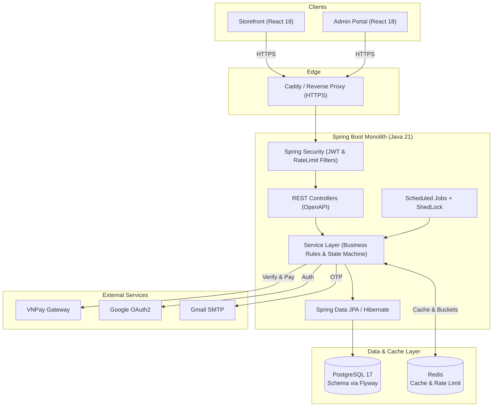

# Ladux

> A full-stack e-commerce platform for laptops and technology products, simulating real-world customer shopping, order lifecycle operations, inventory management, procurement, and payment workflows.

[](https://openjdk.org/)
[](https://spring.io/projects/spring-boot)
[](https://spring.io/projects/spring-security)
[](https://www.postgresql.org/)
[](https://redis.io/)
[](https://www.docker.com/)
[](https://flywaydb.org/)
[](https://testcontainers.com/)
[](https://react.dev/)
[](https://www.typescriptlang.org/)

---

## 📌 Overview

**Ladux** là một hệ thống thương mại điện tử chuyên ngành thiết bị công nghệ, được xây dựng để mô phỏng chân thực quy trình vận hành của một nền tảng bán lẻ từ khâu bán hàng đến quản trị kho vận và nhà cung cấp.

Hệ thống tập trung vào 3 phân hệ cốt lõi:
- **Customer / Storefront**: Trải nghiệm tìm kiếm, lọc theo thông số phần cứng (CPU/RAM/SSD), quản lý giỏ hàng, áp dụng coupon và thanh toán trực tuyến.
- **Admin Operations**: Điều phối đơn hàng qua cỗ máy trạng thái (State Machine), quản lý danh mục sản phẩm, biến thể (SKU) và xử lý đổi trả/hoàn tiền.
- **Inventory & Supply Chain**: Lập đơn nhập hàng từ nhà cung cấp (Purchase Orders), kiểm soát số lượng tồn kho nguyên tử và ghi vết lịch sử qua sổ cái biến động kho (Stock Ledger).

---

## 💡 Why I Built It

Phần lớn các dự án e-commerce mẫu chỉ dừng lại ở các thao tác CRUD cơ bản: thêm sản phẩm, bấm đặt mua và trừ số lượng trong database. Tuy nhiên, một hệ thống thương mại điện tử thực tế phức tạp hơn rất nhiều:

- **Tồn kho là tài nguyên tranh chấp cao**: Khi nhiều người cùng mua sản phẩm cuối cùng tại một thời điểm, hệ thống phải ngăn chặn triệt để tình trạng bán vượt tồn kho (overselling) mà không làm nghẽn toàn bộ cơ sở dữ liệu.
- **Vòng đời đơn hàng phụ thuộc nhiều ràng buộc**: Đơn hàng không thể tùy tiện đổi trạng thái nếu không thỏa mãn quy tắc nghiệp vụ; khi đơn hàng hết hạn thanh toán hoặc bị hủy, tồn kho và lượt dùng coupon phải được hoàn trả tự động và nhất quán.
- **Kho hàng bắt buộc phải có sổ cái (Audit Trail)**: Mọi biến động tăng/giảm tồn kho đều phải gắn liền với chứng từ tham chiếu (đơn bán, đơn nhập, hàng lỗi, kiểm kê) và người thực hiện thay vì ghi đè trực tiếp giá trị.
- **Thanh toán là quy trình bất đồng bộ**: Callback từ cổng thanh toán có thể đến chậm, gửi lặp lại (duplicate requests) hoặc bị can thiệp dữ liệu trên đường truyền.

**Ladux** được phát triển nhằm giải quyết trực tiếp những bài toán kỹ thuật backend này, tập trung vào tính toàn vẹn dữ liệu (data consistency), an toàn giao dịch (transaction boundaries) và khả năng kiểm soát luồng nghiệp vụ end-to-end.

---

## 🎯 What It Does

### 1. Customer
- **Bộ lọc thông số & Tìm kiếm mờ**: Tìm kiếm nhanh theo tên sản phẩm (Fuzzy search) và lọc kết hợp đa tiêu chí (Hãng, CPU, RAM, Ổ cứng, Giá bán).
- **Giỏ hàng & Khóa giá**: Quản lý giỏ hàng theo thời gian thực; chốt giá bán tại thời điểm tạo đơn (`priceAtPurchase`) để đảm bảo minh bạch tài chính.
- **Coupon & Thanh toán trực tuyến**: Áp dụng mã giảm giá (% hoặc số tiền), tích hợp cổng thanh toán **VNPay Sandbox** (HMAC-SHA512 checksum) và thanh toán khi nhận hàng (COD).
- **Lịch sử & Đánh giá**: Theo dõi hành trình đơn hàng theo thời gian thực; kiểm soát quyền đánh giá sản phẩm (chỉ cho phép sau khi nhận hàng thành công).

### 2. Admin Operations
- **Quản trị vòng đời đơn hàng**: Cập nhật trạng thái đơn theo State Machine (`PENDING` → `CONFIRMED` → `SHIPPED` → `DELIVERED`), cấp mã tracking vận chuyển.
- **Quản lý danh mục & Biến thể**: Cấu hình phân cấp Thương hiệu, Danh mục, Sản phẩm và các biến thể cấu hình (RAM, ROM, Màu sắc).
- **Xử lý Đổi trả & Hoàn tiền**: Hỗ trợ quy trình nghiệp vụ `RETURN_REQUESTED` → `RETURNED` → `REFUNDED`, tự động điều phối trạng thái thanh toán và nhập lại kho.
- **Phân quyền & Kiểm soát**: Phân quyền truy cập theo vai trò (`ROLE_CUSTOMER`, `ROLE_ADMIN`), quản lý tài khoản người dùng và lịch sử giao dịch.

### 3. Inventory & Supply Chain
- **Quản lý Nhà cung cấp & Nhập hàng**: Lưu trữ danh mục nhà cung cấp, tạo và theo dõi tiến độ đơn nhập hàng (Purchase Order - PO), hỗ trợ nhập kho từng phần.
- **Sổ cái biến động kho (Stock Ledger)**: Ghi nhận nhật ký bất biến cho mọi giao dịch (`PURCHASE_IN`, `SALE_OUT`, `RETURN_IN`, `DAMAGE_OUT`, `ADJUSTMENT`) kèm chứng từ đối soát.

---

## ⚡ Engineering Challenges

### 1. Atomic Inventory Deduction & Overselling Prevention
- **Problem:** Khi nhiều khách hàng cùng mua một sản phẩm tại cùng một thời điểm, race condition có thể làm tồn kho bị âm hoặc tạo đơn vượt quá số lượng thực tế.
- **Approach:** Áp dụng câu lệnh cập nhật có điều kiện nguyên tử (`UPDATE product_variants SET stock_quantity = stock_quantity - :qty WHERE id = :id AND stock_quantity >= :qty`) kết hợp với ràng buộc `CHECK (stock_quantity >= 0)` tại database. Cách tiếp cận này loại bỏ việc phải giữ lock bi quan kéo dài toàn bộ transaction mà vẫn đảm bảo tính nhất quán tuyệt đối. *(Chi tiết tại [`02-kien-truc-backend.md`](file:///c:/Users/ADMIN/OneDrive/Desktop/Ladux/docs/02-kien-truc-backend.md))*

### 2. Order State Machine & Automated Inventory Rollback
- **Problem:** Đơn hàng chuyển đổi trạng thái sai quy tắc sẽ làm sai lệch luồng vận hành; các đơn hàng `PENDING` bị bỏ rơi sẽ chiếm dụng tồn kho và mã giảm giá vô thời hạn.
- **Approach:** Xây dựng `OrderStateMachine` với ma trận chuyển đổi trạng thái nghiêm ngặt để chặn các request bất hợp pháp. Thiết lập background job quét các đơn quá hạn thanh toán (`paymentExpiresAt`), tự động hủy đơn, hoàn lại số lượng tồn kho và phục hồi lượt dùng coupon trong cùng một Transaction boundary; đồng thời dùng **ShedLock** để tránh xung đột khi chạy trên nhiều instance.

### 3. Idempotent Payment Webhooks & Signature Verification
- **Problem:** Webhook từ cổng thanh toán (VNPay IPN) có thể bị gửi lặp lại do cơ chế retry mạng, bị giả mạo payload hoặc gửi sai số tiền.
- **Approach:** Xác thực chữ ký số HMAC-SHA512 trước khi xử lý dữ liệu, đối chiếu số tiền thực nhận (`vnp_Amount`) với tổng tiền đơn hàng, và sử dụng khóa bi quan (`FOR UPDATE`) trên bản ghi thanh toán theo `merchantTxnRef`. Nếu thanh toán đã ở trạng thái `SUCCESS`, webhook trả về thành công ngay lập tức để đảm bảo tính Idempotent. *(Chi tiết tại [`03-luong-nghiep-vu.md`](file:///c:/Users/ADMIN/OneDrive/Desktop/Ladux/docs/03-luong-nghiep-vu.md))*

### 4. Dual-Token Authentication & Instant Revocation (Token Versioning)
- **Problem:** JWT stateless khó thu hồi ngay lập tức khi người dùng đổi mật khẩu hoặc đăng xuất; lưu trữ token trong LocalStorage tiềm ẩn rủi ro tấn công XSS.
- **Approach:** Sử dụng Access Token ngắn hạn trong bộ nhớ và Refresh Token dài hạn trong Cookie an toàn (`HttpOnly`, `SameSite`, `Secure`). Bổ sung trường `token_version` trong bảng `users`; khi người dùng đổi mật khẩu hoặc đăng xuất, `token_version` sẽ được tăng lên, ngay lập tức vô hiệu hóa toàn bộ token cũ mà không cần duy trì blacklist trong database.

### 5. Distributed Rate Limiting with Bucket4j & Redis
- **Problem:** Các endpoint nhạy cảm như Đăng nhập, Gửi mã OTP, Tạo đơn hàng và Chatbot dễ bị khai thác bởi botnet spam hoặc tấn công brute-force.
- **Approach:** Tích hợp **Bucket4j** với backend lưu trữ trên **Redis** qua `EndpointRateLimitFilter`. Các định danh (IP, Email, Phone, User ID) được băm (SHA-256) trước khi lưu vào Redis key nhằm giới hạn lưu lượng theo thuật toán Token Bucket mà vẫn bảo vệ thông tin cá nhân.

### 6. Fuzzy Search Optimization with PostgreSQL Trigram
- **Problem:** Sử dụng câu lệnh `LIKE '%keyword%'` thông thường gây ra full table scan khi danh mục sản phẩm lớn và không hỗ trợ tốt tìm kiếm gần đúng/sai chính tả nhẹ.
- **Approach:** Kích hoạt PostgreSQL extension `pg_trgm` và tạo chỉ mục GIN index trên trường `LOWER(name)` của sản phẩm, giúp tối ưu tốc độ tìm kiếm văn bản và nâng cao độ chính xác khi khách hàng gõ từ khóa. *(Chi tiết tại [`04-co-so-du-lieu-va-module.md`](file:///c:/Users/ADMIN/OneDrive/Desktop/Ladux/docs/04-co-so-du-lieu-va-module.md))*

---

## 🏗️ Architecture

Hệ thống được thiết kế theo kiến trúc **Spring Boot Monolith phân tầng (Layered Architecture)**, kết hợp reverse proxy và các dịch vụ lưu trữ phân tán:



---

## 💻 Tech Stack

| Layer | Technology | Purpose |
| :--- | :--- | :--- |
| **Backend** | Java 21, Spring Boot 4.0.x | Core monolith REST API application |
| **Security** | Spring Security, JJWT, OAuth2 Client | Stateless JWT authentication, RBAC authorization, Google login |
| **Database** | PostgreSQL 17, Flyway (42 migrations) | Primary relational database & automated schema versioning |
| **Cache / Concurrency** | Redis 7.x, Spring Cache, ShedLock | Catalog caching, distributed rate limit storage, scheduler lock |
| **Traffic Control** | Bucket4j (Lettuce backend) | Token bucket rate limiting for sensitive endpoints |
| **Payment** | VNPay SDK / REST, Apache Commons Codec | Sandbox payment processing & HMAC-SHA512 checksum |
| **Testing** | JUnit 5, Mockito, Testcontainers | Unit testing & integration testing with real PostgreSQL instances |
| **Frontend** | React 18, TypeScript 5, Vite 6, Tailwind CSS | Modern SPA for Customer Storefront & Admin Portal |
| **State Management** | Zustand, TanStack Query | Client-side global state and server state synchronization |
| **Infrastructure** | Docker, Docker Compose, Caddy | Containerized environments & HTTPS reverse proxy |

---

## 📸 Screenshots / Demo

| Storefront & Catalog | Product Details & Variants |
| :---: | :---: |
|  |  |

| Checkout & Payment Flow | Admin Operations Dashboard |
| :---: | :---: |
|  |  |

| Inventory & Stock Ledger | Purchase Orders (Procurement) |
| :---: | :---: |
|  |  |

---

## 📚 Documentation

Hệ thống tài liệu thiết kế chi tiết được tổ chức trong thư mục [`/docs`](file:///c:/Users/ADMIN/OneDrive/Desktop/Ladux/docs):

- [`00-tong-quan-du-an.md`](file:///c:/Users/ADMIN/OneDrive/Desktop/Ladux/docs/00-tong-quan-du-an.md): Tổng quan dự án, vai trò các thành phần và lộ trình đọc code.
- [`02-kien-truc-backend.md`](file:///c:/Users/ADMIN/OneDrive/Desktop/Ladux/docs/02-kien-truc-backend.md): Thiết kế phân tầng, DTO mapping, locking và transaction rules.
- [`03-luong-nghiep-vu.md`](file:///c:/Users/ADMIN/OneDrive/Desktop/Ladux/docs/03-luong-nghiep-vu.md): Chi tiết 5 luồng nghiệp vụ chính (Auth, Catalog, Cart, Order, Payment).
- [`04-co-so-du-lieu-va-module.md`](file:///c:/Users/ADMIN/OneDrive/Desktop/Ladux/docs/04-co-so-du-lieu-va-module.md): Sơ đồ ERD, thiết kế bảng dữ liệu và danh sách Flyway migrations.
- [`08-ke_hoach_production.md`](file:///c:/Users/ADMIN/OneDrive/Desktop/Ladux/docs/08-ke_hoach_production.md): Kế hoạch hardening bảo mật, vận hành và danh mục audit trước khi deploy.

---

## 🚀 Getting Started

### 1. Khởi chạy Database & Redis (Docker Compose)
```bash
cd backend
docker compose up -d postgres redis
```

### 2. Khởi chạy Backend (Spring Boot)
Tạo file cấu hình môi trường hoặc sử dụng mặc định của profile `dev`:
```bash
cd backend
./mvnw spring-boot:run -Dspring-boot.run.profiles=dev
```
- API Documentation (Swagger UI): `http://localhost:8080/swagger-ui.html`
- Health check: `http://localhost:8080/actuator/health`

### 3. Khởi chạy Frontend (React + Vite)
```bash
cd frontend
npm install
npm run dev
```
- Storefront & Admin Portal: `http://localhost:5173`

*(Xem hướng dẫn cấu hình biến môi trường chi tiết tại [`backend/.env.production.example`](file:///c:/Users/ADMIN/OneDrive/Desktop/Ladux/backend/.env.production.example) và [`frontend/.env.example`](file:///c:/Users/ADMIN/OneDrive/Desktop/Ladux/frontend/.env.example))*

---

## 📁 Project Structure

```text
Ladux/
├── backend/                  # Spring Boot REST API monolith (Java 21)
├── frontend/                 # React 18 SPA (Storefront & Admin)
├── docs/                     # Tài liệu thiết kế kiến trúc, nghiệp vụ & database
├── uploads/                  # Thư mục lưu trữ media & hình ảnh sản phẩm
└── README.md                 # Project landing documentation
```

---

## 🚦 Status

- **Core Capabilities**: Hoàn thiện toàn bộ luồng Auth, Catalog, Cart, Atomic Checkout, VNPay Webhook, Order State Machine, Sổ cái kho và Distributed Rate Limiting.
- **Testing**: Đã triển khai Unit Test và Integration Test với Testcontainers (PostgreSQL).
- **Active Improvements**: Đang hoàn thiện các hạng mục trong [`08-ke_hoach_production.md`](file:///c:/Users/ADMIN/OneDrive/Desktop/Ladux/docs/08-ke_hoach_production.md) (tích hợp SMS provider chính thức thay thế stub OTP, cấu hình CDN và hoàn thiện monitoring với Prometheus/Grafana).

---

## 👤 Author

- **Họ và tên**: Phan Anh Khang
- **Vị trí ứng tuyển**: Java Backend Developer (Intern)
- **GitHub**: [github.com/phananhkhang](https://github.com/phananhkhang)
- **Email**: [phananhkhang0603@gmail.com]
