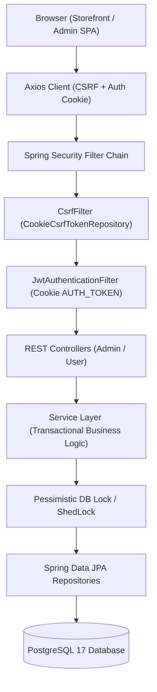
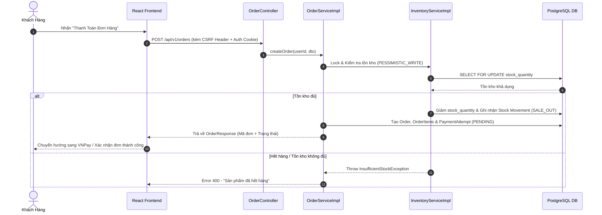

# Ladux - Hệ Thống Thương Mại Điện Tử & Quản Lý Chuỗi Cung Ứng Laptop


**Ladux** là một hệ thống thương mại điện tử chuyên biệt dành cho ngành hàng Laptop & Thiết bị công nghệ, tích hợp toàn diện từ **Storefront (Khách hàng)**, **Admin Operations (Quản trị vận hành)** đến **Supply Chain & Procurement (Quản lý chuỗi cung ứng & Kho hàng)**.

---

## 📋 Mục Lục

- [Giới Thiệu Tổng Quan](#-giới-thiệu-tổng-quan)
- [Tính Năng Nổi Bật](#-tính-năng-nổi-bật)
- [Công Nghệ & Kiến Trúc](#-công-nghệ--kiến-trúc)
- [Cấu Trúc Thư Mục Dự Án](#-cấu-trúc-thư-mục-dự-án)
- [Luồng Hoạt Động Hệ Thống](#-luồng-hoạt-động-hệ-thống)
- [Hướng Dẫn Cài Đặt & Chạy Ứng Dụng](#-hướng-dẫn-cài-đặt--chạy-ứng-dụng)
- [Cấu Hình Biến Môi Trường](#-cấu-hình-biến-môi-trường)
- [Cơ Sở Dữ Liệu & Migrations](#-cơ-sở-dữ-liệu--migrations)
- [Danh Sách API Chính](#-danh-sách-api-chính)
- [Tài Liệu Chi Tiết trong `/docs`](#-tài-liệu-chi-tiết-trong-docs)
- [Kiểm Thử, Build & Ghi Chú Vận Hành](#-kiểm-thử-build--ghi-chú-vận-hành)

---

## 🚀 Giới Thiệu Tổng Quan

Dự án Ladux bao gồm hai thành phần trọng yếu kết nối qua REST API:

- **`backend/`**: Hệ thống Spring Boot RESTful API hỗ trợ Java 21, quản lý danh mục sản phẩm, biến thể (RAM, ROM, Màu sắc, SKU), giỏ hàng, đặt hàng khóa tồn kho nguyên tử (`PESSIMISTIC_WRITE`), tích hợp thanh toán (VNPay IPN HMAC-SHA512, MoMo, COD), quy trình nhập hàng NCC (PO, Goods Receipt), sổ cái biến động kho (Stock Ledger), mã giảm giá (Coupon), xác thực OTP (Phone/Email), và phân quyền người dùng (Role-based access control).
- **`frontend/`**: Ứng dụng Single Page Application (SPA) xây dựng trên nền React 18, TypeScript, Vite & Tailwind CSS. Cung cấp cả giao diện bán hàng (Storefront) hiện đại, tối ưu UX/UI và giao diện quản trị (Admin Dashboard) chuyên nghiệp.

---

## ✨ Tính Năng Nổi Bật

### 🛒 1. Khách Hàng (Storefront)

- **Trang chủ & Danh mục sản phẩm**: Hiển thị Hero banner, danh mục nổi bật, tìm kiếm theo nhu cầu (*Gaming, Văn phòng, Ultrabook, Đồ họa, Doanh nhân, Sinh viên*) và thương hiệu (*Apple, Dell, Asus, Lenovo, HP, Acer, MSI, v.v.*).
- **Bộ lọc sản phẩm thông minh (Catalog Filters)**: Lọc kết hợp đa tiêu chí cùng lúc: Thương hiệu, Dòng máy, Dung lượng RAM, Dung lượng Ổ cứng (ROM), Khoảng giá (Range Slider), Tìm kiếm từ khóa full-text (`pg_trgm`) và Sắp xếp (Mới nhất, Giá tăng/giảm, Đánh giá cao).
- **Trang chi tiết sản phẩm**: Chọn biến thể cấu hình (RAM/ROM/Color), xem giá khuyến mãi, thông số kỹ thuật chi tiết, bộ sưu tập hình ảnh, và danh sách đánh giá của người mua.
- **Xác thực & Bảo mật tài khoản**:
  - Đăng ký / Đăng nhập tài khoản bằng mật khẩu mã hóa BCrypt.
  - Đăng nhập nhanh bằng **Google OAuth2**.
  - Xác thực qua Cookie HttpOnly `AUTH_TOKEN` kết hợp CSRF Token cho các request ghi dữ liệu.
  - Token Versioning (`token_version`) giúp vô hiệu hóa phiên làm việc tức thì khi đổi mật khẩu hoặc đăng xuất.
  - Xác thực số điện thoại & email qua mã OTP (`phone_verifications`, `email_verifications`).
- **Giỏ hàng & Đơn hàng**:
  - Quản lý giỏ hàng realtime, chọn biến thể, cập nhật số lượng.
  - Áp dụng Mã giảm giá (Coupon) trực tiếp khi checkout.
  - Tính phí vận chuyển tự động theo địa chỉ & đơn vị vận chuyển.
  - Khóa tồn kho nguyên tử an toàn tránh overselling.
  - Tích hợp các phương thức thanh toán: **VNPay** (kèm Webhook IPN kiểm tra checksum HMAC SHA-512), **MoMo**, và **COD** (Thanh toán khi nhận hàng).
  - Theo dõi trạng thái đơn hàng & timeline lịch sử đơn (`PENDING` -> `CONFIRMED` -> `SHIPPED` -> `DELIVERED`).
- **Đánh giá & Yêu thích**:
  - Thêm/Xóa sản phẩm khỏi danh sách yêu thích (Wishlist).
  - Gửi đánh giá sao & bình luận cho sản phẩm đã mua thành công.
  - Trung tâm thông báo hệ thống (Notification Center) nhận thông báo đơn hàng & khuyến mãi.

### ⚙️ 2. Quản Trị & Chuỗi Cung Ứng (Admin & Supply Chain Operations)

- **Dashboard Vận Hành**: Thống kê doanh thu, số lượng đơn hàng, biểu đồ tổng quan, danh sách đơn hàng mới nhất và trạng thái hệ thống.
- **Quản lý Danh Mục & Sản Phẩm (Catalog Management)**:
  - Quản lý Thương hiệu (Brands), Danh mục (Categories) và Màu sắc (Colors).
  - Quản lý Sản phẩm, Biến thể sản phẩm (Variant: SKU, RAM, ROM, Giá nhập, Giá bán, Giá giảm, Số lượng tồn kho).
  - Upload & quản lý bộ sưu tập hình ảnh sản phẩm local/public asset.
- **Quản lý Chuỗi Cung Ứng & Nhập Hàng (Procurement & Inventory)**:
  - Quản lý Nhà cung cấp (Suppliers) & Liên kết Sản phẩm - Nhà cung cấp (Product-Supplier mapping).
  - Đơn nhập hàng (Purchase Orders - PO): Tạo PO, chuyển trạng thái, nhận hàng từng phần (Partial Receiving) hoặc toàn bộ.
  - Sổ cái biến động kho (Stock Ledger): Tự động ghi nhật ký mọi giao dịch kho (`PURCHASE_IN`, `SALE_OUT`, `ADJUSTMENT_IN/OUT`, `DAMAGE_OUT`). Hỗ trợ điều chỉnh kho thủ công an toàn (chống kho âm).
- **Quản lý Đơn Hàng & Thanh Toán (Sales & Payments)**:
  - Xem danh sách đơn hàng, lọc theo trạng thái, tìm kiếm mã đơn.
  - Chuyển trạng thái đơn hàng an toàn theo State Machine.
  - Xử lý các yêu cầu thanh toán (Payment Attempts), xác nhận thanh toán thành công hoặc thất bại.
- **Quản lý Người Dùng & Hệ Thống**:
  - Quản lý danh sách User, Phân quyền Role (ADMIN, USER), kiểm tra lịch sử địa chỉ khách hàng.
  - Quản lý Mã giảm giá (Coupons): loại giảm theo %, giảm cố định, giới hạn lượt dùng, ngày hết hạn.
  - Kiểm duyệt Đánh giá (Reviews) của khách hàng.

---

## 🛠️ Công Nghệ & Kiến Trúc

### Backend
- **Core Framework**: Java 21, Spring Boot `4.0.6`.
- **Web & Security**: Spring Web MVC, Spring Security, OAuth2 Client (Google Login), Spring Validation.
- **Authentication**: JWT (`jjwt` 0.12.x) lưu trong Cookie `AUTH_TOKEN` HttpOnly, CSRF Token via `CookieCsrfTokenRepository`, Refresh Token Rotation, Token Versioning.
- **Database & Persistence**: PostgreSQL 17, Spring Data JPA / Hibernate, Flyway Database Migration (41 scripts).
- **Full-Text Search & Locking**: PostgreSQL Extension `pg_trgm` cho tìm kiếm chuỗi, ShedLock cho distributed locking, Pessimistic Locking (`PESSIMISTIC_WRITE`) cho giao dịch kho/coupon.
- **Utils & Integration**: Lombok, Commons Codec (HMAC SHA-512 cho VNPay checksum).

### Frontend
- **Framework & Build Tools**: React 18, TypeScript 5, Vite 6.3.
- **Routing & State Management**: React Router DOM v7, Zustand (quản lý state toàn cục cho auth, products, cart, wishlist, orders, notifications, UI).
- **Styling & UI Components**: Tailwind CSS, Radix UI Primitives (Dialog, Select, Popover), Lucide React Icons, Sonner Toaster.
- **Data Fetching**: Axios API Client với Interceptors (xử lý tự động CSRF token, Auth expired events, Error handling).

### Infrastructure & DevOps
- Dockerfile đa tầng (Multi-stage build / JAR deployment) cho backend.
- Docker Compose thiết lập môi trường hoàn chỉnh (Backend + PostgreSQL 17 Alpine).

---

## 📁 Cấu Trúc Thư Mục Dự Án

```text
Ladux/
├── backend/
│   ├── Dockerfile
│   ├── docker-compose.yml
│   ├── pom.xml
│   └── src/
│       ├── main/
│       │   ├── java/org/akira/ladux/
│       │   │   ├── config/              # Security, CORS, Web, ShedLock, OpenAPI configs
│       │   │   ├── controller/          # AuthController
│       │   │   │   ├── admin/           # Admin REST APIs (22 controllers)
│       │   │   │   └── user/            # Storefront REST APIs (16 controllers)
│       │   │   ├── dto/                 # Request & Response DTOs theo module
│       │   │   ├── exception/           # Global Exception Handler & Custom Errors
│       │   │   ├── model/               # JPA Entities (User, Product, Order, PO, Stock, etc.)
│       │   │   ├── repository/          # Spring Data JPA Repositories
│       │   │   ├── service/             # Business Logic & Service Implementations
│       │   │   └── utils/               # Helper utils (Cookie, JWT, Security, VNPay)
│       │   └── resources/
│       │       ├── application.properties
│       │       ├── application-dev.properties
│       │       ├── application-prod.properties
│       │       └── db/
│       │           ├── migration/       # 41 Flyway SQL Migrations
│       │           └── devdata/         # Seed mock data cho môi trường Dev
│       └── test/                        # Integration & Unit Tests
├── frontend/
│   ├── package.json
│   ├── vite.config.ts
│   ├── tailwind.config.js
│   └── src/
│       ├── admin/                       # Admin Panel SPA
│       │   ├── api/                     # Admin API client endpoints
│       │   ├── components/              # AdminUI (Table, Panel, Button, Dialog) & AdminShell
│       │   ├── pages/                   # Admin pages (Dashboard, Products, Sales, Procurement, etc.)
│       │   └── types/                   # Admin TypeScript declarations
│       ├── app/                         # App Router, StorefrontProvider & UI primitives
│       ├── components/                  # Shared Storefront UI components (Header, Footer, Cards)
│       ├── config/                      # env.ts (API URL config)
│       ├── pages/                       # Storefront pages (Home, Catalog, ProductDetail, Cart, Checkout, etc.)
│       ├── services/                    # Axios API services (product, cart, order, user, etc.)
│       ├── stores/                      # Zustand state stores
│       └── types/                       # Core TypeScript interfaces & DTO mappers
├── docs/                                # Tài liệu thiết kế, kiến trúc & báo cáo chi tiết
├── uploads/                             # Thư mục lưu hình ảnh sản phẩm / brand / category
└── README.md
```

---

## 🔄 Luồng Hoạt Động Hệ Thống

### 1. Kiến trúc tổng thể



### 2. Luồng Đặt Hàng & Khóa Tồn Kho (Order & Inventory Locking Flow)



---

## 🛠️ Hướng Dẫn Cài Đặt & Chạy Ứng Dụng

### Yêu cầu hệ thống
- **Java**: OpenJDK 21 trở lên.
- **Maven**: 3.9+ (hoặc dùng `./mvnw` / `mvnw.cmd` trong thư mục `backend/`).
- **Node.js**: v20.x trở lên.
- **Package Manager**: `npm`.
- **Database**: PostgreSQL 17 (hoặc chạy qua Docker).
- **Docker & Docker Compose** (Tùy chọn).

---

### Phương Án 1: Chạy bằng Docker Compose (Nhanh nhất)

1. **Build file JAR cho backend**:
   ```powershell
   cd backend
   mvn -q -DskipTests package
   ```

2. **Khởi chạy container PostgreSQL & Backend**:
   ```powershell
   docker compose up --build -d
   ```
   *Backend REST API sẽ sẵn sàng tại:* `http://localhost:8080`

3. **Khởi chạy Frontend**:
   ```powershell
   cd ../frontend
   npm install
   npm run dev
   ```
   *Frontend Storefront sẽ khả dụng tại:* `http://localhost:3000` (hoặc port do Vite cấp).

---

### Phương Án 2: Chạy trực tiếp trên máy cục bộ (Local Development)

#### 1. Khởi động Backend Spring Boot:
Cần đảm bảo PostgreSQL đang chạy và đã tạo cơ sở dữ liệu `ladux`.

```powershell
cd backend
$env:SPRING_PROFILES_ACTIVE="dev"
$env:DB_HOST="localhost"
$env:DB_USERNAME="postgres"
$env:DB_PASSWORD="your_postgres_password"
$env:JWT_SECRET="c3VwZXItc2VjcmV0LWtleS13aXRoLW1pbmltdW0tMjU2LWJpdHMtZm9yLWp3dC1zaWduaW5n"
$env:GOOGLE_CLIENT_ID="dummy_google_client_id"
$env:GOOGLE_CLIENT_SECRET="dummy_google_client_secret"

mvn spring-boot:run
```

*Khi khởi động ở profile `dev`, Flyway sẽ tự động chạy 41 file migrations và nạp dữ liệu mẫu (devdata).*

#### 2. Khởi động Frontend React / Vite:
```powershell
cd frontend
npm install
$env:VITE_API_BASE_URL="http://localhost:8080"
npm run dev
```

---

## 🔑 Cấu Hình Biến Môi Trường

### Backend (`application.properties` / Môi trường)

| Biến Môi Trường | Bắt Bắt Buộc | Giá Trị Mặc Định | Mô Tả |
| :--- | :---: | :--- | :--- |
| `SPRING_PROFILES_ACTIVE` | Không | `dev` | Profile hoạt động (`dev`, `prod`). |
| `DB_HOST` | Không | `localhost` | Địa chỉ Host PostgreSQL Database. |
| `DB_PORT` | Không | `5432` | Cổng kết nối PostgreSQL. |
| `DB_NAME` | Không | `ladux` | Tên cơ sở dữ liệu PostgreSQL. |
| `DB_USERNAME` | Không | `akira` / `postgres` | Username kết nối PostgreSQL. |
| `DB_PASSWORD` | Có | `secret` | Mật khẩu truy cập PostgreSQL. |
| `JWT_SECRET` | Có | `-` | Chuỗi Base64 ký JWT (tối thiểu 256-bit). |
| `GOOGLE_CLIENT_ID` | Có (nếu dùng OAuth) | `-` | Google OAuth2 Client ID. |
| `GOOGLE_CLIENT_SECRET` | Có (nếu dùng OAuth) | `-` | Google OAuth2 Client Secret. |
| `AUTH_COOKIE_NAME` | Không | `AUTH_TOKEN` | Tên Cookie HttpOnly lưu JWT. |
| `AUTH_COOKIE_SAME_SITE` | Không | `Strict` | Cấu hình SameSite cookie (`Strict`/`Lax`/`None`). |
| `AUTH_COOKIE_SECURE` | Không | `false` (dev) / `true` (prod) | Đặt `true` trên HTTPS. |

### Frontend (`frontend/.env`)

| Biến Môi Trường | Bắt Buộc | Giá Trị Mặc Định | Mô Tả |
| :--- | :---: | :--- | :--- |
| `VITE_API_BASE_URL` | Không | `http://localhost:8080` | URL REST API Backend (không kèm `/api/v1`). |

---

## 🗄️ Cơ Sở Dữ Liệu & Migrations

Dự án sử dụng **Flyway** để quản lý 41 phiên bản migration tự động tại `backend/src/main/resources/db/migration/`.

### Các sơ đồ bảng dữ liệu chính:

```text
├── Identity & Access        : users, roles, user_roles, refresh_tokens, phone_verifications, email_verifications
├── Product Catalog         : categories, brands, products, product_images, colors, product_variants, product_suppliers
├── Sales & Commerce        : carts, cart_items, orders, order_items, order_histories, coupons
├── Procurement & Inventory : suppliers, purchase_orders, purchase_order_items, stock_movements
├── Engagement & Audit      : reviews, wishlists, user_addresses, notifications, shedlock
```

---

## 🌐 Danh Sách API Chính (`/api/v1`)

### 🔑 Authentication & Profile
- `POST /api/v1/auth/register` : Đăng ký tài khoản mới.
- `POST /api/v1/auth/login` : Đăng nhập (Set HttpOnly JWT Cookie).
- `POST /api/v1/auth/logout` : Đăng xuất (Clear Cookie & Revoke Token).
- `GET  /api/v1/auth/csrf` : Lấy CSRF Token.
- `GET  /api/v1/users/me` : Lấy thông tin user hiện tại.

### 💻 Products & Catalog
- `GET /api/v1/products` : Lấy danh sách sản phẩm (Phân trang, Lọc, Tìm kiếm full-text).
- `GET /api/v1/products/{id}` : Lấy chi tiết sản phẩm & danh sách biến thể.
- `GET /api/v1/categories` : Lấy danh sách danh mục.
- `GET /api/v1/brands` : Lấy danh sách thương hiệu.

### 🛍️ Cart & Checkout & Orders
- `GET    /api/v1/cart` : Lấy giỏ hàng của người dùng.
- `POST   /api/v1/cart/items` : Thêm sản phẩm/biến thể vào giỏ.
- `PUT    /api/v1/cart/items/{id}` : Cập nhật số lượng item trong giỏ.
- `DELETE /api/v1/cart/items/{id}` : Xóa item khỏi giỏ hàng.
- `POST   /api/v1/orders` : Khởi tạo đơn hàng & khóa tồn kho.
- `GET    /api/v1/orders/user` : Xem danh sách đơn hàng của người dùng.

### 🛡️ Admin Operations (`/api/v1/admin/*`)
- `GET/POST/PUT/DELETE /api/v1/admin/products` : Quản lý CRUD sản phẩm.
- `GET/POST/PUT/DELETE /api/v1/admin/product-variants` : Quản lý biến thể cấu hình.
- `GET/POST/PUT /api/v1/admin/orders` : Xử lý đơn hàng & đổi trạng thái State Machine.
- `GET/POST/PUT /api/v1/admin/purchase-orders` : Quản lý đơn nhập hàng (PO) & nhận hàng.
- `GET/POST /api/v1/admin/stock-movements` : Ghi sổ cái điều chỉnh kho hàng.

---

## 📚 Tài Liệu Chi Tiết Trong `/docs`

Dự án cung cấp bộ tài liệu kỹ thuật hoàn chỉnh trong thư mục [`docs/`](file:///c:/Users/ADMIN/OneDrive/Desktop/Ladux/docs):

1. 📖 [00. Tổng quan dự án](docs/00-tong-quan-du-an.md)
2. 📂 [01. Cấu trúc thư mục](docs/01-cau-truc-thu-muc.md)
3. 🏗️ [02. Kiến trúc Backend](docs/02-kien-truc-backend.md)
4. 🔄 [03. Luồng nghiệp vụ End-to-End](docs/03-luong-nghiep-vu.md)
5. 🗃️ [04. Cơ sở dữ liệu & Các Module](docs/04-co-so-du-lieu-va-module.md)
6. 🎨 [05. Frontend & API Integration](docs/05-frontend-va-api.md)
7. 🚀 [06. Vận hành, Kiểm thử & Mở rộng](docs/06-van-hanh-kiem-thu-mo-rong.md)
8. 🎓 [07. Bài giảng Backend chi tiết](docs/07-bai-giang-backend-chi-tiet.md)

---

## 🧪 Kiểm Thử, Build & Ghi Chú Vận Hành

### 1. Build & Kiểm thử Backend
```powershell
cd backend

# Biên dịch mã nguồn
mvn clean compile

# Chạy kiểm thử tự động (yêu cầu DB hoặc test profile)
mvn test

# Đóng gói ứng dụng JAR
mvn -DskipTests package
```

### 2. Build & Kiểm tra kiểu Frontend
```powershell
cd frontend

# Kiểm tra TypeScript
npm run typecheck

# Build ứng dụng cho môi trường Production
npm run build
```

---

*Hệ thống Ladux được thiết kế tối ưu, sẵn sàng cho việc phát triển mở rộng tính năng thương mại điện tử chuyên nghiệp.*
