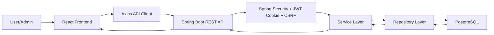

# AuraTech

      

     

AuraTech là dự án web bán hàng công nghệ gồm hai phần chính:

- `backend/`: REST API viết bằng Spring Boot, quản lý người dùng, sản phẩm, giỏ hàng, đơn hàng, tồn kho, coupon, thanh toán, đánh giá và admin.
- `frontend/`: giao diện React/Vite cho storefront và trang quản trị.

Mục tiêu của dự án là mô phỏng một hệ thống thương mại điện tử đủ đầy đủ để học, phát triển MVP, và làm nền tảng mở rộng lên môi trường thật.

## Mục Lục

- [Tính năng chính](#tinh-nang-chinh)
- [Công nghệ sử dụng](#cong-nghe-su-dung)
- [Cấu trúc thư mục](#cau-truc-thu-muc)
- [Luồng hoạt động tổng quan](#luong-hoat-dong-tong-quan)
- [Cách chạy dự án](#cach-chay-du-an)
- [Biến môi trường](#bien-moi-truong)
- [Database và migration](#database-va-migration)
- [API chính](#api-chinh)
- [Tài liệu trong docs](#tai-lieu-trong-docs)
- [Kiểm thử và build](#kiem-thu-va-build)
- [Ghi chú vận hành](#ghi-chu-van-hanh)

## Tính Năng Chính

### Storefront

- Xem trang chủ, danh sách sản phẩm, chi tiết sản phẩm.
- Lọc/tìm kiếm sản phẩm theo từ khóa, brand, category.
- Đăng ký, đăng nhập bằng tài khoản thường.
- Đăng nhập OAuth2 Google ở backend.
- Lưu JWT trong cookie `AUTH_TOKEN`.
- Tự lấy CSRF token cho các request ghi dữ liệu.
- Quản lý giỏ hàng: xem, thêm, cập nhật số lượng, xóa item, xóa toàn bộ.
- Quản lý wishlist.
- Checkout tạo đơn hàng.
- Xem danh sách đơn hàng và chi tiết đơn hàng.
- Đánh giá sản phẩm sau khi đơn đã giao thành công.
- Quản lý địa chỉ người dùng.

### Admin

- Đăng nhập admin bằng cùng cơ chế auth cookie.
- Dashboard quản trị.
- Quản lý sản phẩm, brand, category, coupon.
- Quản lý đơn hàng, lịch sử đơn hàng, payment.
- Quản lý user, role, review.
- Xem một số dữ liệu phân tích/cart analytics ở frontend admin.

## Công Nghệ Sử Dụng

### Backend

- Java 21.
- Spring Boot `4.0.6`.
- Spring Web MVC cho REST API.
- Spring Data JPA/Hibernate cho ORM.
- PostgreSQL làm database chính.
- Flyway quản lý migration database.
- Spring Security cho authentication/authorization.
- OAuth2 Client cho Google Login.
- JWT với thư viện `jjwt`.
- Cookie auth qua `AUTH_TOKEN`.
- CSRF token qua `CookieCsrfTokenRepository`.
- Bean Validation cho request DTO.
- Lombok giảm boilerplate entity/service.
- Commons Codec dùng HMAC SHA-512 cho logic VNPay webhook.
- Maven làm build tool.

### Frontend

- React `18`.
- TypeScript.
- Vite.
- React Router DOM.
- Axios.
- Zustand cho state management.
- Tailwind CSS.
- Radix UI primitives.
- Lucide React icons.
- Framer Motion.
- Three.js, React Three Fiber, Drei cho phần hero/3D.
- Sonner/toaster cho thông báo.

### Hạ tầng phát triển

- Dockerfile cho backend app.
- Docker Compose cho backend + PostgreSQL.
- PostgreSQL `17-alpine` trong compose.
- Flyway tự chạy migration khi backend khởi động.

## Cấu Trúc Thư Mục

```text
AuraTech/
├── backend/
│   ├── Dockerfile
│   ├── docker-compose.yml
│   ├── pom.xml
│   ├── database/
│   │   └── auratech_erd.png
│   └── src/
│       ├── main/
│       │   ├── java/org/akira/auratech/
│       │   │   ├── config/
│       │   │   ├── controller/
│       │   │   ├── dto/
│       │   │   ├── exception/
│       │   │   ├── model/
│       │   │   ├── repository/
│       │   │   ├── service/
│       │   │   └── utils/
│       │   └── resources/
│       │       ├── application.properties
│       │       ├── application-dev.properties
│       │       ├── application-prod.properties
│       │       └── db/
│       │           ├── migration/
│       │           └── devdata/
│       └── test/
├── frontend/
│   ├── package.json
│   ├── vite.config.ts
│   └── src/
│       ├── admin/
│       ├── api/
│       ├── components/
│       ├── features/
│       ├── lib/
│       ├── pages/
│       └── types/
├── docs/
└── README.md
```

## Luồng Hoạt Động Tổng Quan



Luồng đọc sản phẩm:

```text
Home/Shop/ProductDetail
  -> frontend/src/api/client.ts
  -> GET /api/v1/products
  -> ProductController
  -> ProductServiceImpl
  -> ProductRepository
  -> PostgreSQL
  -> ProductResponse
  -> React render UI
```

Luồng đăng nhập:

```text
Login form
  -> POST /api/v1/auth/login
  -> AuthController
  -> AuthenticationManager
  -> MyUserDetailsService
  -> UserRepository
  -> JwtService generate token
  -> AuthCookieService set AUTH_TOKEN cookie
  -> Browser lưu cookie HttpOnly
```

Luồng checkout:

```text
Checkout page
  -> POST /api/v1/orders
  -> JwtFilter xác thực user từ cookie
  -> OrderController
  -> OrderServiceImpl.createOrder
  -> InventoryServiceImpl lock và trừ tồn kho
  -> CouponRedemptionServiceImpl lock và redeem coupon nếu có
  -> PaymentAttemptServiceImpl tạo payment PENDING
  -> OrderRepository lưu order/order_items/payment/history
  -> Trả OrderResponse
```

## Cách Chạy Dự Án

### Yêu cầu môi trường

- Java 21 trở lên.
- Maven 3.9+ hoặc dùng Maven Wrapper trong `backend/`.
- Node.js 20+.
- npm.
- Docker Desktop nếu muốn chạy PostgreSQL/backend bằng Docker Compose.
- PostgreSQL nếu muốn chạy local không qua Docker.

### Chạy backend bằng Docker Compose

Backend Dockerfile copy file `target/aura-tech.jar`, vì vậy cần build jar trước khi compose build.

```powershell
cd backend
mvn -q -DskipTests package
```

Thiết lập biến môi trường trong PowerShell:

```powershell
$env:DB_PASSWORD="your_db_password"
$env:JWT_SECRET="base64_secret_min_256_bits"
$env:GOOGLE_CLIENT_ID="your_google_client_id"
$env:GOOGLE_CLIENT_SECRET="your_google_client_secret"
```

Sau đó chạy:

```powershell
docker compose up --build
```

Backend sẽ chạy tại:

```text
http://localhost:8080
```

Database PostgreSQL trong compose:

```text
host: localhost
port: 5432
database: aura_tech
user: akira hoặc DB_USERNAME nếu bạn set biến môi trường
password: DB_PASSWORD
```

### Chạy backend trực tiếp bằng Maven

Bạn cần có PostgreSQL đang chạy và database `aura_tech` đã tồn tại.

```powershell
cd backend
$env:SPRING_PROFILES_ACTIVE="dev"
$env:DB_HOST="localhost"
$env:DB_USERNAME="akira"
$env:DB_PASSWORD="your_db_password"
$env:JWT_SECRET="base64_secret_min_256_bits"
$env:GOOGLE_CLIENT_ID="your_google_client_id"
$env:GOOGLE_CLIENT_SECRET="your_google_client_secret"
mvn spring-boot:run
```

Nếu không dùng Google Login trong lúc phát triển, vẫn nên set giá trị dummy hợp lệ cho `GOOGLE_CLIENT_ID` và `GOOGLE_CLIENT_SECRET` để Spring resolve được placeholder.

### Chạy frontend

```powershell
cd frontend
npm install
npm run dev
```

Frontend mặc định chạy tại:

```text
http://localhost:3000
```

Frontend gọi backend qua biến:

```text
VITE_API_BASE_URL
```

Nếu không set, frontend dùng mặc định:

```text
http://localhost:8080
```

Ví dụ:

```powershell
cd frontend
$env:VITE_API_BASE_URL="http://localhost:8080"
npm run dev
```

## Biến Môi Trường

### Backend

| Biến | Bắt buộc | Mô tả | Ví dụ |
| --- | --- | --- | --- |
| `SPRING_PROFILES_ACTIVE` | Không | Profile chạy app. Mặc định `dev`. | `dev`, `prod` |
| `DB_HOST` | Không | Host PostgreSQL. Mặc định `localhost`. | `localhost`, `postgres` |
| `DB_USERNAME` | Không | User PostgreSQL. Mặc định `akira`. | `akira` |
| `DB_PASSWORD` | Có khi chạy compose | Password PostgreSQL. | `secret` |
| `JWT_SECRET` | Có | Secret dạng Base64 cho JWT HMAC. | `base64...` |
| `GOOGLE_CLIENT_ID` | Có | Google OAuth2 client id. | `xxx.apps.googleusercontent.com` |
| `GOOGLE_CLIENT_SECRET` | Có | Google OAuth2 client secret. | `GOCSPX-...` |
| `AUTH_COOKIE_NAME` | Không | Tên cookie auth. Mặc định `AUTH_TOKEN`. | `AUTH_TOKEN` |
| `AUTH_COOKIE_SAME_SITE` | Không | SameSite cookie. Mặc định `Strict`. | `Strict` |
| `AUTH_COOKIE_SECURE` | Không | Cookie secure. Prod nên `true`. | `true` |
| `AUTH_COOKIE_MAX_AGE_SECONDS` | Không | Tuổi cookie. Mặc định 36000 giây. | `36000` |
| `OAUTH2_SUCCESS_REDIRECT` | Không | URL redirect sau Google login. | `http://localhost:3000/checkout/success` |

### Frontend

| Biến | Bắt buộc | Mô tả | Ví dụ |
| --- | --- | --- | --- |
| `VITE_API_BASE_URL` | Không | Base URL backend, chưa gồm `/api/v1`. | `http://localhost:8080` |

## Database Và Migration

Flyway chạy migration từ:

```text
backend/src/main/resources/db/migration
```

Trong profile `dev`, Flyway chạy thêm mock data từ:

```text
backend/src/main/resources/db/devdata
```

Các file chính:

- `V1__init_schema.sql`: tạo schema ban đầu.
- `V2__add_hot_path_indexes.sql`: thêm index cho các đường truy vấn nóng.
- `V3__insert_mock_data.sql`: seed dữ liệu phát triển.

Các nhóm bảng chính:

- Identity: `users`, `roles`, `user_roles`.
- Catalog: `products`, `brands`, `categories`, `product_images`.
- Commerce: `carts`, `cart_items`, `orders`, `order_items`, `order_histories`.
- Payment/discount: `payments`, `coupons`.
- Engagement: `reviews`, `wishlists`.
- User profile: `user_addresses`.

Sơ đồ ERD hiện có:

```text
docs/auratech_erd.png
backend/database/auratech_erd.png
```

## API Chính

Tất cả API backend có prefix:

```text
/api/v1
```

Nhóm endpoint chính:

| Module | Endpoint | Vai trò |
| --- | --- | --- |
| Auth | `/auth/register`, `/auth/login`, `/auth/logout`, `/auth/csrf` | Đăng ký, đăng nhập, logout, lấy CSRF token |
| Products | `/products`, `/products/{id}`, `/products/slug/{slug}` | Xem/tìm kiếm sản phẩm |
| Brands | `/brands` | Xem/quản lý brand |
| Categories | `/categories` | Xem/quản lý category |
| Cart | `/cart`, `/cart/items` | Quản lý giỏ hàng |
| Wishlist | `/wishlists` | Quản lý wishlist |
| Orders | `/orders`, `/orders/user`, `/orders/{id}` | Tạo/xem/cập nhật đơn |
| Payments | `/payments`, `/payments/order/{orderId}` | Quản lý payment |
| Coupons | `/coupons`, `/coupons/apply` | Quản lý/preview coupon |
| Reviews | `/reviews`, `/reviews/product/{productId}` | Đánh giá sản phẩm |
| User Addresses | `/user-addresses` | Quản lý địa chỉ |
| Users | `/users`, `/users/me` | Quản lý user/profile |

## Tài Liệu Trong Docs

Nên đọc theo thứ tự:

1. [Tổng quan dự án](docs/00-tong-quan-du-an.md)
2. [Cấu trúc thư mục](docs/01-cau-truc-thu-muc.md)
3. [Kiến trúc backend](docs/02-kien-truc-backend.md)
4. [Luồng nghiệp vụ end-to-end](docs/03-luong-nghiep-vu.md)
5. [Cơ sở dữ liệu và module](docs/04-co-so-du-lieu-va-module.md)
6. [Frontend và API client](docs/05-frontend-va-api.md)
7. [Vận hành, kiểm thử và mở rộng](docs/06-van-hanh-kiem-thu-mo-rong.md)

## Kiểm Thử Và Build

### Backend compile

```powershell
cd backend
mvn -q -DskipTests compile
```

### Backend test

```powershell
cd backend
mvn -q test
```

Lưu ý: test hiện tại là `@SpringBootTest` và boot cả application context, vì vậy cần PostgreSQL và biến môi trường phù hợp. Nếu DB local chưa đúng credential, test sẽ fail ở bước kết nối database.

### Frontend typecheck/build

```powershell
cd frontend
npm run typecheck
npm run build
```

## Ghi Chú Vận Hành

Hiện tại hệ thống phù hợp với MVP hoặc quy mô nhỏ-vừa. Để tiến tới production lớn hơn cần bổ sung:

- Observability: actuator, metrics, structured logs, tracing.
- Cache cho dữ liệu đọc nhiều như product/category/brand/user roles.
- Rate limit cho auth, cart, order, coupon.
- Distributed lock cho scheduled job khi chạy nhiều backend instance.
- Queue/event cho email, notification, inventory sync, payment reconciliation.
- Idempotency cho payment webhook và order/payment command.
- Full-text search hoặc search engine cho sản phẩm.
- Testcontainers hoặc test profile riêng để CI chạy độc lập.

Chi tiết các điểm này nằm trong [docs/06-van-hanh-kiem-thu-mo-rong.md](docs/06-van-hanh-kiem-thu-mo-rong.md).
