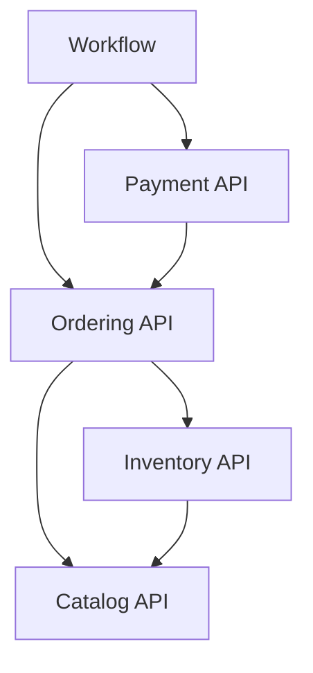

# Backend Ladux — Kiến trúc mục tiêu

## 1. Phạm vi và mức độ xác nhận

Mục tiêu là chuyển dần monolith tổ chức theo tầng kỹ thuật sang module theo nghiệp vụ, giữ một ứng dụng Spring Boot, một PostgreSQL và một Redis. Không tách microservices trong đợt này.

Bộ tài liệu gốc mô tả các package `controller`, `dto`, `model`, `repository`, `service`, `service/impl` và các luồng checkout, tồn kho, VNPay, bảo mật, Flyway, scheduler, Testcontainers. Đây là đầu vào cần xác minh với repository khi triển khai; bản tài liệu cập nhật không phải kết quả kiểm toán mã nguồn đang chạy.

Thứ tự ưu tiên: tính đúng đắn và bảo mật → nhất quán transaction → tương thích API → quyền sở hữu và dependency → cô lập framework → hình thức package. Không đánh đổi bất biến nghiệp vụ để di chuyển class nhanh hơn.

## 2. Cấu trúc mục tiêu

```text
backend/
  AGENT.md
  docs/architecture/
  src/main/java/org/akira/ladux/
    identity/
    catalog/
    ordering/
    payment/
    inventory/
    procurement/
    promotion/
    notification/
    workflow/       # chỉ khi có nhu cầu điều phối cụ thể
    shared/
```

Một module nghiệp vụ có thể có `api/`, `application/`, `domain/`, `infrastructure/`. Trong infrastructure, phân chia `web/`, `persistence/`, `integration/` khi có ích. Output port thuộc `application/port/out/`; adapter tương ứng thuộc infrastructure. Không tạo thư mục trống hoặc interface không có vai trò rõ ràng. Primitive dùng chung được export qua `shared.api`; cấu hình/adapter chung ở `shared.infrastructure` là nội bộ, được framework wiring theo cấu hình đã kiểm chứng, không để business module import trực tiếp.

| Thành phần | Trách nhiệm | Không chứa |
| --- | --- | --- |
| `api` | Contract Java xuất ra ngoài module; command, result, event bất biến | JPA entity, repository, REST controller, kiểu SDK |
| `application` | Use case, phân quyền nghiệp vụ, transaction, điều phối trong module | Chi tiết HTTP, Spring Data implementation, SDK gateway |
| `domain` | Mô hình, bất biến, chuyển trạng thái và chính sách nghiệp vụ | Web, application, adapter, truy cập module khác |
| `infrastructure` | REST, JPA, Redis, gateway, email/SMS, cấu hình adapter | Quyết định nghiệp vụ thay cho use case/domain |

`api` là API Java nội bộ, khác với REST API. Controller thuộc `infrastructure.web`; URL và JSON công khai không cần thay đổi khi đổi package.

## 3. Clean/Hexagonal có chọn lọc

Ưu tiên port cho gateway thanh toán, email/SMS/CAPTCHA/OAuth, Redis và persistence mà application cần dùng. Application gọi abstraction thuộc chính nó hoặc API của module được phép; không import adapter cụ thể.

Không bắt buộc tách một JPA entity thành hai mô hình có cùng thuộc tính. Cho phép annotation JPA trên domain của module nếu thực tế có lợi; entity vẫn là nội bộ và không có association tới entity module khác. Domain thuần framework là lựa chọn riêng cho những phần có chính sách phức tạp, ví dụ tính tiền hoặc trạng thái thanh toán.

Một class `OrderQueries` có thể chứa nhiều truy vấn đơn giản và được controller cùng module gọi trực tiếp. Không bắt buộc một class/interface cho mỗi GET. Tách command riêng khi transaction, invariant, dependency hoặc lý do thay đổi khác nhau. Đối với API chéo module, interface và DTO riêng giúp bảo vệ ranh giới; đối với lời gọi nội bộ đơn giản, một public application service có thể đủ.

Kiểu được dùng từ package khác phải có visibility Java phù hợp. Nếu controller inject trực tiếp application class, class và phương thức cần `public`; nếu inject interface public, implementation có thể package-private khi cơ chế wiring/proxy đã được kiểm chứng.

## 4. Quyền sở hữu và phụ thuộc

Mỗi dữ liệu có một chủ sở hữu logic; dùng chung DB không đồng nghĩa mọi module được đọc/ghi mọi bảng. Tra cứu [ranh giới module](02-module-boundaries.md) trước khi thiết kế API và dùng [ma trận phụ thuộc](03-dependency-rules.md#2-ma-tran-phu-thuoc) làm nguồn duy nhất cho chiều import.

Các module trao đổi ID, snapshot hoặc DTO bất biến, không trao đổi entity hoặc repository. Ordering lưu snapshot tên hàng, SKU, đơn giá, giảm giá, địa chỉ giao hàng tại thời điểm nghiệp vụ yêu cầu; không phụ thuộc việc Catalog/Identity thay đổi dữ liệu sau đó.

## 5. Điều phối nhiều module

`workflow` xử lý các luồng mà việc đặt lời gọi tại một module nghiệp vụ sẽ tạo vòng phụ thuộc. Nó chỉ tổ chức trình tự, transaction bên ngoài và ánh xạ kết quả; mỗi module vẫn tự kiểm tra quyền, invariant và trạng thái mà mình sở hữu. Không module nghiệp vụ nào được import `workflow`.

| Luồng | Nơi vào hệ thống | Cách phối hợp |
| --- | --- | --- |
| Checkout cần tạo order và payment attempt cục bộ nguyên tử | `workflow.infrastructure.web` → `workflow.application` | Gọi `ordering.api` rồi `payment.api` trong một transaction DB |
| Truy vấn sản phẩm kèm availability | Controller/read service của workflow | Gọi batch `catalog.api` và `inventory.api`, ghép DTO theo ID |
| Review cần xác minh đã mua | Workflow | Hỏi `ordering.api`, gọi `catalog.api` với kết quả xác minh; Catalog vẫn sở hữu review |
| Cập nhật điểm Customer từ đơn hàng, nếu tính năng hiện có | Listener của workflow | Nhận event của Ordering, gọi `identity.api`; Identity thực thi ledger/quy tắc điểm |

Không thêm tính năng review/điểm mới chỉ vì có ví dụ. Không lấy tên endpoint làm lý do đặt sai dependency. Controller chuyển sang workflow vẫn giữ REST contract hiện có.

Sơ đồ dưới biểu diễn dependency Java của một phần kiến trúc, không phải thứ tự phát event:



Nếu repository hiện tại đã tách tạo đơn và khởi tạo thanh toán thành hai giao dịch độc lập có chủ đích, giữ semantics đó và ghi nhận baseline. Không tự chuyển một checkout nguyên tử thành hai HTTP request. Khi luồng hiện có yêu cầu cả order và attempt nguyên tử, dùng coordinator ở workflow; không thêm `Ordering → Payment` song song với `Payment → Ordering`.

## 6. Transaction cốt lõi

Transaction do application service ngoài cùng quản lý. Các API tham gia cùng đơn vị nguyên tử dùng transaction manager PostgreSQL tương ứng và propagation tương thích, thường là `REQUIRED`. Lời gọi phải đi qua Spring proxy; self-invocation không tự mở transaction. Lỗi cần rollback phải được ném ra, với cấu hình rollback phù hợp cho checked exception. [Spring: propagation](https://docs.spring.io/spring-framework/reference/data-access/transaction/declarative/tx-propagation.html), [annotation và proxy](https://docs.spring.io/spring-framework/reference/data-access/transaction/declarative/annotations.html).

| Đơn vị nghiệp vụ | Những thay đổi DB cần cùng commit nếu baseline yêu cầu |
| --- | --- |
| Checkout | Order và snapshot, reserve stock/ledger, redeem coupon; thêm local payment attempt nếu có trong checkout |
| Hủy đơn | Chuyển trạng thái, hoàn stock đúng reservation, rollback coupon, ghi lịch sử; refund intent nếu luồng yêu cầu |
| Nhập hàng | Cập nhật lượng đã nhận của PO, stock/ledger, định danh lần nhận |
| IPN thành công | Ghi nhận kết quả payment, áp dụng transition hợp lệ của order, ghi intent xử lý ngoại lệ khi order không còn nhận payment |

Định nghĩa bảng transaction thực tế trước khi refactor: transaction manager, propagation, isolation, thứ tự khóa, rollback, ràng buộc unique, điểm retry. Không dùng `REQUIRES_NEW` cho một bước cần rollback cùng checkout; không bắt lỗi rồi tiếp tục commit một phần.

Giữ thứ tự khóa nhất quán giữa checkout, IPN, cancel, expire và refund. Với nhiều biến thể, khóa theo ID đã sắp xếp. Giảm transaction dài; retry deadlock/serialization phải có giới hạn và chỉ khi toàn thao tác lũy đẳng. [PostgreSQL: locking](https://www.postgresql.org/docs/17/explicit-locking.html).

## 7. I/O bên ngoài và sự kiện

Transaction PostgreSQL không rollback được HTTP tới gateway hoặc email đã gửi. Tạo URL thanh toán bằng ký dữ liệu cục bộ khác với gọi HTTP tạo giao dịch/refund: chỉ thao tác cục bộ, ngắn và xác định mới được cân nhắc trong transaction; remote I/O phải có intent bền, timeout và đối soát phù hợp.

Hiệu ứng bắt buộc không mất phải có outbox hoặc cơ chế event publication bền tương đương, lưu trong cùng transaction với nghiệp vụ, rồi worker/listener xử lý sau commit. Chọn một cơ chế và xác nhận tương thích dependency hiện có; không tự thêm cả hai. Yêu cầu này áp dụng cả trong một JVM. `@TransactionalEventListener(AFTER_COMMIT)` đơn thuần không cung cấp hàng đợi bền hoặc tự động chạy bất đồng bộ. [Spring transactional events](https://docs.spring.io/spring-framework/reference/data-access/transaction/event.html), [Spring Modulith event publication registry](https://docs.spring.io/spring-modulith/reference/events.html).

Không thay reserve/release hoặc redeem/rollback cốt lõi bằng event hậu commit. Notification không được làm transaction đặt hàng thất bại; mức chấp nhận mất thông báo phải được quyết định rõ. Listener hậu commit muốn ghi DB cần transaction mới phù hợp, hoặc một worker mở transaction riêng; không dựa vào tài nguyên còn gắn với transaction đã kết thúc. [TransactionalEventListener Javadoc](https://docs.spring.io/spring-framework/docs/current/javadoc-api/org/springframework/transaction/event/TransactionalEventListener.html).

## 8. Bảo mật, vận hành và khả năng phát triển

Actor đến từ security context đã xác thực hoặc principal của job được cấp quyền; không tin `userId` trong body. Authorization theo đối tượng cần nằm tại use case/API, vì HTTP không phải lối vào duy nhất. Giữ semantics JWT, refresh rotation/revocation, MFA/OTP, OAuth2, CAPTCHA, rate limit và TTL hiện có. Khi dùng method security, xác nhận cấu hình bật thực sự. [Spring Security method security](https://docs.spring.io/spring-security/reference/servlet/authorization/method-security.html).

Giữ tên cache/key, TTL, serializer, ShedLock và scan configuration khi đổi package, hoặc cung cấp kế hoạch tương thích khi triển khai đồng thời hai phiên bản. Redis/cache không là nguồn quyết định cuối cùng về stock, coupon hoặc payment. Lock scheduler không thay thế idempotency; quá thời gian lock có thể dẫn tới chạy chồng. [ShedLock](https://github.com/lukas-krecan/ShedLock).

Theo dõi tối thiểu lỗi chuyển trạng thái, stock conflict, webhook trùng/không hợp lệ, payment/refund chưa rõ kết quả, tuổi/backlog event và retry cạn. Tương quan log qua order ID, payment reference, operation/event ID; không log token, secret, OTP hoặc payload thanh toán nhạy cảm.

Ranh giới ổn định được chứng minh bằng các gate trong [kế hoạch di chuyển](04-migration-plan.md), không chỉ bằng cây package đẹp. Đánh giá nhu cầu scale bằng tải/latency/lock thực tế trước khi cân nhắc microservices.
