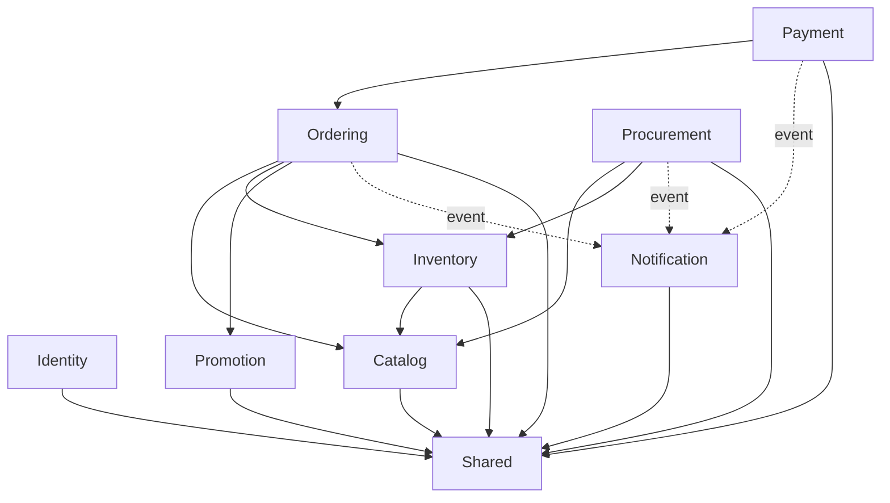

# Backend Ladux — Ranh giới Module

Tài liệu này định nghĩa **quyền sở hữu logic (logical ownership)**.

Khi một class / use case / thao tác sửa đổi dữ liệu chưa rõ thuộc về đâu, không được tạo ngay dependency chéo module. Hãy làm rõ quyền sở hữu trước tiên.

---

## 1. Identity

### Sở hữu

```text
User
Role
Customer
UserAddress
RefreshToken
EmailVerification
PhoneVerification
UserMfaMethod
LoginHistory
SecurityEvent
UserPrincipal
```

### Các use case

- Đăng ký / đăng nhập;
- JWT access token;
- Xoay vòng / thu hồi refresh token (rotation/revocation);
- OAuth2;
- MFA;
- OTP qua email;
- OTP qua điện thoại;
- Xác minh / đổi mật khẩu;
- Tài khoản / hồ sơ / địa chỉ;
- Lịch sử đăng nhập;
- Xử lý sự kiện bảo mật;
- Truy vấn vai trò (role).

### Các adapter bên ngoài

```text
Email sender
SMS / nhà cung cấp OTP qua điện thoại
CAPTCHA
Các nhà cung cấp OAuth
Thử thách MFA lưu trên Redis
```

Việc gửi OTP / email phục vụ riêng cho bảo mật có thể tiếp tục đặt bên trong Identity thay vì ép buộc phải đi qua Notification.

---

## 2. Catalog

### Sở hữu

```text
Product
ProductVariant
ProductImage
Brand
Category
Color
Review
Wishlist
```

### Các use case

- CRUD sản phẩm;
- Truy vấn / tìm kiếm sản phẩm;
- Quản lý biến thể;
- Thương hiệu / danh mục / màu sắc;
- Hình ảnh;
- Đánh giá (review);
- Danh sách yêu thích (wishlist);
- Thông tin giá hiển thị trên catalog.

### Ranh giới quan trọng

`ProductVariant.stockQuantity` là điểm nóng mô hình hóa vật lý.

Quyền sở hữu logic:

```text
Catalog sở hữu danh tính và cấu hình của biến thể.

Inventory sở hữu toàn bộ ngữ nghĩa thay đổi tồn kho.
```

Không thay đổi ngay schema DB.

Trước mắt, hãy đảm bảo mọi thao tác ghi dữ liệu tồn kho đều phải thông qua Inventory.

---

## 3. Ordering

### Sở hữu

```text
Cart
CartItem
Order
OrderItem
OrderHistory
ShippingAddress
OrderStatus
```

### Các use case

- Giỏ hàng (cart);
- Thanh toán đặt hàng (checkout);
- Tạo đơn hàng;
- Truy vấn đơn hàng;
- Máy trạng thái đơn hàng (order state machine);
- Hủy đơn hàng;
- Trả hàng;
- Lịch sử đơn hàng.

### Được phép phụ thuộc vào

```text
Catalog.api
Inventory.api
Promotion.api
Actor / user ID từ Identity
```

### Nghiêm cấm phụ thuộc vào

```text
CatalogRepository
ProductVariantRepository
CouponRepository
Chi tiết triển khai persistence của Inventory
```

---

## 4. Payment

### Sở hữu

```text
Payment
PaymentStatus
PaymentProvider
Mã tham chiếu giao dịch phía merchant (merchant transaction reference)
Vòng đời lần thử thanh toán (payment attempt lifecycle)
Xử lý webhook / đảm bảo tính idempotency từ cổng thanh toán
Điều phối hoàn tiền (refund orchestration)
```

### Phụ thuộc công khai

```text
Payment -> Ordering.api
```

Payment không được gọi trực tiếp `OrderRepository` sau khi đã di chuyển.

### Ranh giới bên ngoài

```text
PaymentGatewayPort
    |
    +-- VNPayAdapter
```

Các nhà cung cấp trong tương lai như MoMo phải là các adapter mới, không được rẽ nhánh trực tiếp bên trong core use case thanh toán.

---

## 5. Inventory

### Sở hữu

```text
StockMovement
StockMovementType
StockReferenceType
Thay đổi tồn kho (stock mutation)
Khả năng cung ứng (availability)
Giữ hàng (reservation)
Giải phóng hàng (release)
Nhập kho (receiving)
Điều chỉnh kho (adjustment)
Sổ cái tồn kho (stock ledger)
```

### Các thao tác công khai

Khuyến nghị:

```text
reserveForOrder(...)
releaseForOrder(...)
receivePurchase(...)
adjustStock(...)
getAvailability(...)
```

### Quy tắc sở hữu cốt lõi

Các module khác không được phép trực tiếp cập nhật số lượng tồn kho.

```text
Ordering    -> Inventory.api
Procurement -> Inventory.api
```

---

## 6. Procurement

### Sở hữu

```text
Supplier
ProductSupplier
PurchaseOrder
PurchaseOrderItem
PurchaseOrderStatus
```

### Các use case

- Quản lý nhà cung cấp;
- Mối quan hệ sản phẩm - nhà cung cấp;
- Tạo đơn mua hàng (purchase order);
- Phê duyệt / cập nhật đơn mua hàng;
- Nhập kho một phần;
- Nhập kho toàn bộ.

### Phụ thuộc vào

```text
Catalog.api
Inventory.api
Actor ID từ Identity
```

Quy trình nhập kho:

```text
Procurement
    |
    +--> Inventory.receivePurchase(...)
```

Procurement tuyệt đối không được sửa đổi trực tiếp `ProductVariant.stockQuantity`.

---

## 7. Promotion

### Sở hữu

```text
Coupon
DiscountType
Thời hạn coupon
Giới hạn sử dụng
Quy tắc áp dụng mã (redemption rules)
Quy tắc hoàn trả mã (rollback rules)
```

API công khai khuyến nghị:

```text
PromotionOperations
├── quote(...)
├── redeem(...)
└── rollback(...)
```

Ordering không được sử dụng `CouponRepository` sau khi di chuyển.

Promotion không được phụ thuộc vào JPA entity của Ordering.

Sử dụng các giá trị dữ liệu bất biến:

```text
orderId
userId
couponCode
amount
```

---

## 8. Notification

### Sở hữu

```text
Notification
NotificationType
Thông báo nghiệp vụ chung
Hành vi thông báo liên hệ / hỗ trợ
```

Khuyến nghị dùng sự kiện (event-driven) cho các tác vụ phụ (side effects):

```text
OrderDeliveredEvent
OrderCancelledEvent
PaymentSucceededEvent
```

Tuyệt đối không dùng luồng thông báo/sự kiện bất đồng bộ để thay thế các thao tác có tính nhất quán sống còn của kho / coupon / đơn hàng.

---

## 9. Shared

Package `shared` được chủ động giữ ở mức tối giản.

Các ví dụ được phép:

```text
shared/
├── error/
├── pagination/
├── time/
└── common primitives/
```

Các ví dụ bị cấm:

```text
OrderService
ProductRepository
Payment
Coupon
Quy tắc nghiệp vụ của User
```

Quy tắc:

```text
business module -> shared
shared -X-> business module
```

---

## 10. Bảng ma trận sở hữu

| Khái niệm | Chủ sở hữu logic | Cách truy cập từ bên ngoài |
|---|---|---|
| User / tài khoản / bảo mật | Identity | ID / `identity.api` |
| Sản phẩm (Product) | Catalog | `catalog.api` |
| Biến thể sản phẩm (ProductVariant) | Catalog | ID / immutable view |
| Biến động tồn kho | Inventory | `inventory.api` |
| Giỏ hàng / Đơn hàng | Ordering | `ordering.api` |
| Thanh toán | Payment | Application/API của payment |
| Mã giảm giá (Coupon) | Promotion | `promotion.api` |
| Nhà cung cấp / Đơn mua hàng | Procurement | Application/API của procurement |
| Thông báo | Notification | Event / API |
| Kiểu dữ liệu chung về lỗi / phân trang | Shared | Shared type |

---

## 11. Biểu đồ phụ thuộc mục tiêu



---

## 12. Quy tắc dữ liệu chéo module

Không để lộ entity:

```java
public interface InventoryApi {
    ProductVariant reserve(ProductVariant variant, int quantity);
}
```

Ưu tiên sử dụng contract bất biến:

```java
public interface InventoryApi {
    StockReservation reserve(ReserveStockCommand command);
}

public record ReserveStockCommand(
        Integer variantId,
        int quantity,
        String referenceType,
        Integer referenceId
) {}
```

---

## 13. Quy tắc sử dụng Event

Sử dụng API đồng bộ cho các bất biến (invariants) bắt buộc phải thành công hoặc thất bại một cách nguyên tử:

```text
giữ tồn kho (stock reservation)
giải phóng tồn kho (stock release)
áp dụng coupon (coupon redeem)
hoàn trả coupon (coupon rollback)
chuyển đổi trạng thái đơn hàng quan trọng
```

Sử dụng event cho các tác vụ phụ có thể diễn ra sau khi transaction đã commit thành công:

```text
thông báo (notification)
phân tích số liệu (analytics)
đánh chỉ mục tìm kiếm (search indexing)
cập nhật điểm thưởng không quan trọng
```

Nếu trong tương lai cần đảm bảo chuyển phát tin cậy qua ranh giới tiến trình, hãy chủ động đưa vào mẫu Transactional Outbox một cách có tính toán.
