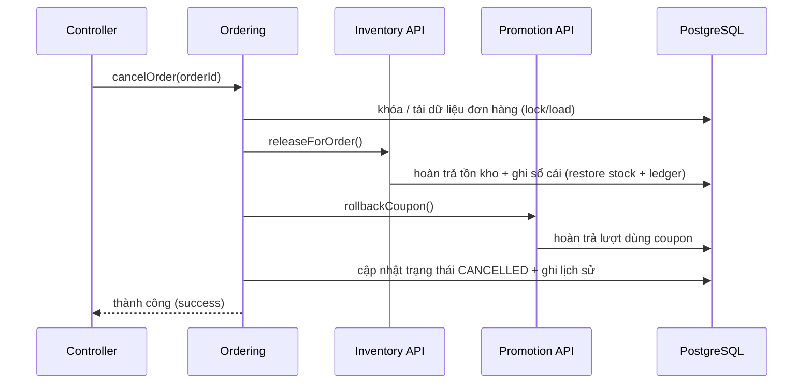

# Backend Ladux — Các ví dụ Tái cấu trúc (Refactor Examples)

Các ví dụ này minh họa cho mẫu di chuyển chuẩn:

```text
tạo ranh giới (seam)
    ->
điều hướng phụ thuộc
    ->
di chuyển code nội bộ
    ->
thực thi ranh giới
```

Đây là các ví dụ minh họa phương pháp, không phải chỉ dẫn để sao chép nguyên xi tên lớp.

---

## 1. Controller truy cập trực tiếp repository

### Trước khi sửa

```java
@RestController
@RequiredArgsConstructor
class AdminRoleController {

    private final RoleRepository roleRepository;

    @GetMapping
    public ResponseEntity<List<RoleResponse>> getAllRoles() {
        return ResponseEntity.ok(
                roleRepository.findAll()
                        .stream()
                        .map(RoleResponse::fromEntity)
                        .toList()
        );
    }
}
```

Vấn đề:

```text
HTTP adapter -> persistence
```

### Trạng thái mục tiêu

```text
identity/
├── application/
│   └── RoleQueryUseCase.java
└── infrastructure/
    ├── web/
    │   └── AdminRoleController.java
    └── persistence/
```

Use case:

```java
public interface RoleQueryUseCase {

    List<RoleView> getRoles();

    record RoleView(Integer id, String name) {}
}
```

Controller:

```java
@RestController
@RequiredArgsConstructor
class AdminRoleController {

    private final RoleQueryUseCase roleQueryUseCase;

    @GetMapping
    ResponseEntity<List<RoleResponse>> getAllRoles() {
        return ResponseEntity.ok(
                roleQueryUseCase.getRoles()
                        .stream()
                        .map(it -> new RoleResponse(it.id(), it.name()))
                        .toList()
        );
    }
}
```

---

## 2. Thanh toán và VNPay

### Mô hình khái niệm trước khi sửa

```text
PaymentServiceImpl
    |
    +--> PaymentRepository
    +--> OrderRepository
    +--> VNPayPaymentUrlService
             |
             +--> VNPayProperties
             +--> VNPayUtils
```

### Trạng thái mục tiêu

```text
payment/
├── api/
├── application/
│   ├── PaymentApplicationService.java
│   └── port/out/
│       └── PaymentGatewayPort.java
├── domain/
└── infrastructure/
    ├── persistence/
    └── integration/vnpay/
        ├── VNPayAdapter.java
        ├── VNPayProperties.java
        └── VNPaySigner.java
```

Port:

```java
public interface PaymentGatewayPort {

    PaymentRedirect createPayment(PaymentGatewayRequest request);

    record PaymentGatewayRequest(
            String merchantTransactionReference,
            long amountInMinorUnit,
            String orderDescription,
            String clientIp
    ) {}

    record PaymentRedirect(String url) {}
}
```

Application:

```java
@Service
@RequiredArgsConstructor
class PaymentApplicationService {

    private final OrderingPaymentApi orderingPaymentApi;
    private final PaymentStore paymentStore;
    private final PaymentGatewayPort paymentGateway;

    @Transactional
    public PaymentResult createPayment(
            Integer userId,
            CreatePaymentCommand command
    ) {
        var order = orderingPaymentApi.getPayableOrder(
                command.orderId(),
                userId
        );

        var payment = paymentStore.createPending(
                order.orderId(),
                order.amount()
        );

        var redirect = paymentGateway.createPayment(
                new PaymentGatewayPort.PaymentGatewayRequest(
                        payment.merchantReference(),
                        payment.amountInMinorUnit(),
                        "Thanh toan don hang " + order.orderId(),
                        command.clientIp()
                )
        );

        return new PaymentResult(payment.id(), redirect.url());
    }
}
```

VNPay adapter:

```java
@Component
@RequiredArgsConstructor
class VNPayAdapter implements PaymentGatewayPort {

    private final VNPayProperties properties;

    @Override
    public PaymentRedirect createPayment(PaymentGatewayRequest request) {
        return new PaymentRedirect(buildUrl(request));
    }
}
```

---

## 3. Vòng đời đơn hàng (Order lifecycle)

### Mô hình liên kết hiện tại

Về mặt khái niệm:

```text
OrderLifecycleServiceImpl
├── ProductVariantRepository
├── CouponRepository
├── StockMovementService
└── OrderRepository
```

Yêu cầu then chốt không đơn thuần là dọn dẹp cấu trúc package.

Quá trình di chuyển bắt buộc phải bảo toàn tính nguyên tử (atomic).

### Trạng thái mục tiêu

```text
ordering/application/OrderLifecycleService
    |
    +--> InventoryOperations
    +--> PromotionOperations
    +--> Ordering persistence
```

Mã giả:

```java
@Service
@RequiredArgsConstructor
class OrderLifecycleService {

    private final InventoryOperations inventory;
    private final PromotionOperations promotion;
    private final OrderStore orderStore;

    @Transactional
    public void cancelOrder(Integer orderId, String reason) {

        Order order = orderStore.findForUpdate(orderId);

        if (order.isCancelled()) {
            return;
        }

        order.ensureCancellable();

        inventory.releaseForOrder(
                ReleaseOrderStockCommand.from(order)
        );

        if (order.couponId() != null) {
            promotion.rollback(
                    new RollbackCouponCommand(
                            order.couponId(),
                            order.id()
                    )
            );
        }

        order.cancel(reason);
        orderStore.save(order);
    }
}
```

Việc triển khai của Inventory và Promotion cần tham gia vào cùng transaction nếu vẫn yêu cầu rollback nguyên tử.

Việc gửi thông báo có thể phát ra sau khi transaction commit thành công.

---

## 4. Nhập hàng trong Procurement

### Trước khi sửa (khái niệm)

```text
PurchaseOrderServiceImpl
├── SupplierRepository
├── ProductVariantRepository
├── ProductSupplierRepository
├── UserRepository
└── StockMovementService
```

### Trạng thái mục tiêu

```text
procurement/application/ReceivePurchaseOrderUseCase
├── ProcurementStore
├── CatalogVariantQuery
└── InventoryReceivingOperations
```

Ví dụ command:

```java
public record ReceivePurchaseStockCommand(
        Integer purchaseOrderId,
        Integer variantId,
        int quantity,
        Integer receivedByUserId
) {}
```

Sử dụng:

```java
inventoryReceivingOperations.receivePurchase(
        new ReceivePurchaseStockCommand(
                purchaseOrder.id(),
                variantId,
                quantity,
                actorUserId
        )
);
```

Procurement tuyệt đối không được cập nhật trực tiếp số lượng tồn kho.

---

## 5. Rò rỉ DTO chéo module

### Vấn đề

Một response trong Ordering có thể đang phụ thuộc trực tiếp vào entity hoặc đồ thị đối tượng của Catalog.

Ví dụ anti-pattern:

```java
public record OrderItemResponse(
        Integer id,
        ProductResponse product
) {
    public static OrderItemResponse fromEntity(OrderItem item) {
        return new OrderItemResponse(
                item.getId(),
                ProductResponse.fromEntity(item.getProduct())
        );
    }
}
```

### Định hướng dài hạn tốt hơn

Ordering sở hữu dữ liệu item ổn định hoặc các trường snapshot sản phẩm tại thời điểm mua.

Ví dụ:

```java
public record OrderedProductView(
        Integer productId,
        Integer variantId,
        String productName,
        String sku
) {}
```

Response gợi ý:

```java
public record OrderItemResponse(
        Integer id,
        Integer productId,
        Integer variantId,
        String productName,
        String sku,
        int quantity,
        BigDecimal priceAtPurchase
) {}
```

Không phá vỡ contract API frontend hiện có trong đợt di chuyển thuần túy về package.

Hãy tách rời sự liên kết nội bộ trước. Việc thay đổi API công khai chỉ thực hiện trong một task riêng về tương thích nếu cần thiết.

---

## 6. Điểm nóng tồn kho giữa Catalog và Inventory

### Mô hình vật lý hiện tại

```text
ProductVariant
└── stockQuantity
```

### Mục tiêu logic

```text
Catalog sở hữu:
├── variant identity
├── SKU
├── configuration
└── price metadata

Inventory sở hữu:
├── availability
├── reserve
├── release
├── receive
├── adjust
└── stock ledger
```

Chuyển đổi:

```text
Ordering
    |
    v
InventoryOperations.reserve(...)
    |
    v
Inventory persistence adapter
    |
    v
product_variants.stock_quantity hiện có
```

Không cần tạo thêm bảng mới trong giai đoạn kiến trúc đầu tiên này.

---

## 7. Di chuyển package từng bước

Trạng thái lai trung gian là hoàn toàn được chấp nhận.

Ví dụ sau khi Catalog hoàn thành di chuyển:

```text
org/akira/ladux/
├── catalog/
│   ├── api/
│   ├── application/
│   ├── domain/
│   └── infrastructure/
├── controller/      # code legacy của các module khác
├── service/         # code legacy của các module khác
├── repository/      # code legacy của các module khác
└── model/           # code legacy của các module khác
```

Không bắt buộc tất cả các module phải di chuyển cùng lúc trong một PR.

---

## 8. Quy tắc phụ thuộc của Payment

```java
@Test
void paymentMustNotDependOnOrderingImplementation() {
    noClasses()
            .that().resideInAPackage("org.akira.ladux.payment..")
            .should().dependOnClassesThat()
            .resideInAnyPackage(
                    "org.akira.ladux.ordering.application..",
                    "org.akira.ladux.ordering.domain..",
                    "org.akira.ladux.ordering.infrastructure.."
            )
            .check(classes);
}
```

Payment vẫn được phép sử dụng:

```text
org.akira.ladux.ordering.api..
```

---

## 9. Sơ đồ tuần tự — Hủy đơn hàng (Order cancellation)



Mục tiêu của đợt di chuyển là tái cấu trúc ranh giới phụ thuộc nhưng vẫn bảo toàn đầy đủ các ngữ nghĩa nhất quán bắt buộc.

---

## 10. Checklist cho một ranh giới Hexagonal

- [ ] Hành vi hiện tại đã có bài kiểm thử đặc tả (characterization test).
- [ ] Module sở hữu đã được xác định rõ ràng.
- [ ] Port được định nghĩa ở phía application.
- [ ] Port sử dụng các kiểu dữ liệu hướng nghiệp vụ.
- [ ] Các kiểu SDK của bên thứ ba không bị rò rỉ vào bên trong.
- [ ] Adapter đóng gói trọn vẹn chi tiết kỹ thuật của nhà cung cấp/framework.
- [ ] Tầng application không import trực tiếp adapter.
- [ ] Ngữ nghĩa transaction không bị thay đổi.
- [ ] Contract REST không bị thay đổi.
- [ ] Không phát sinh DB migration không cần thiết.
- [ ] ArchUnit bảo vệ ranh giới mới.
- [ ] Toàn bộ test đều pass.
