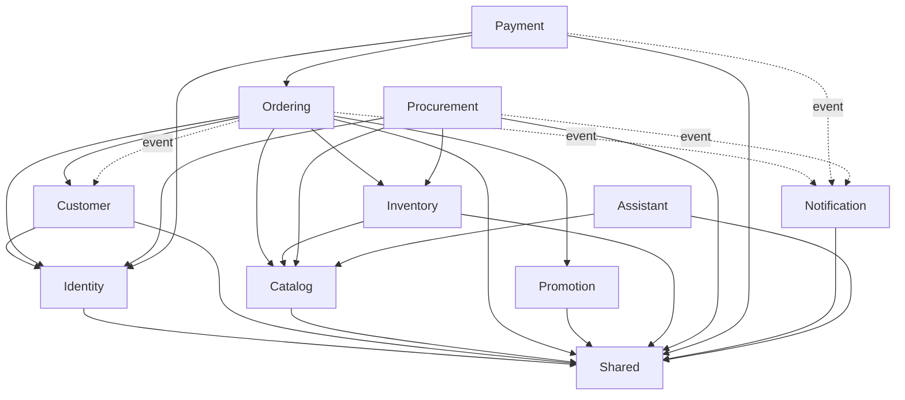

# Ladux Backend — Target Project Structure

> **Status:** Target structure  
> **Architecture:** Modular Monolith by business capability + selective Clean/Hexagonal Architecture  
> **Scope:** `backend/`  
> **Package root:** `org.akira.ladux`  
> **Rulebook:** `backend/AGENT.md`

---

## 1. Mục tiêu

Ladux giữ nguyên là **một Spring Boot application, một deployable unit, một PostgreSQL chính, một Redis dùng chung**, nhưng source code được chia theo **nghiệp vụ** thay vì chia toàn cục theo technical layer.

Không tiếp tục tổ chức chính theo:

```text
controller/
dto/
model/
repository/
service/
service/impl/
```

Không tách sang microservices trong giai đoạn này.

Target:

```text
org.akira.ladux
├── identity/
├── customer/
├── catalog/
├── ordering/
├── promotion/
├── inventory/
├── procurement/
├── payment/
├── notification/
├── assistant/
└── shared/
```

---

## 2. Cấu trúc repository mục tiêu

```text
backend/
│
├── AGENT.md
├── pom.xml
├── mvnw
├── mvnw.cmd
├── Dockerfile
├── docker-compose.yml
├── docker-compose.prod.yml
│
├── caddy/
│   └── Caddyfile
│
├── docs/
│   └── architecture/
│       ├── README.md
│       ├── 01-target-architecture.md
│       ├── 02-module-boundaries.md
│       ├── 03-dependency-rules.md
│       ├── 04-migration-plan.md
│       ├── 05-archunit-rules.md
│       ├── 06-examples-refactor.md
│       ├── 08-target-project-structure.md
│       └── 07-adr/
│           └── ADR-001-modular-monolith.md
│
├── scripts/
│   └── validate-production-env.ps1
│
└── src/
    ├── main/
    │   ├── java/
    │   │   └── org/akira/ladux/
    │   │       ├── LaduxApplication.java
    │   │       ├── identity/
    │   │       ├── customer/
    │   │       ├── catalog/
    │   │       ├── ordering/
    │   │       ├── promotion/
    │   │       ├── inventory/
    │   │       ├── procurement/
    │   │       ├── payment/
    │   │       ├── notification/
    │   │       ├── assistant/
    │   │       └── shared/
    │   │
    │   └── resources/
    │       ├── application.properties
    │       ├── application-dev.properties
    │       ├── application-prod.properties
    │       └── db/
    │           ├── migration/
    │           └── devdata/
    │
    └── test/
        ├── java/
        │   └── org/akira/ladux/
        │       ├── architecture/
        │       ├── identity/
        │       ├── customer/
        │       ├── catalog/
        │       ├── ordering/
        │       ├── promotion/
        │       ├── inventory/
        │       ├── procurement/
        │       ├── payment/
        │       ├── notification/
        │       └── assistant/
        └── resources/
            └── application-test.properties
```

---

## 3. Template chuẩn cho một business module

```text
<module>/
│
├── api/
│   ├── command/
│   ├── query/
│   ├── event/
│   └── model/
│
├── application/
│   ├── command/
│   ├── query/
│   ├── service/
│   └── port/
│       └── out/
│
├── domain/
│   ├── model/
│   ├── repository/
│   ├── service/
│   └── event/
│
└── infrastructure/
    ├── web/
    │   ├── admin/
    │   ├── user/
    │   └── dto/
    │       ├── request/
    │       └── response/
    ├── persistence/
    │   ├── repository/
    │   └── adapter/
    ├── integration/
    ├── cache/
    └── scheduling/
```

Không bắt buộc module nào cũng phải có đủ mọi folder.

Nguyên tắc:

```text
không tạo abstraction nếu không có boundary thực sự
không tạo interface chỉ để có Service + ServiceImpl
không tạo mapper/domain-model/JPA-model kép ở mọi nơi chỉ vì Clean Architecture
```

---

## 4. Dependency direction

Trong module:

```text
infrastructure
      |
      v
application
      |
      v
domain
```

Cross-module:

```text
module A -> module B.api
```

Không cho phép:

```text
module A -> module B.infrastructure
module A -> module B.persistence
module A -> module B repository
module A -> module B internal JPA entity
controller -> repository
shared -> business module
```

---

# 5. Identity

Identity chịu trách nhiệm:

```text
authentication
authorization support
User account security
Role
JWT
Refresh Token
OAuth2
MFA
email verification
phone verification
password verification
login/rate limiting
security events
login history
```

Target:

```text
identity/
├── api/
│   ├── IdentityQuery.java
│   ├── CurrentUserView.java
│   └── UserAccountStatusView.java
│
├── application/
│   ├── command/
│   │   ├── LoginUseCase.java
│   │   ├── RegisterUseCase.java
│   │   ├── LogoutUseCase.java
│   │   ├── RefreshSessionUseCase.java
│   │   ├── ChangePasswordUseCase.java
│   │   ├── VerifyEmailUseCase.java
│   │   ├── VerifyPhoneUseCase.java
│   │   └── VerifyMfaUseCase.java
│   ├── query/
│   │   ├── GetCurrentAccountUseCase.java
│   │   └── GetLoginHistoryUseCase.java
│   └── port/out/
│       ├── EmailOtpSenderPort.java
│       ├── PhoneOtpProviderPort.java
│       ├── CaptchaPort.java
│       ├── MfaChallengeStore.java
│       └── SecurityEventSink.java
│
├── domain/
│   ├── model/
│   │   ├── User.java
│   │   ├── Role.java
│   │   ├── RefreshToken.java
│   │   ├── EmailVerification.java
│   │   ├── PhoneVerification.java
│   │   ├── UserMfaMethod.java
│   │   ├── LoginHistory.java
│   │   └── SecurityEvent.java
│   └── repository/
│
└── infrastructure/
    ├── web/
    │   ├── AuthController.java
    │   ├── AdminAuthController.java
    │   └── dto/
    ├── persistence/
    ├── security/
    │   ├── SecurityConfig.java
    │   ├── JwtFilter.java
    │   ├── UserPrincipal.java
    │   ├── PasswordEncoderConfig.java
    │   ├── OAuth2SuccessHandler.java
    │   └── OAuth2FailureHandler.java
    ├── ratelimit/
    │   ├── EndpointRateLimitFilter.java
    │   └── RedisRateLimitAdapter.java
    └── integration/
        ├── email/
        │   └── GmailEmailOtpSender.java
        ├── phone/
        │   ├── DevPhoneOtpProvider.java
        │   ├── DisabledPhoneOtpProvider.java
        │   └── SomePhoneOtpProviderImpl.java
        └── oauth/
            └── GoogleOAuth2Adapter.java
```

---

# 6. Customer

Customer chịu trách nhiệm:

```text
Customer
UserAddress
customer profile
loyalty points
customer level
total spent
```

Target:

```text
customer/
├── api/
│   ├── CustomerQuery.java
│   ├── CustomerView.java
│   └── CustomerLoyaltyOperations.java
├── application/
│   ├── command/
│   ├── query/
│   └── listener/
│       └── OrderDeliveredLoyaltyListener.java
├── domain/
│   ├── model/
│   │   ├── Customer.java
│   │   ├── UserAddress.java
│   │   └── CustomerLevel.java
│   └── repository/
└── infrastructure/
    ├── web/
    │   ├── CustomerController.java
    │   ├── UserAddressController.java
    │   ├── AdminCustomerController.java
    │   └── AdminUserAddressController.java
    └── persistence/
```

Identity sở hữu account/security.

Customer sở hữu CRM/profile.

---

# 7. Catalog

Catalog sở hữu:

```text
Product
ProductVariant
ProductImage
Brand
Category
Color
Review
Wishlist
current selling price policy
```

Target:

```text
catalog/
├── api/
│   ├── CatalogProductQuery.java
│   ├── CatalogVariantQuery.java
│   ├── ProductView.java
│   ├── VariantView.java
│   └── PriceView.java
├── application/
│   ├── command/
│   ├── query/
│   └── port/out/
│       └── ProductMediaStoragePort.java
├── domain/
│   ├── model/
│   │   ├── Product.java
│   │   ├── ProductVariant.java
│   │   ├── ProductImage.java
│   │   ├── Brand.java
│   │   ├── Category.java
│   │   ├── Color.java
│   │   ├── Review.java
│   │   └── Wishlist.java
│   ├── service/
│   │   └── PricingPolicy.java
│   └── repository/
└── infrastructure/
    ├── web/
    │   ├── user/
    │   │   ├── ProductController.java
    │   │   ├── BrandController.java
    │   │   ├── CategoryController.java
    │   │   ├── ProductImageController.java
    │   │   ├── ReviewController.java
    │   │   └── WishlistController.java
    │   ├── admin/
    │   │   ├── AdminProductController.java
    │   │   ├── AdminProductVariantController.java
    │   │   ├── AdminProductImageController.java
    │   │   ├── AdminBrandController.java
    │   │   ├── AdminCategoryController.java
    │   │   ├── AdminColorController.java
    │   │   └── AdminReviewController.java
    │   └── dto/
    ├── persistence/
    ├── cache/
    └── storage/
```

Lưu ý:

```text
ProductVariant.stockQuantity
```

có thể vẫn nằm vật lý ở bảng hiện tại trong giai đoạn migrate, nhưng **Inventory mới là owner logic của stock mutation**.

---

# 8. Ordering

Ordering sở hữu:

```text
Cart
CartItem
Order
OrderItem
OrderHistory
ShippingAddress
OrderStatus
checkout
order lifecycle
state machine
returns
```

Target:

```text
ordering/
├── api/
│   ├── OrderingPaymentApi.java
│   ├── OrderView.java
│   ├── PayableOrderView.java
│   └── event/
│       ├── OrderDeliveredEvent.java
│       ├── OrderCancelledEvent.java
│       └── OrderReturnedEvent.java
├── application/
│   ├── command/
│   │   ├── AddCartItemUseCase.java
│   │   ├── UpdateCartItemUseCase.java
│   │   ├── RemoveCartItemUseCase.java
│   │   ├── CheckoutUseCase.java
│   │   ├── CancelOrderUseCase.java
│   │   ├── UpdateOrderStatusUseCase.java
│   │   ├── RequestReturnUseCase.java
│   │   └── ProcessReturnUseCase.java
│   ├── query/
│   │   ├── GetCartUseCase.java
│   │   ├── GetOrderUseCase.java
│   │   ├── GetOrdersUseCase.java
│   │   └── GetOrderHistoryUseCase.java
│   └── service/
│       ├── OrderLifecycleService.java
│       └── OrderStateMachine.java
├── domain/
│   ├── model/
│   │   ├── Cart.java
│   │   ├── CartItem.java
│   │   ├── Order.java
│   │   ├── OrderItem.java
│   │   ├── OrderHistory.java
│   │   ├── ShippingAddress.java
│   │   └── OrderStatus.java
│   └── repository/
└── infrastructure/
    ├── web/
    │   ├── user/
    │   │   ├── CartController.java
    │   │   ├── OrderController.java
    │   │   └── OrderHistoryController.java
    │   ├── admin/
    │   │   ├── AdminOrderController.java
    │   │   ├── AdminOrderHistoryController.java
    │   │   └── AdminOrderItemController.java
    │   └── dto/
    ├── persistence/
    ├── cache/
    └── scheduling/
        └── ExpirePendingOrdersJob.java
```

Ordering phụ thuộc:

```text
Catalog.api
Inventory.api
Promotion.api
Customer.api / Identity.api khi thật sự cần
```

Không phụ thuộc repository của module khác.

---

# 9. Promotion

```text
promotion/
├── api/
│   ├── PromotionOperations.java
│   ├── RedeemCouponCommand.java
│   ├── RollbackCouponCommand.java
│   └── CouponRedemptionResult.java
├── application/
│   ├── command/
│   │   ├── CreateCouponUseCase.java
│   │   ├── UpdateCouponUseCase.java
│   │   ├── DeleteCouponUseCase.java
│   │   └── RedeemCouponUseCase.java
│   └── query/
│       └── GetCouponUseCase.java
├── domain/
│   ├── model/
│   │   ├── Coupon.java
│   │   └── DiscountType.java
│   └── repository/
└── infrastructure/
    ├── web/
    │   ├── CouponController.java
    │   ├── AdminCouponController.java
    │   └── dto/
    ├── persistence/
    └── cache/
```

Ordering chỉ được gọi qua `PromotionOperations`.

---

# 10. Inventory

Inventory sở hữu:

```text
stock availability
reserve
release
receive
manual adjustment
StockMovement
immutable stock ledger
```

Target:

```text
inventory/
├── api/
│   ├── InventoryOperations.java
│   ├── InventoryQuery.java
│   ├── ReserveStockCommand.java
│   ├── ReleaseStockCommand.java
│   ├── ReceiveStockCommand.java
│   ├── AdjustStockCommand.java
│   └── StockReservation.java
├── application/
│   ├── command/
│   │   ├── ReserveStockUseCase.java
│   │   ├── ReleaseStockUseCase.java
│   │   ├── ReceiveStockUseCase.java
│   │   └── AdjustStockUseCase.java
│   └── query/
│       ├── GetStockAvailabilityUseCase.java
│       └── GetStockMovementsUseCase.java
├── domain/
│   ├── model/
│   │   ├── StockMovement.java
│   │   ├── StockMovementType.java
│   │   └── StockReferenceType.java
│   ├── service/
│   │   └── StockPolicy.java
│   └── repository/
└── infrastructure/
    ├── web/
    │   ├── AdminStockMovementController.java
    │   └── dto/
    ├── persistence/
    └── cache/
```

Critical rule:

```text
Ordering    -> Inventory.api
Procurement -> Inventory.api
```

Mọi stock mutation phải đi qua Inventory.

---

# 11. Procurement

```text
procurement/
├── api/
│   ├── ProcurementQuery.java
│   └── SupplierView.java
├── application/
│   ├── command/
│   │   ├── CreateSupplierUseCase.java
│   │   ├── UpdateSupplierUseCase.java
│   │   ├── CreatePurchaseOrderUseCase.java
│   │   ├── ApprovePurchaseOrderUseCase.java
│   │   ├── ReceivePurchaseOrderUseCase.java
│   │   └── UpdatePurchaseOrderStatusUseCase.java
│   └── query/
│       ├── GetSuppliersUseCase.java
│       └── GetPurchaseOrdersUseCase.java
├── domain/
│   ├── model/
│   │   ├── Supplier.java
│   │   ├── ProductSupplier.java
│   │   ├── PurchaseOrder.java
│   │   ├── PurchaseOrderItem.java
│   │   └── PurchaseOrderStatus.java
│   └── repository/
└── infrastructure/
    ├── web/
    │   ├── AdminSupplierController.java
    │   ├── AdminProductSupplierController.java
    │   ├── AdminPurchaseOrderController.java
    │   └── dto/
    └── persistence/
```

Dependencies:

```text
Procurement -> Catalog.api
Procurement -> Inventory.api
```

---

# 12. Payment

Payment là module nên áp dụng Hexagonal rõ nhất.

```text
payment/
├── api/
│   ├── PaymentQuery.java
│   ├── PaymentView.java
│   └── event/
│       ├── PaymentSucceededEvent.java
│       ├── PaymentFailedEvent.java
│       └── PaymentRefundedEvent.java
├── application/
│   ├── command/
│   │   ├── CreatePaymentUseCase.java
│   │   ├── ProcessPaymentWebhookUseCase.java
│   │   └── RefundPaymentUseCase.java
│   ├── query/
│   │   └── GetPaymentUseCase.java
│   └── port/out/
│       └── PaymentGatewayPort.java
├── domain/
│   ├── model/
│   │   ├── Payment.java
│   │   ├── PaymentStatus.java
│   │   └── PaymentProvider.java
│   └── repository/
└── infrastructure/
    ├── web/
    │   ├── PaymentController.java
    │   ├── PaymentWebhookController.java
    │   ├── AdminPaymentController.java
    │   └── dto/
    ├── persistence/
    └── integration/
        └── vnpay/
            ├── VNPayAdapter.java
            ├── VNPayProperties.java
            ├── VNPaySigner.java
            ├── VNPayRequestMapper.java
            └── VNPayWebhookVerifier.java
```

Dependency:

```text
Payment -> Ordering.api
```

Không:

```text
Payment -> OrderRepository
```

---

# 13. Notification

```text
notification/
├── api/
│   └── NotificationOperations.java
├── application/
│   ├── command/
│   │   ├── MarkNotificationReadUseCase.java
│   │   ├── DeleteNotificationUseCase.java
│   │   └── SendContactMessageUseCase.java
│   └── listener/
│       ├── OrderEventNotificationListener.java
│       └── PaymentEventNotificationListener.java
├── domain/
│   ├── model/
│   │   ├── Notification.java
│   │   └── NotificationType.java
│   └── repository/
└── infrastructure/
    ├── web/
    │   ├── NotificationController.java
    │   ├── AdminNotificationController.java
    │   ├── ContactController.java
    │   └── dto/
    ├── persistence/
    └── integration/
        └── mail/
            └── ContactMailAdapter.java
```

Security OTP email vẫn thuộc Identity.

---

# 14. Assistant

AI chatbot/embedding là capability riêng:

```text
assistant/
├── api/
│   └── AssistantQuery.java
├── application/
│   ├── command/
│   │   ├── IndexProductUseCase.java
│   │   └── ReindexCatalogUseCase.java
│   ├── query/
│   │   └── ChatWithSalesAssistantUseCase.java
│   └── port/out/
│       ├── SemanticSearchPort.java
│       └── LanguageModelPort.java
└── infrastructure/
    ├── web/
    │   ├── ChatbotController.java
    │   └── AdminChatbotController.java
    └── integration/
        └── springai/
            ├── SpringAiChatAdapter.java
            ├── PgVectorSearchAdapter.java
            ├── ProductDocumentMapper.java
            └── ChatBotConfig.java
```

Dependency:

```text
Assistant -> Catalog.api
```

Không để `ChatbotService` đọc `ProductRepository` trực tiếp sau migration.

---

# 15. Shared

```text
shared/
├── error/
│   ├── BusinessRuleException.java
│   ├── ResourceNotFoundException.java
│   ├── UnauthenticatedException.java
│   ├── RateLimitExceededException.java
│   ├── ErrorResponse.java
│   └── GlobalExceptionHandler.java
├── config/
│   ├── JacksonConfig.java
│   ├── WebConfig.java
│   └── ShedLockConfig.java
├── time/
│   └── ClockProvider.java
├── pagination/
└── util/
```

Không đưa business logic vào `shared`.

Module-specific config/util phải về đúng owner:

```text
VNPayProperties -> payment
ChatBotConfig -> assistant
SecurityConfig/JwtFilter -> identity
SkuUtils/SlugUtils -> catalog
PhoneNumberUtils -> identity
```

---

# 16. Mapping code hiện tại -> module mới

| Code hiện tại | Target |
|---|---|
| `AuthController` | `identity.infrastructure.web` |
| `AdminAuthController` | `identity.infrastructure.web` |
| `JwtFilter` | `identity.infrastructure.security` |
| `SecurityConfig` | `identity.infrastructure.security` |
| `OAuth2SuccessHandler` | `identity.infrastructure.security` |
| `RefreshToken` | `identity.domain.model` |
| `EmailVerification` | `identity.domain.model` |
| `PhoneVerification` | `identity.domain.model` |
| `User` | `identity.domain.model` |
| `Role` | `identity.domain.model` |
| `Customer` | `customer.domain.model` |
| `UserAddress` | `customer.domain.model` |
| `LoyaltyEventListener` | `customer.application.listener` |
| `Product` | `catalog.domain.model` |
| `ProductVariant` | `catalog.domain.model` |
| `ProductImage` | `catalog.domain.model` |
| `Brand` | `catalog.domain.model` |
| `Category` | `catalog.domain.model` |
| `Color` | `catalog.domain.model` |
| `Review` | `catalog.domain.model` |
| `Wishlist` | `catalog.domain.model` |
| `PricingServiceImpl` | `catalog.domain.service` / `catalog.application` |
| `Cart` | `ordering.domain.model` |
| `CartItem` | `ordering.domain.model` |
| `Order` | `ordering.domain.model` |
| `OrderItem` | `ordering.domain.model` |
| `OrderHistory` | `ordering.domain.model` |
| `ShippingAddress` | `ordering.domain.model` |
| `OrderStateMachineImpl` | `ordering.application.service` |
| `OrderLifecycleService` | `ordering.application.service` |
| order expiration scheduler | `ordering.infrastructure.scheduling` |
| `Coupon` | `promotion.domain.model` |
| `CouponRedemptionServiceImpl` | `promotion.application` |
| `StockMovement` | `inventory.domain.model` |
| `InventoryServiceImpl` | `inventory.application` |
| `StockMovementServiceImpl` | `inventory.application` |
| `Supplier` | `procurement.domain.model` |
| `ProductSupplier` | `procurement.domain.model` |
| `PurchaseOrder` | `procurement.domain.model` |
| `PurchaseOrderItem` | `procurement.domain.model` |
| `PurchaseOrderServiceImpl` | `procurement.application` |
| `Payment` | `payment.domain.model` |
| `PaymentServiceImpl` | `payment.application` |
| `PaymentAttemptServiceImpl` | `payment.application` |
| `PaymentWebhookServiceImpl` | `payment.application` |
| `VNPayPaymentUrlServiceImpl` | `payment.infrastructure.integration.vnpay` |
| `VNPayUtils` | `payment.infrastructure.integration.vnpay` |
| `VNPayProperties` | `payment.infrastructure.integration.vnpay` |
| `Notification` | `notification.domain.model` |
| `NotificationServiceImpl` | `notification.application` |
| `ContactServiceImpl` | `notification.application` |
| `ProductEmbeddingService` | `assistant.application.command` |
| `ProductDocumentMapper` | `assistant.infrastructure.integration.springai` |
| `ChatbotService` | `assistant.application.query` |
| `ChatBotConfig` | `assistant.infrastructure.integration.springai` |

---

# 17. DTO placement

REST DTO:

```text
<module>/infrastructure/web/dto/request
<module>/infrastructure/web/dto/response
```

Cross-module contract:

```text
<module>/api/command
<module>/api/query
<module>/api/model
```

Internal application command:

```text
<module>/application/command
```

Không dùng REST DTO làm Java contract giữa các module.

---

# 18. Repository placement

## Pragmatic migration

Có thể đặt Spring Data repository trực tiếp trong:

```text
<module>/infrastructure/persistence/repository/
```

và application cùng module sử dụng tạm thời.

## Strong Hexagonal

Khi có lợi ích rõ ràng:

```text
payment/
├── domain/repository/PaymentRepository.java
└── infrastructure/persistence/
    ├── SpringDataPaymentRepository.java
    └── PaymentRepositoryAdapter.java
```

Không bắt buộc tất cả CRUD module phải có adapter wrapper.

---

# 19. Database ownership

Flyway vẫn dùng một stream:

```text
src/main/resources/db/migration
```

Logical ownership:

```text
identity
    users / roles / refresh token / MFA / verification / security

customer
    customers / user_addresses

catalog
    products / product_variants / images / brands / categories / colors / reviews / wishlists

ordering
    carts / cart_items / orders / order_items / order_histories

promotion
    coupons

inventory
    stock mutation responsibility / stock_movements

procurement
    suppliers / product_suppliers / purchase_orders / purchase_order_items

payment
    payments

notification
    notifications

assistant
    vector-store related schema
```

Không chia database vật lý trong giai đoạn này.

---

# 20. Test structure

```text
src/test/java/org/akira/ladux/
├── architecture/
│   ├── ModularArchitectureTest.java
│   ├── CatalogArchitectureTest.java
│   ├── OrderingArchitectureTest.java
│   └── PaymentArchitectureTest.java
├── identity/
├── customer/
├── catalog/
├── ordering/
├── promotion/
├── inventory/
├── procurement/
├── payment/
├── notification/
└── assistant/
```

Các loại test:

```text
domain unit test
application/use-case test
repository/JPA test
integration/Testcontainers test
architecture/ArchUnit test
```

---

# 21. Module dependency graph



---

# 22. Package tree cuối cùng

```text
org.akira.ladux
│
├── LaduxApplication.java
│
├── identity/
│   ├── api/
│   ├── application/
│   │   ├── command/
│   │   ├── query/
│   │   └── port/out/
│   ├── domain/
│   │   ├── model/
│   │   └── repository/
│   └── infrastructure/
│       ├── web/
│       ├── persistence/
│       ├── security/
│       ├── ratelimit/
│       └── integration/
│
├── customer/
│   ├── api/
│   ├── application/
│   ├── domain/
│   └── infrastructure/
│
├── catalog/
│   ├── api/
│   ├── application/
│   │   ├── command/
│   │   ├── query/
│   │   └── port/out/
│   ├── domain/
│   │   ├── model/
│   │   ├── service/
│   │   └── repository/
│   └── infrastructure/
│       ├── web/
│       ├── persistence/
│       ├── cache/
│       └── storage/
│
├── ordering/
│   ├── api/
│   ├── application/
│   │   ├── command/
│   │   ├── query/
│   │   └── service/
│   ├── domain/
│   │   ├── model/
│   │   └── repository/
│   └── infrastructure/
│       ├── web/
│       ├── persistence/
│       ├── cache/
│       └── scheduling/
│
├── promotion/
│   ├── api/
│   ├── application/
│   ├── domain/
│   └── infrastructure/
│
├── inventory/
│   ├── api/
│   ├── application/
│   ├── domain/
│   └── infrastructure/
│
├── procurement/
│   ├── api/
│   ├── application/
│   ├── domain/
│   └── infrastructure/
│
├── payment/
│   ├── api/
│   ├── application/
│   │   ├── command/
│   │   ├── query/
│   │   └── port/out/
│   ├── domain/
│   └── infrastructure/
│       ├── web/
│       ├── persistence/
│       └── integration/vnpay/
│
├── notification/
│   ├── api/
│   ├── application/
│   ├── domain/
│   └── infrastructure/
│
├── assistant/
│   ├── api/
│   ├── application/
│   │   ├── command/
│   │   ├── query/
│   │   └── port/out/
│   └── infrastructure/
│       ├── web/
│       └── integration/springai/
│
└── shared/
    ├── error/
    ├── config/
    ├── pagination/
    ├── time/
    └── util/
```

---

# 23. Những package global phải biến mất dần

Sau khi migration hoàn tất, không còn dùng làm nơi phát triển business code:

```text
org.akira.ladux.controller
org.akira.ladux.dto
org.akira.ladux.model
org.akira.ladux.repository
org.akira.ladux.service
org.akira.ladux.service.impl
org.akira.ladux.service.admin
org.akira.ladux.service.user
```

Trong giai đoạn chuyển tiếp có thể tồn tại song song.

---

# 24. Migration order

```text
1. Foundation + ArchUnit
2. Catalog
3. Promotion
4. Inventory
5. Procurement
6. Customer
7. Ordering
8. Payment
9. Identity
10. Notification
11. Assistant
12. Shared cleanup
13. Remove legacy packages
```

Không chuyển Ordering/Payment đầu tiên vì đây là vùng có transaction/state/idempotency rủi ro cao.

---

# 25. Quy tắc đặt tên

Ưu tiên:

```text
CheckoutUseCase
CancelOrderUseCase
ReserveStockUseCase
ProcessPaymentWebhookUseCase
ReceivePurchaseOrderUseCase
ChangePasswordUseCase
```

Public module contract:

```text
InventoryOperations
CatalogVariantQuery
PromotionOperations
OrderingPaymentApi
CustomerQuery
```

Tránh:

```text
CommonService
BaseService
ManagerService
HelperService
UtilsService
```

---

# 26. Quy tắc cuối cùng

Khi tạo một class mới, phải trả lời được:

```text
Nghiệp vụ này thuộc module nào?

Nó là:
- public module API?
- application use case?
- domain policy/model?
- infrastructure adapter?

Module khác có thật sự cần class này không,
hay chỉ cần một contract nhỏ trong *.api?

Có đang vô tình import repository/entity nội bộ của module khác không?
```

Mục tiêu không phải tạo nhiều folder hơn.

Mục tiêu là:

> **Business ownership rõ ràng, dependency có kiểm soát, transaction an toàn, và codebase có thể tiếp tục phát triển mà không quay lại global service/repository monolith.**
