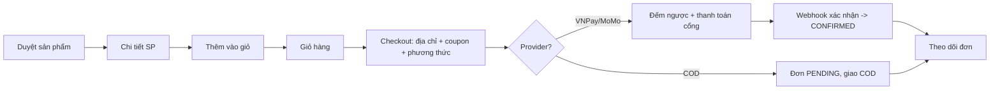
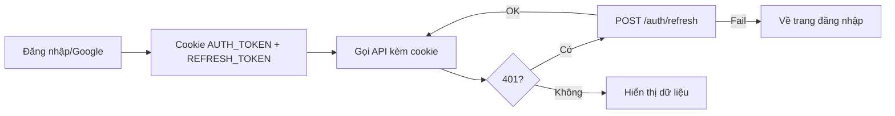

# AuraTech — Đặc tả Giao diện (UI Spec cho Figma / AI Design)

> Mục đích: cung cấp **ngữ cảnh đầy đủ** để Figma (hoặc công cụ sinh UI bằng AI) tạo ra giao diện
> đúng nghiệp vụ, đúng dữ liệu thật của backend AuraTech. Tài liệu suy ra trực tiếp từ API, luồng
> hoạt động và codebase hiện có — KHÔNG bịa thêm tính năng không tồn tại trong backend.
>
> Cách dùng: dán từng phần (hoặc cả file) làm context cho công cụ thiết kế. Mỗi màn hình nêu rõ:
> *mục đích → dữ liệu lấy từ API nào → thành phần UI → trạng thái → tương tác*.

---

## 0. Tóm tắt sản phẩm

**AuraTech** là sàn thương mại điện tử chuyên **laptop & thiết bị công nghệ** (Apple, Lenovo, Dell, ASUS, MSI, Razer...).
Có 2 không gian giao diện:

1. **Storefront (Khách hàng)** — duyệt sản phẩm, giỏ hàng, đặt hàng, thanh toán (VNPay/MoMo/COD), theo dõi đơn, đánh giá, yêu thích, quản lý tài khoản & địa chỉ.
2. **Admin (Quản trị)** — quản lý sản phẩm, đơn hàng, người dùng, coupon, danh mục, thương hiệu, đánh giá, thanh toán.

**Personas:**
- *Khách mua hàng (CUSTOMER)*: tìm laptop theo nhu cầu (gaming, văn phòng, đồ họa), so sánh cấu hình, mua nhanh.
- *Quản trị viên (ADMIN)*: vận hành catalog, xử lý đơn, theo dõi doanh thu/đơn.

**Tông thương hiệu (mood):** công nghệ, hiện đại, sạch sẽ, đáng tin cậy. Gợi ý phong cách: tối giản, nhiều khoảng trắng, ảnh sản phẩm lớn, nhấn nhá màu thương hiệu, có hỗ trợ **dark mode** (đối tượng yêu công nghệ).

---

## 1. Ràng buộc kỹ thuật ảnh hưởng trực tiếp tới UI

Những điểm này quyết định cách thiết kế component/trạng thái — cần tuân thủ:

| Chủ đề | Quy ước | Ý nghĩa với UI |
|--------|---------|----------------|
| Base URL API | `/api/v1` | Mọi lời gọi đều dưới tiền tố này. |
| Xác thực | Cookie **HttpOnly** `AUTH_TOKEN` (15 phút) + `REFRESH_TOKEN` (7 ngày); login cũng trả `accessToken` trong body | UI **không tự lưu token vào localStorage**; trình duyệt tự gửi cookie. Khi 401 → gọi `POST /auth/refresh` rồi thử lại; refresh fail → về trang đăng nhập. |
| Đăng nhập Google | OAuth2 → redirect về `http://localhost:3000/checkout/success` | Cần nút "Đăng nhập với Google" + trang đích sau redirect. |
| CSRF | Cookie-based: lấy token `GET /api/v1/auth/csrf`, gửi header `X-XSRF-TOKEN` cho POST/PUT/DELETE/PATCH (trừ các endpoint auth & webhook) | Form thay đổi dữ liệu cần kèm CSRF token. |
| Phân trang | Spring `Page`: `{ content[], totalElements, totalPages, number, size, first, last }`. Mặc định size **12**, tối đa **50**. Tham số `?page=&size=&sort=` | Mọi danh sách dùng phân trang; thiết kế pagination/"tải thêm" với 12 item/trang. |
| Tiền tệ | Số thập phân 2 chữ số (`BigDecimal`). Giá mẫu dạng `2899.00`, `649.00` | Hiển thị theo định dạng tiền của dự án. Mức giá gợi ý USD (`$2,899.00`); nếu kinh doanh tại VN, format ₫. **Thiết kế component giá tách biệt giá gốc / giá giảm.** |
| Thời gian | API trả chuỗi `dd-MM-yyyy HH:mm:ss` (giờ `Asia/Ho_Chi_Minh`) | Hiển thị ngày giờ dạng `14-06-2026 10:30:00`; có thể rút gọn "x phút trước" ở UI. |
| Ảnh | Phục vụ tại `/uploads/...` (thumbnail, avatar, ảnh sản phẩm) | `thumbnail`/`imageUrl` có thể là URL tương đối → cần prefix host. Có ảnh chính + gallery. |
| Lỗi | `ErrorResponse { timestamp, status, error, message }` | Toast/inline hiển thị trường `message` (tiếng Việt). |
| Rate limit đăng nhập | Quá 5 lần/phút → **429** body `{"message":"Bạn đăng nhập quá nhiều, hãy thử lại sau!"}` | Màn login cần trạng thái "bị khóa tạm" + đếm ngược/thông báo. |

### 1.1 Enum & nhãn hiển thị (badge)

| Enum | Giá trị | Nhãn tiếng Việt gợi ý | Màu badge gợi ý |
|------|---------|----------------------|-----------------|
| `OrderStatus` | PENDING | Chờ thanh toán/Chờ xử lý | xám/vàng |
| | CONFIRMED | Đã xác nhận | xanh dương |
| | SHIPPED | Đang giao | tím/indigo |
| | DELIVERED | Đã giao | xanh lá |
| | CANCELLED | Đã hủy | đỏ |
| `PaymentStatus` | PENDING | Chờ thanh toán | vàng |
| | SUCCESS | Thành công | xanh lá |
| | FAILED | Thất bại | đỏ |
| `PaymentProvider` | VNPAY | VNPay | (logo VNPay) |
| | MOMO | MoMo | (logo MoMo) |
| | COD | Thanh toán khi nhận hàng | xám |
| `DiscountType` | PERCENT | Giảm theo % | |
| | FIXED_AMOUNT | Giảm số tiền cố định | |
| `RoleName` | ADMIN / CUSTOMER | Quản trị / Khách hàng | |

---

## 2. Hệ thống thiết kế (Design System)

> Đây là gợi ý nền tảng để Figma sinh token & component nhất quán. Có thể tinh chỉnh.

**Bảng màu (gợi ý):**
- Primary (thương hiệu/CTA): xanh dương đậm `#2563EB` (tin cậy, công nghệ).
- Accent (khuyến mãi/giá giảm): cam/đỏ `#EF4444` cho badge "-X%".
- Neutral: thang xám `#0F172A → #64748B → #E2E8F0 → #F8FAFC`.
- Semantic: success `#16A34A`, warning `#F59E0B`, danger `#DC2626`, info `#0EA5E9`.
- Dark mode: nền `#0B1220`, surface `#111827`, text `#E5E7EB`.

**Typography:** font sans-serif hiện đại (Inter/Manrope). Thang: Display 32–40, H1 28, H2 22, H3 18, Body 14–16, Caption 12. Giá sản phẩm dùng cỡ đậm nổi bật.

**Spacing/Radius/Shadow:** spacing 4-base (4/8/12/16/24/32). Bo góc 8–12px (thẻ sản phẩm 12px). Shadow nhẹ cho card, đậm hơn khi hover.

**Component nền tảng cần có trong thư viện Figma:**
- Button (primary/secondary/ghost/danger; size sm/md/lg; trạng thái default/hover/disabled/loading).
- Input/Textarea/Select/Quantity-stepper (default/focus/error + dòng lỗi đỏ).
- Badge/Tag (theo bảng enum trên).
- ProductCard (ảnh, tên, brand, giá gốc gạch ngang + giá giảm, badge "-%", nút thêm giỏ, icon wishlist, nhãn "Hết hàng" khi `stockQuantity = 0`).
- Rating stars (1–5, hiển thị trung bình + số đánh giá).
- Pagination / "Tải thêm".
- Toast (success/error) + Inline alert.
- Empty state (minh họa + CTA), Skeleton loading, Spinner.
- Modal/Drawer (xác nhận hủy đơn, mini-cart...).
- Stepper (tiến trình checkout & vòng đời đơn).
- DataTable (cho Admin: sort, phân trang, filter, hành động hàng).
- Stat card (Admin dashboard).

---

## 3. Bản đồ trang (Sitemap / Information Architecture)

### 3.1 Storefront (Khách hàng)
```
/                         Trang chủ (hero, danh mục nổi bật, sản phẩm mới/giảm giá, thương hiệu)
/products                 Danh sách sản phẩm (tìm kiếm, lọc theo brand/category, sắp xếp, phân trang)
/products/:slug|:id       Chi tiết sản phẩm (gallery, specs, giá, tồn kho, reviews, thêm giỏ/wishlist)
/brands/:id               Sản phẩm theo thương hiệu
/categories/:id           Sản phẩm theo danh mục
/cart                     Giỏ hàng
/checkout                 Đặt hàng (chọn địa chỉ, coupon, phương thức thanh toán)
/checkout/success         Trang sau thanh toán / sau đăng nhập Google
/orders                   Đơn hàng của tôi (danh sách + trạng thái)
/orders/:id               Chi tiết đơn (items, tiến trình, lịch sử, thanh toán, hủy/thử lại)
/wishlist                 Danh sách yêu thích
/account                  Hồ sơ (sửa thông tin, avatar)
/account/addresses        Sổ địa chỉ (CRUD, đặt mặc định)
/login  /register         Đăng nhập / Đăng ký (+ Google)
```

### 3.2 Admin
```
/admin                    Dashboard (thống kê đơn theo trạng thái, doanh thu, đơn mới)
/admin/products           Quản lý sản phẩm (DataTable + tạo/sửa/xóa, ảnh)
/admin/orders             Quản lý đơn (lọc theo trạng thái, cập nhật trạng thái + tracking)
/admin/users              Quản lý người dùng (khóa/mở, đổi role)
/admin/coupons            Quản lý mã giảm giá
/admin/categories         Quản lý danh mục (cây cha-con)
/admin/brands             Quản lý thương hiệu
/admin/reviews            Kiểm duyệt đánh giá
/admin/payments           Tra cứu thanh toán
```

---

## 4. Đặc tả màn hình — Storefront (Khách hàng)

> Layout chung: **Header** (logo, ô tìm kiếm, điều hướng danh mục, icon giỏ hàng có badge số lượng,
> icon wishlist, menu tài khoản/đăng nhập) · **Footer** (thông tin, liên kết) · vùng nội dung.
> Header sticky. Responsive: desktop ≥1024, tablet 768–1023, mobile <768 (menu hamburger, bottom nav tùy chọn).

### 4.1 Trang chủ `/`
- **Mục đích:** giới thiệu, điều hướng nhanh tới danh mục/sản phẩm nổi bật.
- **API dùng:**
  - `GET /api/v1/products/active?page=0&size=12` — sản phẩm đang bán.
  - `GET /api/v1/categories/roots` — danh mục gốc (Laptop Gaming, Văn phòng, Ultrabook, Đồ họa...).
  - `GET /api/v1/brands` — thương hiệu.
- **Thành phần:** Hero banner (CTA "Mua ngay"); lưới danh mục gốc; carousel/lưới "Sản phẩm nổi bật" & "Đang giảm giá" (lọc item có `discountPrice != null`); dải logo thương hiệu.
- **Trạng thái:** skeleton khi tải; ẩn section nếu rỗng.

### 4.2 Danh sách sản phẩm `/products`
- **Mục đích:** duyệt, tìm kiếm, lọc, sắp xếp sản phẩm.
- **API:**
  - `GET /api/v1/products?search={q}&page=&size=&sort=` — danh sách/tìm kiếm (nếu có `search` thì tìm theo tên).
  - Lọc theo thương hiệu: `GET /api/v1/products/brand/{brandId}`.
  - Lọc theo danh mục: `GET /api/v1/products/category/{categoryId}`.
  - Sidebar dữ liệu lọc: `GET /api/v1/brands`, `GET /api/v1/categories`.
- **Dữ liệu mỗi item (`ProductResponse` summary):** `id, name, slug, brand{name}, category{name}, basePrice, discountPrice, stockQuantity, thumbnail, isActive`.
- **Thành phần:** thanh tìm kiếm; sidebar bộ lọc (brand, category); dropdown sắp xếp (theo giá/tên — map sang `sort`); lưới `ProductCard`; pagination 12/trang.
- **ProductCard:** ảnh (`thumbnail`), tên, thương hiệu, **giá**: nếu có `discountPrice` → hiện `discountPrice` đậm + `basePrice` gạch ngang + badge `-%`; nút "Thêm vào giỏ" (cần đăng nhập); icon wishlist; overlay "Hết hàng" nếu `stockQuantity = 0` (disable nút mua).
- **Trạng thái:** loading (skeleton grid), empty ("Không tìm thấy sản phẩm" + gợi ý xóa lọc), error (toast).

### 4.3 Chi tiết sản phẩm `/products/:id`
- **Mục đích:** xem cấu hình chi tiết, ảnh, đánh giá; thêm giỏ/wishlist.
- **API:**
  - `GET /api/v1/products/{id}` — chi tiết (`ProductResponse` đầy đủ, gồm `images[]`, `specs`).
  - `GET /api/v1/products/{productId}/images` — gallery ảnh (nếu cần riêng).
  - `GET /api/v1/reviews/product/{productId}?page=&size=` — đánh giá (phân trang).
  - Thêm giỏ: `POST /api/v1/cart/items` body `{ productId, quantity }`.
  - Wishlist: `POST /api/v1/wishlists` body `{ productId }`.
  - Tạo đánh giá: `POST /api/v1/reviews` `{ productId, rating, comment }` (chỉ user đăng nhập).
- **Dữ liệu:** tên, SKU, brand, category, giá (gốc/giảm), `stockQuantity`, `thumbnail` + `images[]`, **`specs`** (chuỗi JSON, ví dụ `{"ram":"16GB","storage":"512GB","cpu":"Apple M3","man_hinh":"13.6 inch"}` → render thành **bảng thông số**), trạng thái còn hàng.
- **Thành phần:** gallery ảnh (thumbnail + ảnh lớn, zoom); khối thông tin (tên, brand link, rating tổng hợp, giá, badge giảm, tồn kho); **bảng specs** (parse JSON → key→value tiếng Việt: ram, storage, cpu, gpu, man_hinh, tan_so, tam_nen...); quantity stepper + nút "Thêm vào giỏ" + nút wishlist; tabs "Mô tả / Thông số / Đánh giá".
- **Khối đánh giá:** điểm trung bình + số lượng; danh sách review (`reviewerName`, `reviewerAvatar`, `rating` sao, `comment`, `createdAt`); form viết đánh giá (rating 1–5 + comment) — chỉ hiện khi đăng nhập; cho sửa/xóa review của chính mình (`PUT/DELETE /reviews/{reviewId}`).
- **Trạng thái:** loading skeleton; "Hết hàng" disable mua; nếu chưa đăng nhập mà bấm mua/đánh giá → mở modal/redirect đăng nhập.

### 4.4 Giỏ hàng `/cart`
- **Mục đích:** xem/sửa giỏ trước khi đặt.
- **API:**
  - `GET /api/v1/cart` — `CartResponse { id, userId, items[], totalPrice }`, mỗi item: `{ id, product(summary), quantity }`.
  - Cập nhật số lượng: `PUT /api/v1/cart/items/{productId}` `{ quantity }`.
  - Xóa item: `DELETE /api/v1/cart/items/{productId}`.
  - Xóa sạch: `DELETE /api/v1/cart`.
- **Thành phần:** danh sách dòng hàng (ảnh, tên, đơn giá, stepper số lượng, thành tiền, nút xóa); ô tóm tắt (tạm tính = `totalPrice`); nút "Tiến hành đặt hàng" → `/checkout`; nút "Xóa giỏ".
- **Trạng thái:** **empty** ("Giỏ hàng trống" + CTA "Mua sắm ngay"); loading; cảnh báo khi số lượng vượt tồn kho.
- **Lưu ý:** giỏ hàng yêu cầu đăng nhập (mọi API cart cần auth).

### 4.5 Checkout `/checkout`
- **Mục đích:** chọn địa chỉ giao, áp coupon, chọn phương thức thanh toán, đặt hàng.
- **API:**
  - Địa chỉ: `GET /api/v1/user-addresses/user` (danh sách), `GET /api/v1/user-addresses/default`; tạo nhanh `POST /api/v1/user-addresses`.
  - Xem trước coupon: `POST /api/v1/coupons/apply` `{ code }` → `CouponApplyResponse { code, discountType, discountValue, minOrderValue, usageLimit, usedCount, expiresAt }`.
  - Giỏ: `GET /api/v1/cart` (hiển thị tóm tắt).
  - **Đặt hàng:** `POST /api/v1/orders` body `{ couponCode?, paymentProvider (VNPAY|MOMO|COD), shippingAddress }`. Đơn được tạo **từ giỏ hàng hiện tại** (không gửi danh sách item). Trả `OrderResponse`.
- **Thành phần:**
  - Cột trái: chọn/nhập **địa chỉ giao** (chọn từ sổ địa chỉ hoặc form mới: `receiverName, phone, street, district, city, isDefault`); ô nhập **mã giảm giá** (nút "Áp dụng" → hiển thị mức giảm preview); chọn **phương thức thanh toán** (VNPay / MoMo / COD — radio kèm logo).
  - Cột phải (Order Summary): danh sách item, tạm tính (`subTotal`), giảm giá (`discountAmount`), **tổng cuối** (`finalAmount`), nút "Đặt hàng".
- **Quy tắc UI từ backend:**
  - `shippingAddress` bắt buộc, tối đa 1000 ký tự; `paymentProvider` bắt buộc.
  - Coupon: nếu hết hạn/hết lượt/chưa đạt `minOrderValue` → backend trả 400 với `message` → hiển thị inline đỏ dưới ô coupon. Discount = % hoặc số tiền cố định, không vượt tạm tính.
  - Sau khi đặt: nếu `paymentProvider != COD` → đơn có `paymentExpiresAt` (hạn 15 phút) → chuyển sang bước thanh toán/đếm ngược. COD → `paymentExpiresAt = null`, về trang đơn hàng.
- **Trạng thái:** giỏ rỗng → chặn (backend trả lỗi "Giỏ hàng trống"); tài khoản bị khóa → lỗi; loading khi submit (disable nút, tránh double-submit).

### 4.6 Thanh toán & kết quả
- **Bối cảnh backend:** mỗi đơn tạo sẵn 1 `Payment` PENDING; cổng (VNPay) gọi webhook `GET/POST /api/v1/payments/vnpay-webhook` (server-to-server, **không phải màn UI**). UI chỉ tạo/Ë theo dõi thanh toán.
- **API liên quan UI:**
  - Tạo/lấy lại phiên thanh toán: `POST /api/v1/payments` `{ orderId, provider }` → `PaymentCallbackResponse` (idempotent — nếu đang PENDING trả lại chính nó).
  - Thử lại khi thất bại: `POST /api/v1/orders/{orderId}/payments/retry` (chỉ khi lần gần nhất FAILED).
  - Lịch sử thanh toán của tôi: `GET /api/v1/payments/my`, theo đơn `GET /api/v1/payments/my/order/{orderId}`, theo trạng thái `GET /api/v1/payments/my/status/{status}`.
- **Màn/section cần có:**
  - **Đang chờ thanh toán:** hiển thị `finalAmount`, đồng hồ **đếm ngược** tới `paymentExpiresAt`, nút "Thanh toán qua VNPay/MoMo" (redirect cổng), trạng thái `PaymentStatus`.
  - **Thành công** (`/checkout/success`): xác nhận đơn, mã đơn, nút "Xem đơn hàng".
  - **Thất bại / hết hạn:** thông báo + nút "Thử lại thanh toán" (gọi retry) hoặc đơn tự bị **CANCELLED** khi quá hạn (backend auto-hủy + hoàn kho).
- **Trạng thái:** polling trạng thái thanh toán (vì webhook cập nhật ở backend) → cập nhật badge PENDING→SUCCESS/FAILED.

### 4.7 Đơn hàng của tôi `/orders` & chi tiết `/orders/:id`
- **API:**
  - Danh sách: `GET /api/v1/orders/user?page=&size=` → `OrderResponse` summary.
  - Chi tiết: `GET /api/v1/orders/{orderId}` → đầy đủ `orderItems[]`.
  - Lịch sử trạng thái: `GET /api/v1/order-histories/my?page=&size=` → `{ orderId, status, description, createdAt }`.
  - Hủy đơn (khách): `PUT /api/v1/orders/{orderId}` (qua state machine — chỉ hủy khi PENDING/CONFIRMED). *(Lưu ý: endpoint cập nhật trạng thái phía khách dùng `OrderStatusUpdateRequest { status, trackingNumber? }`.)*
  - Thử lại thanh toán: `POST /api/v1/orders/{orderId}/payments/retry`.
- **Danh sách đơn:** mỗi dòng: mã đơn, ngày tạo, `finalAmount`, badge `status`, `paymentProvider`, nút "Chi tiết". Bộ lọc theo trạng thái (tabs: Tất cả / Chờ / Đã xác nhận / Đang giao / Đã giao / Đã hủy).
- **Chi tiết đơn:**
  - Header: mã đơn + badge trạng thái + ngày.
  - **Stepper tiến trình:** PENDING → CONFIRMED → SHIPPED → DELIVERED (nhánh CANCELLED hiển thị riêng màu đỏ).
  - Danh sách `orderItems` (productId → cần map sang tên/ảnh: gọi `GET /products/{id}` hoặc hiển thị theo dữ liệu có; `quantity`, `priceAtPurchase`).
  - Khối tiền: `subTotal`, `discountAmount`, `finalAmount`.
  - Địa chỉ giao (`shippingAddress`), `trackingNumber` (khi SHIPPED).
  - Thanh toán: provider + trạng thái + nút "Thử lại" (nếu FAILED) / đếm ngược (nếu PENDING & có hạn).
  - **Timeline lịch sử** từ order-histories.
  - Nút "Hủy đơn" (chỉ hiện khi PENDING/CONFIRMED) → modal xác nhận.
- **Trạng thái:** empty ("Bạn chưa có đơn hàng"), loading, error.

### 4.8 Wishlist `/wishlist`
- **API:** `GET /api/v1/wishlists` → `List<WishlistResponse { id, product }>`; thêm `POST /api/v1/wishlists {productId}`; xóa `DELETE /api/v1/wishlists/{productId}`.
- **Thành phần:** lưới `ProductCard` + nút bỏ yêu thích + nút thêm vào giỏ. Empty state có CTA.

### 4.9 Xác thực — Đăng nhập `/login`, Đăng ký `/register`
- **API:**
  - Đăng ký: `POST /api/v1/auth/register` `{ fullName, username, email, password, phone? }`.
  - Đăng nhập: `POST /api/v1/auth/login` `{ username, password }` → set cookie + trả `{ message, accessToken }`.
  - Google: nút điều hướng tới `/oauth2/authorization/google` (Spring) → redirect về `/checkout/success`.
  - CSRF token: `GET /api/v1/auth/csrf`.
  - Làm mới: `POST /api/v1/auth/refresh`. Đăng xuất: `POST /api/v1/auth/logout`.
- **Ràng buộc form (hiển thị lỗi inline theo `message`):**
  - Đăng ký: `fullName` 2–50; `username` 4–60; `email` đúng định dạng ≤150; `password` 6–100; `phone` regex VN `^(0|\+84)[3|5|7|8|9][0-9]{8}$`.
  - Đăng nhập: username & password không trống.
- **Trạng thái đặc thù:** **429** rate limit ("Bạn đăng nhập quá nhiều, hãy thử lại sau!") → khóa nút + thông báo chờ. Sai mật khẩu → 401 "Username hoặc password không đúng". Tài khoản khóa → 403.
- **Thành phần:** form + nút Google + link chuyển qua lại đăng ký/đăng nhập; hiển thị mật khẩu; trạng thái loading.

### 4.10 Tài khoản `/account` & Sổ địa chỉ `/account/addresses`
- **API hồ sơ:** `GET /api/v1/users/me`; cập nhật `PUT /api/v1/users/me` `{ email?, username?, fullName?, phone? , password? }`; avatar `POST /api/v1/users/me/avatar` (multipart `file`, JPG/PNG/WEBP/GIF, ≤5MB).
- **API địa chỉ:** `GET /user-addresses/user`, `GET /user-addresses/default`, `GET /user-addresses/{id}`, `POST`, `PUT /{id}`, `DELETE /{id}`. Trường: `receiverName, phone, street, district, city, isDefault`.
- **Thành phần:** form hồ sơ (đổi tên/sđt/email, đổi mật khẩu — lưu ý đổi mật khẩu/khóa sẽ đăng xuất mọi thiết bị); upload avatar (crop/preview); danh sách địa chỉ dạng card với nhãn "Mặc định", nút Sửa/Xóa, "Đặt làm mặc định", form thêm địa chỉ.
- **Trạng thái:** validate sđt VN; xác nhận xóa; toast thành công.

---

## 5. Đặc tả màn hình — Admin

> Layout: **Sidebar** điều hướng (Dashboard, Sản phẩm, Đơn hàng, Người dùng, Coupon, Danh mục,
> Thương hiệu, Đánh giá, Thanh toán) + **Topbar** (tên admin, đăng xuất). Nội dung chính là DataTable.
> Mọi API admin có tiền tố `/api/v1/admin/...` và yêu cầu **ROLE_ADMIN** (truy cập sai quyền → 403).

### 5.1 Dashboard `/admin`
- **Dữ liệu gợi ý:** đếm đơn theo trạng thái qua `GET /api/v1/admin/orders/status/{status}` (đọc `totalElements` mỗi trạng thái); đơn mới nhất qua `GET /api/v1/admin/orders`.
- **Thành phần:** Stat cards (Tổng đơn, Chờ xử lý, Đang giao, Đã giao, Đã hủy); biểu đồ đơn theo trạng thái; bảng "Đơn gần đây"; (doanh thu có thể tính từ đơn DELIVERED/finalAmount).

### 5.2 Quản lý sản phẩm `/admin/products`
- **API:** list/search dùng API công khai `GET /api/v1/products`; tạo `POST /api/v1/admin/products`; sửa `PUT /api/v1/admin/products/{id}`; xóa `DELETE /api/v1/admin/products/{id}`. Ảnh sản phẩm: `GET /api/v1/products/{productId}/images` (+ API admin ảnh nếu có).
- **Form sản phẩm (`ProductRequest`):** `brandId, categoryId, sku, name, slug, basePrice, discountPrice?, stockQuantity, specs(JSON), thumbnail, isActive`. Cần dropdown brand/category, editor specs (key-value → JSON), upload/nhập URL ảnh, toggle `isActive`.
- **DataTable:** cột ảnh, tên, SKU, brand, category, giá, tồn kho, trạng thái (Active/Ẩn), hành động (Sửa/Xóa). Filter theo brand/category, ô tìm kiếm, phân trang.

### 5.3 Quản lý đơn hàng `/admin/orders`
- **API:** `GET /api/v1/admin/orders` (tất cả), `GET /api/v1/admin/orders/status/{status}` (lọc); **cập nhật trạng thái** `PATCH /api/v1/admin/orders/{orderId}/status` body `{ status, trackingNumber? }`.
- **Quy tắc state machine (UI phải tôn trọng):** PENDING→CONFIRMED→SHIPPED→DELIVERED; hủy chỉ khi PENDING/CONFIRMED; chuyển sang **SHIPPED bắt buộc nhập `trackingNumber`**; không nhảy cóc; CANCELLED/DELIVERED là trạng thái cuối.
- **Thành phần:** tabs lọc theo trạng thái; DataTable (mã đơn, khách `userId`, tổng `finalAmount`, provider, badge trạng thái, ngày); drawer/màn chi tiết đơn; control đổi trạng thái (chỉ cho phép bước hợp lệ kế tiếp; ô tracking khi sang SHIPPED).

### 5.4 Quản lý người dùng `/admin/users`
- **API:** `GET /api/v1/admin/users`, `/active`, `/{id}`, `/email/{email}`; cập nhật `PUT /api/v1/admin/users/{id}` (`UserAdminUpdateRequest`: email, username, password, fullName, phone, avatar, isActive, roleIds); xóa `DELETE /{id}`.
- **Thành phần:** DataTable (avatar, tên, email, role badges, trạng thái Active/Khóa, ngày tạo); toggle khóa/mở (set `isActive`); gán role (CUSTOMER/ADMIN); cảnh báo "khóa tài khoản sẽ đăng xuất user khỏi mọi thiết bị".

### 5.5 Coupon `/admin/coupons`
- **API:** CRUD `/api/v1/admin/coupons` (request `CouponAdminRequest`).
- **Form:** `code, discountType(PERCENT|FIXED_AMOUNT), discountValue, minOrderValue, usageLimit?, expiresAt`. DataTable hiển thị `usedCount/usageLimit`, hạn dùng, trạng thái còn hiệu lực.

### 5.6 Danh mục `/admin/categories`, Thương hiệu `/admin/brands`
- **API:** CRUD `/api/v1/admin/categories`, `/api/v1/admin/brands`.
- **Danh mục:** dạng **cây cha–con** (`parentId`); UI cây/treeview; ràng buộc xóa node còn con (backend chặn). **Thương hiệu:** name, slug, logoUrl.

### 5.7 Đánh giá `/admin/reviews`, Thanh toán `/admin/payments`
- **Reviews:** liệt kê/kiểm duyệt/xóa đánh giá (`/api/v1/admin/reviews`).
- **Payments:** tra cứu giao dịch `/api/v1/admin/payments` (lọc theo trạng thái/đơn) — cột provider, transactionNo, amount, status, ngày; dùng để đối soát.

---

## 6. Luồng nghiệp vụ chính (cho prototype/flow trong Figma)

### 6.1 Mua hàng (happy path)


### 6.2 Xác thực & phiên


### 6.3 Vòng đời đơn (đồng bộ UI badge & nút hành động)
```
PENDING --(thanh toán thành công / admin xác nhận)--> CONFIRMED --(admin + tracking)--> SHIPPED --> DELIVERED
   |                                                        |
   +------------------ Hủy / hết hạn thanh toán ------------+--> CANCELLED (hoàn kho + hoàn coupon)
```

---

## 7. Bảng ánh xạ Màn hình ↔ API (tổng hợp)

| Màn hình | Method & Endpoint | Ghi chú |
|----------|-------------------|---------|
| Trang chủ | GET /products/active, GET /categories/roots, GET /brands | công khai |
| Danh sách SP | GET /products?search=, /products/brand/{id}, /products/category/{id} | công khai, phân trang |
| Chi tiết SP | GET /products/{id}, GET /products/{id}/images, GET /reviews/product/{id} | công khai |
| Thêm giỏ | POST /cart/items | cần auth |
| Giỏ hàng | GET /cart, PUT /cart/items/{pid}, DELETE /cart/items/{pid}, DELETE /cart | cần auth |
| Áp coupon | POST /coupons/apply | preview |
| Đặt hàng | POST /orders | tạo từ giỏ |
| Thanh toán | POST /payments, POST /orders/{id}/payments/retry, GET /payments/my* | webhook do cổng gọi |
| Đơn của tôi | GET /orders/user, GET /orders/{id}, PUT /orders/{id} | cần auth |
| Lịch sử đơn | GET /order-histories/my | cần auth |
| Wishlist | GET/POST /wishlists, DELETE /wishlists/{pid} | cần auth |
| Đánh giá | POST /reviews, PUT/DELETE /reviews/{id} | của chính mình |
| Tài khoản | GET/PUT /users/me, POST /users/me/avatar | cần auth |
| Địa chỉ | GET/POST /user-addresses..., PUT/DELETE /user-addresses/{id} | cần auth |
| Auth | POST /auth/register, /auth/login, /auth/refresh, /auth/logout, GET /auth/csrf | |
| Admin SP | POST/PUT/DELETE /admin/products | ADMIN |
| Admin đơn | GET /admin/orders, /status/{s}, PATCH /admin/orders/{id}/status | ADMIN |
| Admin user | GET/PUT/DELETE /admin/users | ADMIN |
| Admin coupon/category/brand/review/payment | CRUD /admin/{resource} | ADMIN |

---

## 8. Trạng thái dùng chung & Micro-copy (vi)

**Mọi danh sách cần 4 trạng thái:** Loading (skeleton) · Có dữ liệu · Empty (minh họa + CTA) · Error (thông báo + nút thử lại).

**Micro-copy gợi ý (tiếng Việt):**
- Empty giỏ hàng: "Giỏ hàng của bạn đang trống" — CTA "Khám phá sản phẩm".
- Empty đơn hàng: "Bạn chưa có đơn hàng nào".
- Hết hàng: "Tạm hết hàng".
- Thêm giỏ thành công: "Đã thêm vào giỏ hàng".
- Đặt hàng thành công: "Đặt hàng thành công! Mã đơn #{id}".
- Lỗi chung: hiển thị trực tiếp `message` từ `ErrorResponse`.
- Rate limit login: "Bạn đăng nhập quá nhiều, hãy thử lại sau!".
- Xác nhận hủy đơn: "Bạn chắc chắn muốn hủy đơn #{id}? Hành động không thể hoàn tác."

**Định dạng:** giá theo locale dự án; ngày `dd-MM-yyyy HH:mm:ss`; số lượng tồn kho hiển thị khi thấp ("Chỉ còn {n} sản phẩm").

---

## 9. Ghi chú cho công cụ sinh UI (Figma AI)

Khi sinh giao diện, hãy bám sát:
1. **Đúng dữ liệu thật**: chỉ dùng các trường có trong DTO (mục 4–5). Không thêm field backend không trả (ví dụ không có "đánh giá trung bình" sẵn — phải tính từ danh sách review; `OrderItem` chỉ có `productId` nên cần map tên/ảnh qua API sản phẩm).
2. **Tôn trọng state machine đơn hàng & nút hành động theo trạng thái** (mục 5.3, 6.3).
3. **Phân trang 12 item/trang**, có pagination.
4. **Hai theme**: light + dark.
5. **Responsive**: desktop / tablet / mobile.
6. **Thành phần giá**: luôn xử lý cặp `basePrice`/`discountPrice` + badge giảm.
7. **Bảng thông số** parse từ `specs` JSON (ram, storage, cpu, gpu, man_hinh, tan_so, tam_nen, ket_noi, pin, trong_luong...).
8. **Trạng thái rỗng/đang tải/lỗi** cho mọi màn.
9. **Tách 2 không gian**: Storefront (header thương mại) và Admin (sidebar + DataTable).

**Prompt mẫu cho từng màn** (dán kèm phần đặc tả màn tương ứng):
> "Thiết kế màn [tên màn] cho sàn TMĐT laptop AuraTech, phong cách công nghệ hiện đại tối giản, hỗ trợ light/dark.
> Dữ liệu và thành phần theo đặc tả: [dán mục 4.x/5.x]. Tuân thủ component giá (giá gốc gạch ngang + giá giảm + badge -%),
> phân trang 12/trang, và 4 trạng thái loading/empty/error/data."

---

> Tài liệu này phản ánh API & nghiệp vụ backend tại thời điểm viết. Khi thêm/đổi endpoint, cập nhật mục 4–5 và bảng ánh xạ (mục 7) để Figma luôn sinh đúng giao diện.
