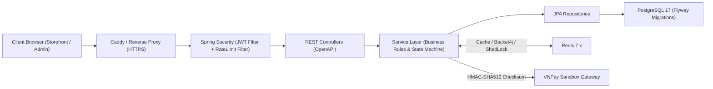

# Tổng Quan Dự Án Ladux

Tài liệu này giúp bạn nắm bức tranh tổng thể của Ladux trước khi đi vào từng module chi tiết.

## 1. Ladux Là Gì?

**Ladux** là hệ thống thương mại điện tử chuyên ngành Laptop & Thiết bị công nghệ, mô phỏng toàn diện luồng vận hành thực tế:

- **Storefront cho khách hàng**: Tìm kiếm nhanh (Fuzzy search), lọc theo cấu hình phần cứng (CPU/RAM/SSD), giỏ hàng thời gian thực, wishlist, checkout khóa giá, áp dụng coupon, thanh toán VNPay/COD, theo dõi đơn và đánh giá sau khi nhận hàng.
- **Admin Portal cho quản trị viên**: Quản lý danh mục, sản phẩm, biến thể (SKU), điều phối vòng đời đơn hàng qua State Machine, xử lý đổi trả/hoàn tiền, quản lý mã giảm giá, kiểm duyệt đánh giá và phân quyền người dùng.
- **Supply Chain & Inventory Ledger**: Quản lý nhà cung cấp, lập đơn nhập hàng (Purchase Order - PO), trừ kho nguyên tử chống overselling và lưu vết lịch sử mọi biến động qua sổ cái kho (Stock Ledger).
- **Backend REST API**: Xây dựng trên nền Spring Boot 4 (Java 21), kiến trúc phân tầng, quản lý transaction an toàn, bảo mật stateless JWT + Refresh Token Rotation, Rate Limiting với Bucket4j và Redis.
- **PostgreSQL 17**: Lưu trữ dữ liệu quan hệ, quản lý schema tự động qua Flyway (42 migrations) và tối ưu tìm kiếm với extension `pg_trgm`.

---

## 2. Kiến Trúc Tổng Thể



---

## 3. Vai Trò Của Từng Phần Trong Repository

| Thư mục / Thành phần | Vai trò |
| :--- | :--- |
| `frontend/` | Giao diện người dùng và admin (React 18, TypeScript, Vite, Tailwind CSS, Zustand, TanStack Query) |
| `backend/` | Spring Boot REST API monolith (Java 21), xử lý toàn bộ nghiệp vụ, phân quyền và kết nối database |
| `backend/src/main/resources/db/migration` | 42 file migration Flyway tạo và đồng bộ schema cơ sở dữ liệu production |
| `backend/src/main/resources/db/devdata` | Seed data cho môi trường development và kiểm thử |
| `docs/` | Tài liệu kiến trúc, luồng nghiệp vụ, cơ sở dữ liệu, bảo mật và vận hành hệ thống |
| `uploads/` | Thư mục lưu trữ hình ảnh sản phẩm, thương hiệu và danh mục phục vụ ứng dụng |

---

## 4. Các Nhóm Nghiệp Vụ Cốt Lõi

### 4.1 Identity, Authentication & Bảo mật
- Đăng ký / Đăng nhập tài khoản bằng email/username + mật khẩu mã hóa BCrypt.
- Đăng nhập nhanh qua **Google OAuth2**.
- Xác thực stateless qua cặp Token:
  - **Access Token**: Thời hạn ngắn, lưu trong bộ nhớ frontend, gửi qua header `Authorization: Bearer <token>`.
  - **Refresh Token**: Thời hạn dài, lưu trong Cookie bảo mật (`HttpOnly`, `SameSite`, `Secure`), có cơ chế xoay vòng (Rotation).
- **Token Versioning (`token_version`)**: Hỗ trợ thu hồi phiên đăng nhập tức thì trên toàn bộ thiết bị khi đổi mật khẩu hoặc đăng xuất.
- **Xác thực OTP**: Gửi mã OTP qua Email / Số điện thoại phục vụ kích hoạt tài khoản hoặc bảo mật giao dịch.
- **Distributed Rate Limiting**: Tích hợp Bucket4j trên Redis chặn brute-force và spam cho các endpoint nhạy cảm (Login, Register, Send OTP, Order Create, Search, Chatbot).
- Phân quyền theo vai trò (`ROLE_CUSTOMER`, `ROLE_ADMIN`) qua `@PreAuthorize`.

### 4.2 Catalog & Product Variants
- Phân cấp quản lý: Thương hiệu (Brands), Danh mục (Categories), Màu sắc (Colors), Sản phẩm (Products) và Biến thể cấu hình (ProductVariants).
- Mỗi biến thể quản lý riêng: `sku`, `ram_gb`, `storage_gb`, `color_id`, `price`, `discount_price`, `stock_quantity`.
- Tìm kiếm gần đúng và lọc sản phẩm tốc độ cao nhờ PostgreSQL extension `pg_trgm` (GIN trigram index trên `LOWER(name)`).
- Hỗ trợ bộ nhớ đệm Redis (`@Cacheable`, `@CacheEvict`) cho danh mục và thông tin sản phẩm.

### 4.3 Cart & Wishlist
- Giỏ hàng gắn liền với người dùng (`Cart` 1-1 `User`).
- Thao tác thêm/sửa/xóa biến thể sản phẩm trong giỏ sử dụng khóa bi quan (`findByUserIdForUpdate`) để chống xung đột race condition.
- Danh sách yêu thích (`Wishlist`) lưu trữ sản phẩm khách hàng quan tâm với ràng buộc unique tránh trùng lặp.

### 4.4 Order, Inventory, Coupon & Payment
- **Trừ tồn kho nguyên tử (Atomic Deduction)**: Trừ kho trực tiếp qua SQL điều kiện (`WHERE stock_quantity >= :qty`) kết hợp database constraint `CHECK (stock_quantity >= 0)` chống overselling.
- **Khóa giá tại thời điểm mua**: Ghi nhận `priceAtPurchase` vào `OrderItem` để bảo vệ giá trị đơn hàng khi catalog thay đổi giá.
- **Khuyến mãi (Coupon)**: Hỗ trợ giảm theo `%` hoặc số tiền cố định, kiểm tra điều kiện đơn tối thiểu, hạn mức sử dụng và khóa bi quan khi redeem.
- **Khởi tạo đơn hàng & Vận chuyển**: Lưu trữ thông tin địa chỉ giao hàng, phí vận chuyển (`shippingFee`) và đơn vị vận chuyển (`carrierName`).
- **Thanh toán trực tuyến (VNPay Sandbox)**: Tạo URL thanh toán kèm mã checksum HMAC-SHA512; xử lý webhook IPN đảm bảo tính Idempotent và xác minh số tiền thực trả.
- **State Machine & Tự động hoàn tồn**: Vòng đời đơn hàng chuyển đổi qua ma trận trạng thái nghiêm ngặt. Cron job định kỳ (được bảo vệ bởi **ShedLock**) tự động hủy đơn `PENDING` quá hạn, hoàn trả tồn kho và phục hồi lượt dùng coupon.
- **Quy trình Đổi trả / Hoàn tiền**: Hỗ trợ luồng `RETURN_REQUESTED` → `RETURNED` → `REFUNDED` đồng bộ tự động với sổ kho và trạng thái giao dịch.

### 4.5 Chuỗi cung ứng & Sổ cái kho (Supply Chain & Stock Ledger)
- Quản lý Nhà cung cấp (Suppliers) và giá nhập tham chiếu từng sản phẩm (`ProductSupplier`).
- Quản lý Đơn nhập hàng (Purchase Orders - PO): Lập PO, duyệt đơn và nhập kho (Goods Receipt) từng phần hoặc toàn bộ.
- **Sổ cái biến động kho (Stock Ledger)**: Ghi log bất biến (`StockMovement`) cho mọi thay đổi số lượng (`PURCHASE_IN`, `SALE_OUT`, `RETURN_IN`, `DAMAGE_OUT`, `ADJUSTMENT`) kèm chứng từ tham chiếu và định danh người thực hiện.

### 4.6 Review & Đánh giá
- Chỉ cho phép khách hàng đánh giá sản phẩm sau khi đơn hàng chứa sản phẩm đó đã chuyển sang trạng thái giao thành công `DELIVERED`.
- Ràng buộc unique `(user_id, product_id)` đảm bảo mỗi khách hàng chỉ gửi đánh giá một lần cho mỗi sản phẩm.

---

## 5. Thứ Tự Đọc Dự Án Chuẩn

Để nắm bắt kiến trúc và source code một cách nhanh nhất:

1. `README.md`: Bức tranh tổng quan và giá trị kỹ thuật cốt lõi.
2. `docs/00-tong-quan-du-an.md` & `docs/01-cau-truc-thu-muc.md`: Cấu trúc tổ chức file và vai trò thành phần.
3. `backend/src/main/resources/db/migration/*.sql`: Hiểu cấu trúc dữ liệu qua các script Flyway.
4. `backend/src/main/java/org/akira/ladux/model`: Khám phá các Entity JPA và quan hệ dữ liệu.
5. `backend/src/main/java/org/akira/ladux/service`: Nắm logic nghiệp vụ chính (`OrderServiceImpl`, `InventoryServiceImpl`, `OrderStateMachineImpl`, `PaymentWebhookServiceImpl`, `StockMovementServiceImpl`).
6. `backend/src/main/java/org/akira/ladux/config`: Hiểu hạ tầng bảo mật (`SecurityConfig`, `EndpointRateLimitFilter`, `ShedLockConfig`).
7. `frontend/src/services/`: Khám phá cách frontend giao tiếp API, quản lý token và tự động refresh phiên.

Quy tắc truy vết một luồng nghiệp vụ:
```text
Database Table / Migration
  -> JPA Entity
  -> Spring Data Repository
  -> Request / Response DTO
  -> Service Interface & Implementation (Transaction & Business Rules)
  -> REST Controller
  -> Frontend Service (Axios Client)
  -> UI Page / Zustand Store
```

---

## 6. Những Luồng Nghiệp Vụ Quan Trọng Nhất

Nếu cần rà soát hoặc phỏng vấn về dự án, hãy tập trung vào 5 luồng:
1. **Authentication & Session Lifecycle**: Dual-token (Access + HttpOnly Refresh Cookie), Token Versioning và OAuth2 Google.
2. **Catalog & High-performance Search**: Lọc đa tiêu chí, PostgreSQL Trigram (`pg_trgm`) và Redis Caching.
3. **Checkout, Concurrency & Atomic Inventory**: Luồng tạo đơn, trừ kho nguyên tử, redeem coupon và chốt giá.
4. **Order State Machine & Scheduled Auto-Rollback**: Quản lý vòng đời đơn, ShedLock cron job và hoàn trả tồn kho/coupon.
5. **Payment Webhook & Sổ cái biến động kho**: Idempotent IPN handler với VNPay HMAC-SHA512 và Stock Ledger audit trail.
