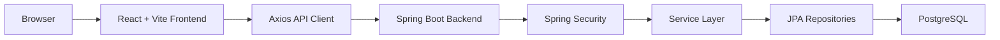

# Tổng Quan Dự Án AuraTech

Tài liệu này giúp bạn nắm bức tranh tổng thể của AuraTech trước khi đi vào từng module.

## 1. AuraTech Là Gì?

AuraTech là web bán hàng công nghệ gồm:

- Storefront cho khách hàng: xem sản phẩm, đăng ký/đăng nhập, giỏ hàng, wishlist, checkout, xem đơn, đánh giá.
- Admin portal cho nhân sự vận hành: quản lý sản phẩm, brand, category, coupon, user, đơn hàng, payment, review.
- Backend REST API quản lý nghiệp vụ và dữ liệu.
- PostgreSQL lưu dữ liệu chính.

## 2. Thành Phần Chính



## 3. Vai Trò Của Từng Phần

| Phần | Vai trò |
| --- | --- |
| `frontend/` | Giao diện người dùng và admin, routing, state management, gọi API |
| `backend/` | REST API, authentication, authorization, nghiệp vụ bán hàng |
| `backend/src/main/resources/db/migration` | Migration tạo schema production |
| `backend/src/main/resources/db/devdata` | Seed data cho môi trường dev |
| `docs/` | Tài liệu kiến trúc, luồng, module, vận hành |

## 4. Các Nhóm Nghiệp Vụ

### Identity và bảo mật

- User đăng ký/đăng nhập.
- Backend xác thực bằng username/email + password.
- Backend phát JWT.
- JWT được lưu trong cookie HttpOnly `AUTH_TOKEN`.
- Request có cookie đi qua `JwtFilter`.
- `JwtFilter` validate token, load user/role và set `SecurityContext`.
- Các API admin dùng `@PreAuthorize("hasRole('ADMIN')")`.

### Catalog

- Brand, category, product, product image.
- Sản phẩm có `sku`, `slug`, giá gốc, giá giảm, tồn kho, specs JSONB, thumbnail.
- Frontend public đọc sản phẩm/brand/category không cần đăng nhập.
- Admin tạo/sửa/xóa catalog.

### Cart và wishlist

- Mỗi user có một cart.
- Cart có nhiều cart item.
- User có thể thêm/xóa/cập nhật số lượng sản phẩm.
- Wishlist lưu sản phẩm user yêu thích.

### Order, inventory, coupon, payment

- User checkout bằng danh sách item gửi lên API.
- Backend lock sản phẩm, kiểm tra tồn kho và trừ tồn.
- Backend tính giá tại thời điểm mua.
- Backend redeem coupon nếu có.
- Backend tạo order, order items, history và payment pending.
- Scheduled job tự hủy order pending quá hạn thanh toán.
- Khi hủy order, backend trả tồn kho và rollback lượt dùng coupon.

### Review

- User chỉ được review sản phẩm nếu từng có đơn `DELIVERED` chứa sản phẩm đó.
- Mỗi user chỉ review một lần cho một product.

## 5. Đọc Dự Án Theo Thứ Tự Nào?

Để nắm nhanh và chắc, đọc theo thứ tự này:

1. `README.md`
2. `docs/00-tong-quan-du-an.md`
3. `docs/01-cau-truc-thu-muc.md`
4. `backend/src/main/resources/application*.properties`
5. `backend/src/main/resources/db/migration/*.sql`
6. `backend/src/main/java/org/akira/auratech/model`
7. `backend/src/main/java/org/akira/auratech/repository`
8. `backend/src/main/java/org/akira/auratech/dto`
9. `backend/src/main/java/org/akira/auratech/service`
10. `backend/src/main/java/org/akira/auratech/controller`
11. `frontend/src/api/client.ts`
12. `frontend/src/App.tsx`
13. `frontend/src/pages`
14. `frontend/src/admin`

Quy tắc đọc một module:

```text
Database table
  -> Entity
  -> Repository
  -> Request DTO
  -> Response DTO
  -> Service
  -> Controller
  -> Frontend API call
  -> Frontend page
```

## 6. Những Luồng Quan Trọng Nhất

Nếu muốn hiểu 80-90% dự án, tập trung vào 5 luồng:

1. Auth/Login/JWT/CSRF.
2. Product listing/search/detail.
3. Cart/Wishlist.
4. Checkout/Order/Inventory/Coupon/Payment.
5. Admin quản lý catalog, order, payment, user.

Các tài liệu tiếp theo trong `docs/` sẽ đi sâu từng luồng.
