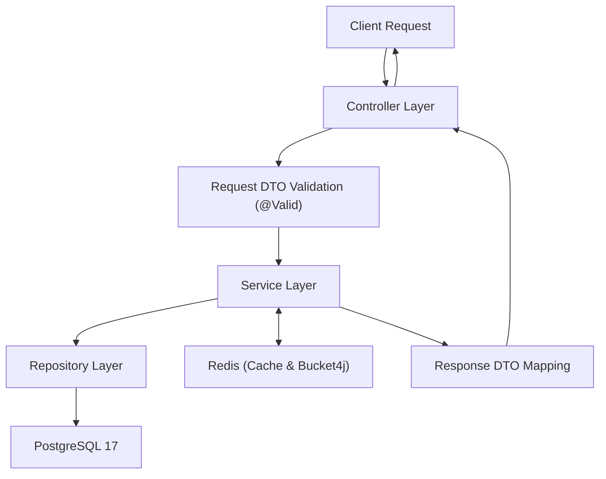
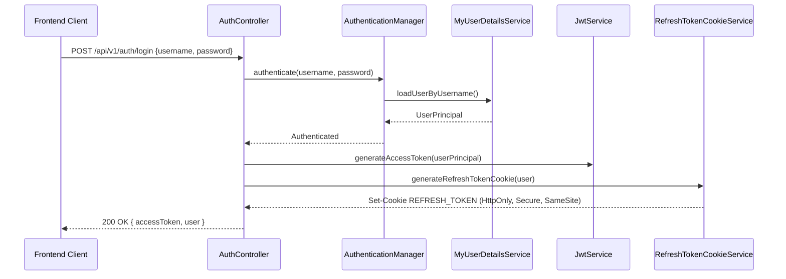
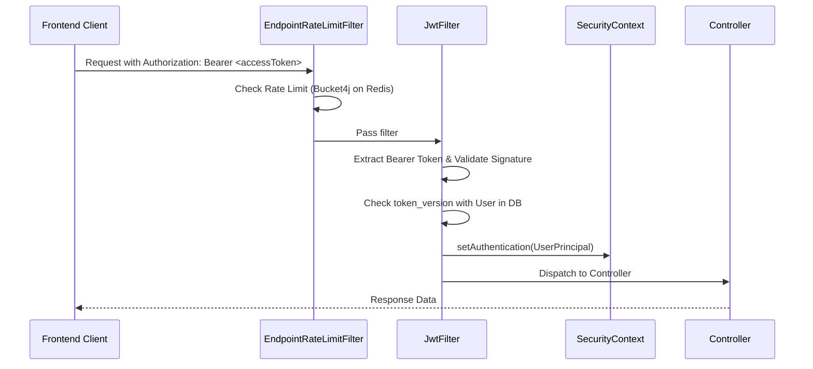

# Kiến Trúc Backend

Backend Ladux được xây dựng theo kiến trúc **Spring Boot Monolith phân tầng (Layered Architecture)**, kết hợp caching phân tán, kiểm soát lưu lượng (rate limiting) và khóa phân tán cho các tiến trình nền:

```text
Client (Web / Mobile)
       │
       ▼
[Reverse Proxy / Caddy] (HTTPS)
       │
       ▼
[Filter Chain]
  EndpointRateLimitFilter (Bucket4j + Redis)
  → JwtFilter (Bearer JWT Validation & Token Versioning)
  → Spring Security (RBAC Authorization)
       │
       ▼
[Controller Layer]
  Request DTO Validation (@Valid)
       │
       ▼
[Service Layer]
  Business Logic, State Machine, Caching (@Cacheable) & Transactions (@Transactional)
       │
  ┌────┴──────────────────────────┐
  ▼                               ▼
[JPA Repositories]         [Distributed Cache & Locks]
  Spring Data JPA            Redis (Buckets & Cache)
  Pessimistic Locks          ShedLock (Distributed Scheduler)
       │
       ▼
[Database Layer]
  PostgreSQL 17 (Flyway Migrations, pg_trgm & CHECK Constraints)
```

---

## 1. Stack Công Nghệ Backend

| Công nghệ | Phiên bản / Thư viện | Vai trò & Trách nhiệm |
| :--- | :--- | :--- |
| **Ngôn ngữ** | Java 21 (LTS) | Tận dụng tính năng hiện đại (Pattern matching, Record, Switch expressions) |
| **Framework** | Spring Boot 4.0.6 | Khung phát triển ứng dụng chính |
| **Web MVC** | Spring Web MVC | RESTful API controllers, interceptors, content negotiation |
| **Bảo mật** | Spring Security 6.x | Stateless JWT filter, CORS, Method-level security (`@PreAuthorize`) |
| **JWT** | `io.jsonwebtoken` (JJWT 0.13.0) | Ký và xác thực HMAC-SHA256 Bearer tokens |
| **OAuth2** | Spring Security OAuth2 Client | Đăng nhập liên kết Google OAuth2 |
| **Persistence** | Spring Data JPA / Hibernate | ORM mapping, tối ưu lazy loading (`open-in-view=false`) |
| **Database** | PostgreSQL 17 | Hệ quản trị cơ sở dữ liệu quan hệ chính |
| **Migration** | Flyway (42 scripts) | Quản trị phiên bản schema tự động |
| **Bộ nhớ đệm** | Spring Cache + Redis | Tăng tốc đọc danh mục, chi tiết sản phẩm, đơn hàng |
| **Rate Limiting** | Bucket4j (`jdk17-lettuce`) | Giới hạn tần suất gọi API phân tán lưu trữ trên Redis |
| **Distributed Lock**| ShedLock (`shedlock-spring`) | Tránh xung đột chạy trùng cron jobs trên nhiều nodes |
| **PostgreSQL Search**| Extension `pg_trgm` | Tìm kiếm văn bản gần đúng và mờ (Fuzzy Trigram search) |
| **Tài liệu API** | SpringDoc OpenAPI 3.0.x | Tự động sinh Swagger UI tại `/swagger-ui.html` |
| **Giám sát** | Spring Boot Actuator | Cung cấp endpoints health check (`/actuator/health/liveness`) |
| **Kiểm thử** | Testcontainers (PostgreSQL) | Kiểm thử tích hợp tự động với database thực |

---

## 2. Thiết Kế Phân Tầng & Trách Nhiệm



### 2.1 Controller Layer
- Tiếp nhận HTTP requests, bind path variables, query parameters và request body.
- Kích hoạt Bean Validation qua `@Valid`.
- Lấy thông tin người dùng hiện tại qua `@AuthenticationPrincipal UserPrincipal principal`.
- Phân quyền tại mức endpoint bằng `@PreAuthorize("hasRole('ADMIN')")`.
- **Nguyên tắc**: Controller hoàn toàn không chứa nghiệp vụ xử lý dữ liệu.

### 2.2 Service Layer (Trung Tâm Nghiệp Vụ)
- Thực thi toàn bộ quy tắc nghiệp vụ (Business Rules).
- Quản lý phạm vi giao dịch (`@Transactional`).
- Điều phối nhiều Repositories và Domain Services trong cùng một transaction.
- Quản lý trạng thái đơn hàng qua `OrderStateMachine`.
- Ghi nhận lịch sử biến động kho (`StockMovementService`) và audit trail.

### 2.3 Repository Layer
- Khai báo các câu lệnh truy vấn dữ liệu (Derived queries, JPQL, Native SQL).
- Áp dụng `EntityGraph` để nạp các quan hệ cần thiết, khắc phục triệt để lỗi N+1 Query.
- Thực thi các câu lệnh khóa dòng dữ liệu (`PESSIMISTIC_WRITE`) hoặc cập nhật nguyên tử (`@Modifying`).

---

## 3. Quản Lý Giao Dịch (Transaction Management)

Hệ thống tuân thủ nghiêm ngặt quy tắc quản lý Transaction của Spring:

- **Read Operations**: Luôn khai báo `@Transactional(readOnly = true)` để Hibernate tối ưu dirty-checking và database mở kết nối tối ưu.
- **Write Operations**: Sử dụng `@Transactional` tại mức phương thức của Service chính.
- **Sub-operations phụ thuộc**: Các dịch vụ con (như trừ kho, áp coupon, khởi tạo payment) bắt buộc chạy trong transaction của service cha bằng `Propagation.MANDATORY`:

```java
// Ví dụ: Luồng Checkout trong 1 Transaction Boundary duy nhất
@Transactional
public OrderResponse createOrder(int userId, OrderRequest request) {
    // 1. Kiểm tra giỏ hàng có khóa
    Cart cart = cartRepository.findByUserIdForUpdate(userId)...;

    // 2. Trừ tồn kho nguyên tử (Bắt buộc chạy trong transaction cha)
    List<LineDraft> lineDrafts = inventoryService.reserveStockAndPriceLines(lineRequests);

    // 3. Redeem mã giảm giá (MANDATORY)
    CouponRedemptionResult redemption = couponRedemptionService.redeem(request.couponCode(), subTotal);

    // 4. Khởi tạo Payment PENDING (MANDATORY)
    paymentAttemptService.initializePayment(order, request.paymentProvider(), finalAmount);

    // 5. Ghi sổ cái biến động kho SALE_OUT (MANDATORY)
    stockMovementService.recordLedgerEntry(...);

    // 6. Xóa giỏ hàng
    cart.getItems().clear();
}
```
> **Lợi ích**: Nếu bất kỳ bước nào trong 6 bước trên phát sinh lỗi, toàn bộ transaction sẽ tự động Rollback, đảm bảo không bao giờ xảy ra tình trạng trừ kho mà không có đơn hàng hoặc mất mã giảm giá.

---

## 4. Kiểm Soát Đồng Thời & Tính Nhất Quán (Concurrency & Consistency)

### 4.1 Trừ Tồn Kho Nguyên Tử (Atomic Inventory Update)
Thay vì sử dụng Lock bi quan kéo dài toàn bộ transaction (dễ gây tắc nghẽn connection pool khi traffic tăng), hệ thống sử dụng câu lệnh SQL cập nhật có điều kiện nguyên tử:
```sql
UPDATE product_variants 
SET stock_quantity = stock_quantity - :qty 
WHERE id = :id AND stock_quantity >= :qty;
```
- Nếu `rowsAffected == 0`, hệ thống ném `InsufficientStockException` ngay lập tức.
- Ràng buộc `CHECK (stock_quantity >= 0)` trong PostgreSQL đóng vai trò bảo vệ an toàn tầng cuối cùng.

### 4.2 Khóa Bi Quan (Pessimistic Locking) Cho Các Luồng Nhạy Cảm
Khóa `SELECT ... FOR UPDATE` được sử dụng ở các trường hợp cần tuần tự hóa:
- `CartRepository.findByUserIdForUpdate`: Chống 2 request sửa giỏ hàng cùng lúc làm sai lệch số lượng.
- `CouponRepository.findByCodeForUpdate`: Đảm bảo không vượt quá `usage_limit`.
- `OrderRepository.findWithItemsByIdForUpdate`: Đảm bảo 2 admin không đổi trạng thái đơn hàng đồng thời.
- `PaymentRepository.findByMerchantTxnRefForUpdate`: Chống race condition khi webhook callback được gửi đồng thời.

---

## 5. Kiến Trúc Bảo Mật & Xác Thực (Security Architecture)



### 5.1 Luồng Gọi API Protected


### 5.2 Các Điểm Bảo Mật Cốt Lõi
1. **Dual-Token Architecture**: Access Token nằm trong bộ nhớ ứng dụng (tránh XSS), Refresh Token nằm trong cookie HttpOnly/Secure (tránh đánh cắp token dài hạn).
2. **Token Versioning**: Trường `token_version` trên Entity `User` được tăng lên khi người dùng đổi mật khẩu hoặc đăng xuất, giúp vô hiệu hóa toàn bộ token cũ ngay lập tức mà không cần duy trì blacklist.
3. **Stateless REST**: REST API chain hoàn toàn stateless (`SessionCreationPolicy.STATELESS`), CSRF tắt cho REST vì dùng Bearer Token; OAuth2 sử dụng chain riêng có session tạm thời cho authorization request.
4. **Distributed Rate Limiting**: `EndpointRateLimitFilter` kiểm soát lưu lượng theo IP/User trước khi request đến tầng xử lý chính.

---

## 6. Phân Trang & Giới Hạn Tải (Pagination)

Cấu hình trong `WebConfig`:
- **Default page size**: 12 items/page.
- **Max page size**: 50 items/page (ngăn chặn client truyền `size=100000` làm tràn RAM server).
- Áp dụng `Page<T>` cho tất cả các endpoint dữ liệu tăng theo thời gian: Sản phẩm, Đơn hàng, Lịch sử đơn hàng, Thanh toán, Sổ cái kho, Đánh giá, Người dùng.

---

## 7. Xử Lý Tác Vụ Nền & Khóa Phân Tán (Scheduled Job & ShedLock)

Cron job quét đơn quá hạn:
```java
@Scheduled(fixedDelayString = "${ladux.order-expiration.fixed-delay-ms:60000}")
@Transactional
@SchedulerLock(name = "expirePendingOrdersLock", lockAtMostFor = "10m", lockAtLeastFor = "1m")
public void expirePendingOrders() {
    List<Order> expiredOrders = orderRepository.findExpiredOrdersForUpdate(OrderStatus.PENDING, Instant.now());
    for (Order order : expiredOrders) {
        orderLifecycleService.cancelOrder(order, "Payment window expired");
    }
}
```
- **ShedLock**: Ghi nhận lock vào bảng `shedlock` trong PostgreSQL. Khi triển khai nhiều instance backend chạy song song, chỉ có 1 instance duy nhất giành được lock để thực thi job tại một thời điểm.

---

## 8. Đánh Giá Hiện Trạng Kiến Trúc

### Điểm Mạnh Hiện Tại
- Phân tầng rõ ràng, tách biệt rành mạch giữa DTO, Domain Entities và Services.
- Quản lý migration schema chuyên nghiệp bằng Flyway (42 scripts) với `ddl-auto=validate`.
- Tắt Open-Session-In-View (`open-in-view=false`) ép buộc nạp dữ liệu rõ ràng trong transaction.
- Trừ kho nguyên tử kết hợp ràng buộc database chống overselling hiệu quả.
- Vòng đời đơn hàng quản lý qua State Machine và tự động hoàn kho/coupon.
- Webhook thanh toán VNPay có xác thực chữ ký HMAC-SHA512 và bảo đảm Idempotency.
- Tích hợp Redis Caching, Distributed Rate Limiting (Bucket4j) và Distributed Locking (ShedLock).
- Tìm kiếm văn bản mờ tốc độ cao với PostgreSQL Trigram (`pg_trgm`).

### Định Hướng Nâng Cấp Tiếp Theo
- Bổ sung Message Queue (RabbitMQ / Kafka) cho các tác vụ gửi email hoặc notification nặng nếu lượng đơn tăng đột biến.
- Thiết lập hạ tầng giám sát tập trung với Prometheus & Grafana theo dõi latency và connection pool metrics.
