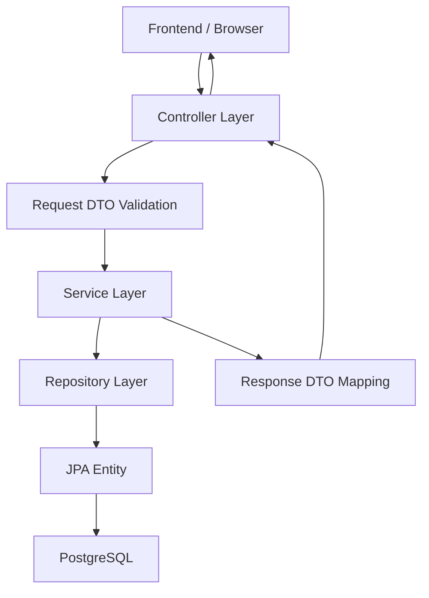
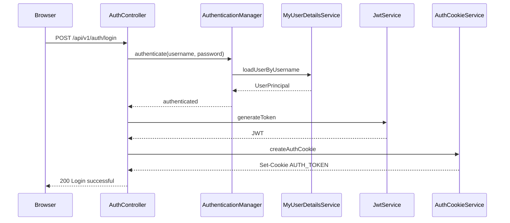
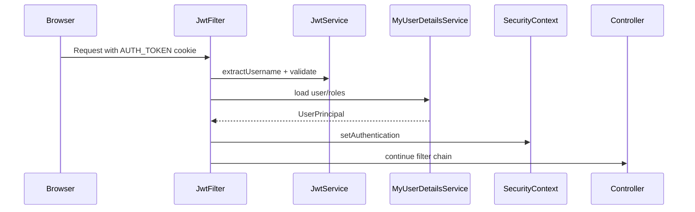

# Kiến Trúc Backend

Backend AuraTech là một Spring Boot monolith được tổ chức theo kiến trúc phân tầng:

```text
Controller -> Service -> Repository -> Database
```

Mỗi tầng có trách nhiệm riêng, giúp code dễ đọc, dễ test và dễ mở rộng.

## 1. Stack Backend

| Công nghệ | Vai trò |
| --- | --- |
| Java 21 | Ngôn ngữ chính |
| Spring Boot 4.0.6 | Framework backend |
| Spring Web MVC | REST API |
| Spring Security | Auth, authorization, CSRF |
| Spring Data JPA | ORM/repository |
| Hibernate | JPA implementation |
| PostgreSQL | Database |
| Flyway | Migration |
| JWT/JJWT | Token authentication |
| OAuth2 Client | Google Login |
| Lombok | Giảm boilerplate |
| Bean Validation | Validate request DTO |
| Maven | Build tool |

## 2. Kiến Trúc Phân Tầng



### Controller Layer

Controller là cửa vào HTTP.

Trách nhiệm:

- Định nghĩa endpoint.
- Nhận path variable, query param, request body.
- Áp dụng `@Valid`.
- Lấy authenticated user qua `@AuthenticationPrincipal`.
- Áp dụng `@PreAuthorize`.
- Gọi service.
- Trả `ResponseEntity`.

Controller không nên chứa nghiệp vụ phức tạp.

### Service Layer

Service là nơi chứa nghiệp vụ thật.

Trách nhiệm:

- Kiểm tra rule nghiệp vụ.
- Điều phối nhiều repository.
- Quản lý transaction.
- Lock dữ liệu khi cần.
- Tạo entity và response DTO.
- Gọi service phụ như inventory, coupon, payment, lifecycle.

Ví dụ `OrderServiceImpl.createOrder` điều phối:

```text
UserRepository
InventoryService
CouponRedemptionService
PaymentAttemptService
OrderRepository
```

### Repository Layer

Repository là nơi truy vấn database.

Trách nhiệm:

- CRUD entity.
- Query theo field.
- Query custom bằng JPQL.
- EntityGraph để load quan hệ cần thiết.
- Pessimistic lock cho dữ liệu cần consistency.

Ví dụ:

- `ProductRepository.findByIdForUpdate`
- `CartRepository.findByUserIdForUpdate`
- `OrderRepository.findExpiredOrdersForUpdate`
- `CouponRepository.findByCodeForUpdate`

### Entity Layer

Entity map với table database.

Ví dụ:

| Entity | Table |
| --- | --- |
| `User` | `users` |
| `Product` | `products` |
| `Cart` | `carts` |
| `Order` | `orders` |
| `Payment` | `payments` |
| `Coupon` | `coupons` |

## 3. Request/Response DTO

Backend không trả trực tiếp entity ra API. Thay vào đó dùng DTO:

- `dto/request`: dữ liệu frontend gửi lên.
- `dto/response`: dữ liệu backend trả về.

Lợi ích:

- Không lộ entity nội bộ.
- Tránh vòng lặp JSON do quan hệ JPA.
- Dễ kiểm soát field trả về.
- Dễ validate request.

Ví dụ:

```text
OrderRequest
  -> OrderServiceImpl
  -> Order entity
  -> OrderResponse
```

## 4. Transaction

Backend dùng `@Transactional` ở service.

Quy tắc hiện tại:

- Read API dùng `@Transactional(readOnly = true)`.
- Write API dùng `@Transactional`.
- Các service phụ bắt buộc chạy trong transaction cha dùng `Propagation.MANDATORY`.

Ví dụ:

```text
OrderServiceImpl.createOrder
  @Transactional
  -> InventoryServiceImpl.reserveStockAndPriceLines
     @Transactional(propagation = MANDATORY)
  -> CouponRedemptionServiceImpl.redeem
     @Transactional(propagation = MANDATORY)
```

Điều này đảm bảo nếu checkout lỗi giữa chừng thì database rollback toàn bộ.

## 5. Lock Và Consistency

Một số nghiệp vụ cần tránh race condition:

### Tồn kho

Khi tạo order:

```text
ProductRepository.findByIdForUpdate
  -> SELECT product FOR UPDATE
  -> kiểm tra stock
  -> trừ stock
```

Mục tiêu: tránh bán vượt tồn kho.

### Coupon

Khi redeem coupon:

```text
CouponRepository.findByCodeForUpdate
  -> lock coupon
  -> kiểm tra usageLimit/usedCount
  -> tăng usedCount
```

Mục tiêu: tránh dùng coupon vượt số lượt.

### Cart

Khi sửa giỏ hàng:

```text
CartRepository.findByUserIdForUpdate
  -> lock cart của user
  -> thêm/sửa/xóa item
```

Mục tiêu: tránh hai request cùng lúc làm lệch số lượng.

### Order

Khi đổi trạng thái hoặc hủy đơn:

```text
OrderRepository.findByIdForUpdate
  -> lock order
  -> validate transition
  -> update status/history/inventory/coupon
```

## 6. Security Architecture



Sau khi login:



Các điểm chính:

- Session backend là stateless.
- JWT nằm trong cookie HttpOnly.
- CSRF bật cho unsafe methods.
- Frontend tự gọi `/auth/csrf` để lấy `XSRF-TOKEN`.
- Admin API dùng role `ADMIN`.

## 7. Pageable

`WebConfig` cấu hình:

- Nếu client không truyền size thì mặc định page size là 12.
- Max page size là 50.

Điều này giúp tránh client kéo quá nhiều dòng ở những API đã dùng `Pageable`.

Các API nên dùng pagination cho dữ liệu tăng theo thời gian:

- orders
- payments
- users
- reviews
- products
- order items
- order histories
- user addresses
- coupons nếu dữ liệu nhiều

Hiện một số API admin vẫn trả `List`, cần chuyển sang `Page` nếu vận hành thật.

## 8. Scheduled Job

Backend bật scheduling bằng `@EnableScheduling`.

Job quan trọng:

```text
OrderStateMachineImpl.expirePendingOrders
```

Luồng:

```text
Mỗi 60 giây
  -> tìm order PENDING quá hạn paymentExpiresAt
  -> lock order
  -> cancel order
  -> trả tồn kho
  -> rollback coupon usage
```

Khi scale nhiều backend instance, cần distributed lock để tránh nhiều instance cùng chạy job.

## 9. Exception Handling

`GlobalExceptionHandler` gom lỗi và trả response thống nhất.

Các loại lỗi chính:

- `ResourceNotFoundException`: không tìm thấy resource.
- `BusinessRuleException`: vi phạm rule nghiệp vụ.
- Validation exception: request body/query param không hợp lệ.

## 10. Điểm Mạnh Hiện Tại

- Phân tầng rõ ràng.
- Có Flyway.
- Production validate schema, không auto update DB.
- `open-in-view=false`, ép service load đủ dữ liệu trong transaction.
- Có DTO request/response.
- Có pessimistic lock cho tồn kho, cart, coupon, order.
- Có state machine cơ bản cho order.
- Có CSRF khi dùng cookie auth.
- Có phân trang và giới hạn page size cho nhiều API.

## 11. Điểm Cần Cẩn Trọng

- Auth hiện load user/role từ DB mỗi request có JWT.
- Search sản phẩm dùng `LIKE '%keyword%'`, chưa tối ưu cho catalog lớn.
- Một số API admin trả `List` không phân trang.
- Payment webhook cần rà kỹ security, idempotency, update payment status và amount verification trước production.
- Scheduled job cần distributed lock khi scale nhiều instance.
- Chưa có actuator/metrics/log tracing/rate limit/cache/queue.
