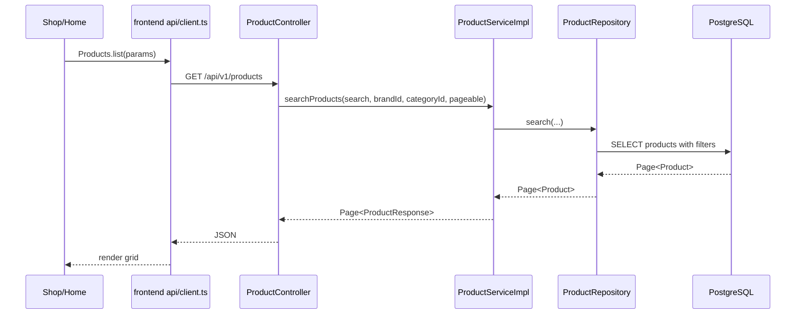
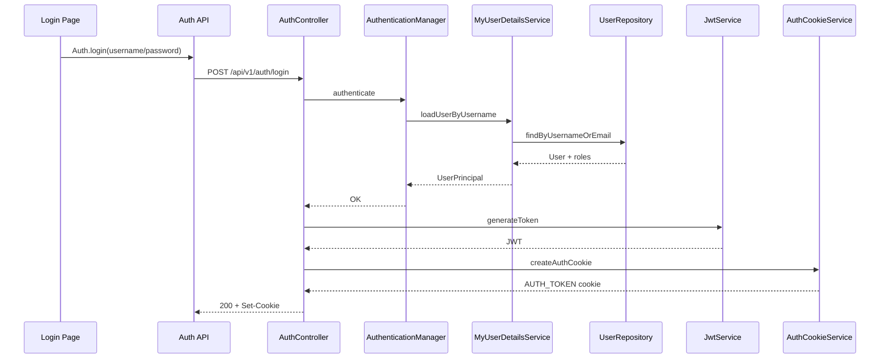
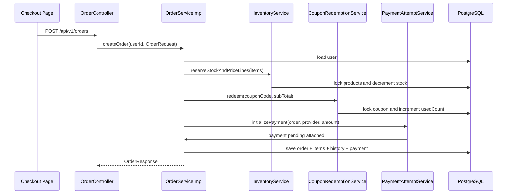

# Luồng Nghiệp Vụ End-To-End

Tài liệu này mô tả các luồng hoạt động chính của toàn bộ dự án, từ frontend tới backend và database.

## 1. Luồng Khởi Động Ứng Dụng

### Backend

```text
AuraTechApplication.main
  -> Spring Boot start
  -> Load application.properties
  -> Chọn profile dev/prod
  -> Kết nối PostgreSQL
  -> Flyway chạy migration
  -> Hibernate validate schema
  -> Khởi tạo SecurityConfig/JwtFilter/services/repositories
  -> Bật scheduler
  -> App listen port 8080
```

### Frontend

```text
main.tsx
  -> Render App
  -> BrowserRouter active
  -> useAuthStore.hydrate()
  -> gọi /api/v1/users/me nếu có cookie
  -> load cart/wishlist nếu đăng nhập
  -> render route hiện tại
```

## 2. Luồng Public Catalog

### Danh sách sản phẩm



### Chi tiết sản phẩm

```text
ProductDetail page
  -> Products.bySlug(slug)
  -> GET /api/v1/products/slug/{slug}
  -> ProductController.getProductBySlug
  -> ProductServiceImpl.getProductBySlug
  -> ProductRepository.findBySlug với EntityGraph brand/category/images
  -> ProductResponse.fromEntity
  -> Frontend hiển thị ảnh, giá, specs, stock, review
```

## 3. Luồng Đăng Ký

```text
Register page
  -> Auth.register
  -> POST /api/v1/auth/register
  -> AuthController.register
  -> UserServiceImpl.savedUser
  -> RoleRepository.findByName(CUSTOMER)
  -> BCryptPasswordEncoder.encode(password)
  -> UserRepository.save(user)
  -> UserResponse
  -> Frontend tự login lại bằng email/username
```

Điểm quan trọng:

- User mới được gán role `CUSTOMER`.
- Password được hash bằng BCrypt.
- `email` và `username` có unique constraint trong DB.

## 4. Luồng Đăng Nhập



Sau login, frontend gọi:

```text
Auth.me()
  -> GET /api/v1/users/me
  -> lấy thông tin user hiện tại
  -> refresh cart
  -> refresh wishlist
```

## 5. Luồng Request Cần Đăng Nhập

```text
Frontend gọi API protected
  -> Browser tự gửi AUTH_TOKEN cookie
  -> JwtFilter kiểm tra cookie
  -> JwtService extract username
  -> MyUserDetailsService load user/roles
  -> JwtService kiểm tra token còn hạn
  -> SecurityContext set Authentication
  -> Controller nhận @AuthenticationPrincipal UserPrincipal
```

Ví dụ:

```text
GET /api/v1/cart
  -> CartController.getCartByUserId
  -> principal.getId()
```

## 6. Luồng CSRF

Frontend dùng cookie auth nên backend bật CSRF.

Với request unsafe method:

- POST
- PUT
- PATCH
- DELETE

Frontend interceptor làm:

```text
Nếu chưa có XSRF-TOKEN cookie
  -> GET /api/v1/auth/csrf
  -> backend set/gửi token
Đọc XSRF-TOKEN từ document.cookie
Gửi header X-XSRF-TOKEN
```

## 7. Luồng Cart

### Xem giỏ hàng

```text
CartDrawer / Checkout
  -> Cart.get()
  -> GET /api/v1/cart
  -> CartController.getCartByUserId
  -> CartServiceImpl.getCartByUserId
  -> CartRepository.findByUserId
  -> EntityGraph load items/product/brand/category
  -> CartResponse tính totalPrice
```

### Thêm item vào giỏ

```text
ProductCard/ProductDetail
  -> useCartStore.add(productId, quantity)
  -> Cart.add
  -> POST /api/v1/cart/items
  -> CartController.addItemToCart
  -> CartServiceImpl.addItemToCart
  -> UserRepository.findByIdForUpdate
  -> CartRepository.findByUserIdForUpdate
  -> ProductRepository.findById
  -> Nếu item đã có: tăng quantity
  -> Nếu chưa có: tạo CartItem
  -> repo.save(cart)
  -> frontend refresh cart
```

### Cập nhật/xóa item

```text
PUT /api/v1/cart/items/{productId}
  -> lock user/cart
  -> tìm item trong cart
  -> set quantity

DELETE /api/v1/cart/items/{productId}
  -> lock user/cart
  -> remove item
```

## 8. Luồng Wishlist

```text
Wishlist toggle
  -> Nếu chưa yêu thích:
     POST /api/v1/wishlists
     -> kiểm tra user/product tồn tại
     -> existsByUserIdAndProductId
     -> save Wishlist

  -> Nếu đã yêu thích:
     DELETE /api/v1/wishlists/{productId}
     -> findByUserIdAndProductId
     -> delete
```

Wishlist có unique constraint `(user_id, product_id)` để tránh trùng dữ liệu.

## 9. Luồng Checkout Và Tạo Đơn

Đây là luồng quan trọng nhất của backend.



Chi tiết:

```text
OrderServiceImpl.createOrder
  -> kiểm tra user tồn tại
  -> kiểm tra user active
  -> reserve stock từng product
  -> tính subTotal
  -> redeem coupon nếu có
  -> tính finalAmount
  -> tạo Order status PENDING
  -> tạo OrderItem cho từng dòng
  -> tạo OrderHistory "Order created"
  -> tạo Payment PENDING
  -> set paymentExpiresAt nếu provider không phải COD
  -> save order
```

Điểm cần nhớ:

- Giá được chốt tại thời điểm mua bằng `priceAtPurchase`.
- Stock bị trừ ngay khi tạo order pending.
- Nếu order bị hủy hoặc payment fail, stock được trả lại.
- Coupon `usedCount` tăng khi tạo order và giảm lại nếu order bị hủy.

## 10. Luồng Payment

### Tạo payment attempt

```text
POST /api/v1/payments
  -> PaymentController.createPayment
  -> PaymentServiceImpl.createPayment
  -> lock order
  -> kiểm tra order thuộc user
  -> kiểm tra order còn nhận payment
  -> chỉ tạo attempt mới nếu attempt trước FAILED
  -> tạo Payment PENDING
```

### Retry payment từ order

```text
POST /api/v1/orders/{orderId}/payments/retry
  -> OrderController.retryPayment
  -> PaymentAttemptServiceImpl.retryPayment
  -> lock order
  -> kiểm tra user sở hữu order
  -> lấy last payment
  -> last payment phải FAILED
  -> tạo payment PENDING mới
```

### Admin update payment

```text
PUT /api/v1/payments/{id}
  -> PaymentController.updatePayment
  -> PaymentServiceImpl.updatePayment
  -> lock payment
  -> lock order kèm items
  -> nếu SUCCESS: OrderLifecycleService.confirmAfterSuccessfulPayment
  -> nếu FAILED: OrderLifecycleService.cancelOrder
```

## 11. Luồng Payment Webhook

```text
VNPay callback/webhook
  -> GET /api/v1/payments/vnpay-webhook
  -> PaymentWebhookController
  -> PaymentServiceImpl.verifyAndProcessWebhook
  -> remove vnp_SecureHash khỏi params
  -> sort params
  -> HMAC SHA-512 bằng secret key
  -> so sánh secure hash
  -> nếu valid:
       vnp_ResponseCode == "00" -> order CONFIRMED
       khác "00" -> order CANCELLED
```

Ghi chú production:

- Webhook cần được public trong security config.
- Nên update cả `Payment.status`, không chỉ `Order.status`.
- Nên kiểm tra amount, transaction number, provider và idempotency.
- Khi cancel nên đi qua `OrderLifecycleService.cancelOrder` để trả tồn kho/coupon.

## 12. Luồng Hủy Đơn Và Hoàn Tồn Kho

`OrderLifecycleService.cancelOrder` xử lý một điểm duy nhất cho việc hủy đơn:

```text
cancelOrder(order, description)
  -> nếu order đã CANCELLED: return
  -> nếu DELIVERED/SHIPPED: không cho hủy
  -> releaseReservedInventory
       -> lock từng product
       -> cộng lại stock
  -> rollbackCouponUsage
       -> lock coupon
       -> usedCount - 1 nếu > 0
  -> set status CANCELLED
  -> clear paymentExpiresAt
  -> thêm OrderHistory
```

## 13. Luồng Scheduled Job Hủy Đơn Quá Hạn

```text
Mỗi 60 giây
  -> OrderStateMachineImpl.expirePendingOrders
  -> OrderRepository.findExpiredOrdersForUpdate(PENDING, now)
  -> Với từng order:
       OrderLifecycleService.cancelOrder(order, "Payment window expired")
```

Order được xem là quá hạn nếu:

```text
status = PENDING
paymentExpiresAt != null
paymentExpiresAt <= now
```

COD có `paymentExpiresAt = null`, nên không bị job này hủy.

## 14. Luồng Admin Order

```text
Admin Orders page
  -> GET /api/v1/orders
  -> @PreAuthorize ADMIN
  -> OrderController.getAllOrders
  -> OrderServiceImpl.getAllOrders
  -> OrderRepository.findAll(pageable)
  -> OrderResponse.summaryFromEntity
```

Update trạng thái:

```text
PATCH /api/v1/orders/{orderId}/status
  -> ADMIN only
  -> OrderStateMachineImpl.updateOrderStatus
  -> lock order
  -> validate transition
  -> nếu CANCELLED: cancelOrder
  -> nếu SHIPPED: bắt buộc trackingNumber
  -> thêm history
```

State transition hợp lệ:

```text
PENDING -> CONFIRMED
CONFIRMED -> SHIPPED
SHIPPED -> DELIVERED
PENDING/CONFIRMED -> CANCELLED
```

Không cho chuyển trạng thái nếu order đã:

```text
CANCELLED
DELIVERED
```

## 15. Luồng Review

```text
POST /api/v1/reviews
  -> ReviewController.createReview
  -> ReviewServiceImpl.createReview
  -> kiểm tra user tồn tại
  -> kiểm tra product tồn tại
  -> kiểm tra user chưa review product này
  -> kiểm tra có order DELIVERED chứa product
  -> save Review
```

Rule:

- Chỉ review sau khi đơn đã giao thành công.
- Một user chỉ review một lần cho một sản phẩm.

## 16. Luồng User Address

```text
GET /api/v1/user-addresses/user
  -> lấy địa chỉ của user hiện tại

POST /api/v1/user-addresses
  -> tạo địa chỉ mới
  -> nếu isDefault = true:
       lock user/address list
       clear default cũ
       save địa chỉ mới default

PUT /api/v1/user-addresses/{addressId}
  -> chỉ sửa địa chỉ thuộc user hiện tại

DELETE /api/v1/user-addresses/{addressId}
  -> chỉ xóa địa chỉ thuộc user hiện tại
```

## 17. Luồng Admin Catalog

```text
Admin Products
  -> GET /api/v1/products
  -> POST /api/v1/products
  -> PUT /api/v1/products/{id}
  -> DELETE /api/v1/products/{id}
```

Tạo/sửa product:

```text
ProductServiceImpl
  -> validate brand/category
  -> validate discountPrice <= basePrice
  -> generate slug từ name
  -> replace product images nếu request có imageUrls
  -> save product
```

Brand/category tương tự:

```text
Controller
  -> Service
  -> validate dữ liệu
  -> generate slug
  -> Repository
```

## 18. Luồng Logout

```text
Frontend Auth.logout
  -> POST /api/v1/auth/logout
  -> AuthController.logout
  -> Set-Cookie AUTH_TOKEN maxAge=0
  -> frontend xóa user state
  -> reset cart/wishlist state
```

## 19. Tóm Tắt Luồng Toàn Bộ

```text
User vào web
  -> đọc catalog public
  -> đăng ký/đăng nhập
  -> cookie AUTH_TOKEN được lưu
  -> thêm sản phẩm vào cart/wishlist
  -> checkout
  -> backend trừ tồn kho, redeem coupon, tạo order/payment
  -> user/admin/payment gateway cập nhật payment/order
  -> order confirmed/shipped/delivered/cancelled
  -> nếu cancelled: trả stock/coupon
  -> nếu delivered: user có thể review
```
