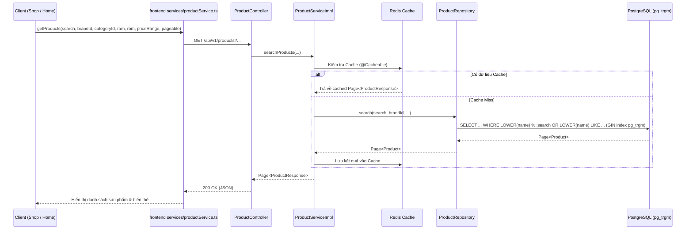
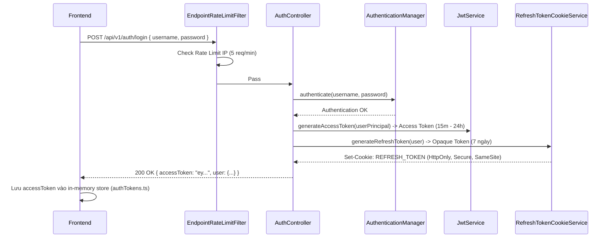
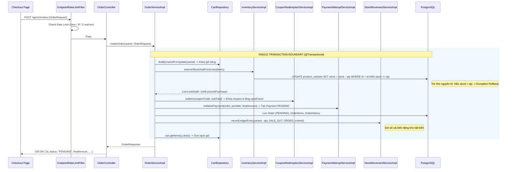
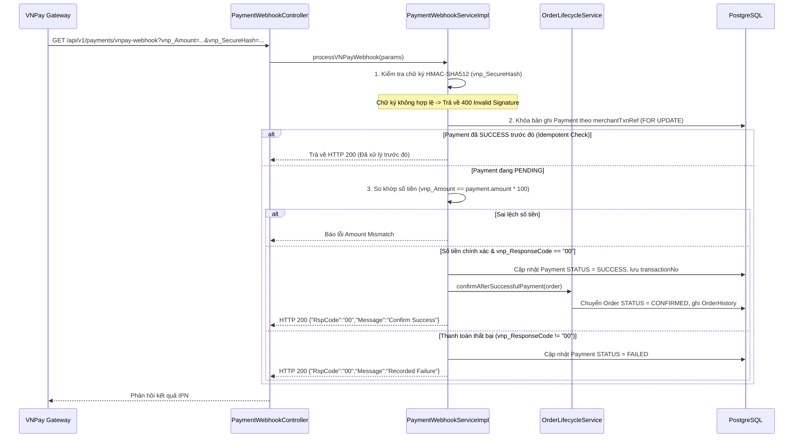
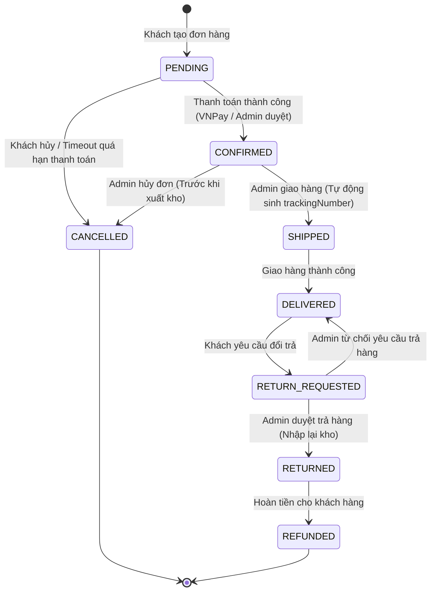

# Luồng Nghiệp Vụ Chi Tiết (End-To-End Business Flows)

Tài liệu này mô tả chi tiết từng luồng nghiệp vụ quan trọng trong hệ thống Ladux từ phía Client, qua các bộ lọc bảo mật, tầng Service xử lý đến Database và dịch vụ bên ngoài.

---

## 1. Luồng Khởi Động & Khởi Tạo Ứng Dụng

### 1.1 Khởi Động Backend
```text
LaduxApplication.main
  -> Khởi tạo Spring Boot context (Java 21 / Spring Boot 4.0.6)
  -> Nạp application.properties & profile (dev / prod)
  -> Kết nối PostgreSQL 17 & Redis 7.x
  -> Flyway chạy và kiểm tra 42 migration scripts (V1 -> V43)
  -> Hibernate kích hoạt với ddl-auto=validate (không tự sửa cấu trúc DB)
  -> Cấu hình SecurityFilterChains (OAuth2 chain & REST Bearer JWT chain)
  -> Khởi tạo Bucket4j ProxyManager trên Redis & ShedLock LockProvider trên PostgreSQL
  -> Kích hoạt Spring Scheduler (@EnableScheduling)
  -> Backend lắng nghe tại cổng :8080
```

### 1.2 Khởi Động Frontend
```text
main.tsx
  -> Khởi tạo ứng dụng React 18 & React Router DOM v7
  -> Khởi chạy Zustand Stores
  -> apiClient interceptor sẵn sàng bắt Authorization Bearer header
  -> Tự động gọi refresh phiên nếu có Refresh Token cookie hợp lệ
```

---

## 2. Luồng Khám Phá Catalog & Tìm Kiếm Mờ (Fuzzy Search)



---

## 3. Luồng Xác Thực, Đăng Nhập & Dual-Token Lifecycle

### 3.1 Đăng Ký Tài Khoản
1. Client gửi thông tin: `POST /api/v1/auth/register` (Username, Email, Password, Phone).
2. `EndpointRateLimitFilter` kiểm tra giới hạn đăng ký theo IP (5 requests/phút).
3. Backend kiểm tra tính duy nhất của `username` và `email`.
4. Mật khẩu được mã hóa bằng `BCryptPasswordEncoder`.
5. Tạo bản ghi `User`, gắn vai trò mặc định `ROLE_CUSTOMER`, khởi tạo `token_version = 0`.
6. Khởi tạo một giỏ hàng rỗng (`Cart`) gắn liền với `User`.

### 3.2 Đăng Nhập & Cấp Phát Token


### 3.3 Tự Động Xoay Vòng Refresh Token (Token Rotation)
1. Khi Access Token hết hạn, request gửi đến backend nhận lỗi `401 Unauthorized`.
2. `apiClient.ts` interceptor tự động bắt lỗi `401` và gọi `POST /api/v1/auth/refresh`.
3. Browser tự động đính kèm cookie `REFRESH_TOKEN`.
4. Backend kiểm tra tính hợp lệ của Refresh Token và so khớp `token_version` với User:
   - Nếu hợp lệ: Hủy Refresh Token cũ, cấp Refresh Token mới (Set-Cookie) và trả về Access Token mới trong response body.
   - Nếu không hợp lệ hoặc `token_version` đã bị tăng: Trả về `401`, frontend chuyển hướng về trang `/login` và xóa state.

---

## 4. Luồng Quản Lý Giỏ Hàng (Cart Operations)

Mọi thao tác thay đổi giỏ hàng đều sử dụng khóa bi quan (`findByUserIdForUpdate`) để tránh lỗi race condition khi người dùng click liên tục:

- **Thêm sản phẩm vào giỏ (`POST /api/v1/cart/items`)**:
  1. Khóa giỏ hàng của user hiện tại.
  2. Kiểm tra tồn kho của `ProductVariant`.
  3. Nếu biến thể đã tồn tại trong giỏ: Tăng `quantity`.
  4. Nếu chưa: Thêm dòng `CartItem` mới.
  5. Lưu giỏ hàng và xóa cache liên quan.
- **Cập nhật số lượng (`PUT /api/v1/cart/items/{variantId}`)**: Khóa giỏ, cập nhật số lượng mới (yêu cầu `quantity > 0`).
- **Xóa sản phẩm (`DELETE /api/v1/cart/items/{variantId}`)**: Khóa giỏ, loại bỏ `CartItem`.

---

## 5. Luồng Đặt Hàng Khóa Tồn Kho Nguyên Tử (Atomic Checkout Flow)

Đây là luồng nghiệp vụ quan trọng nhất của toàn bộ hệ thống backend:



---

## 6. Luồng Xử Lý Thanh Toán & Webhook (Payment & IPN Flow)

### 6.1 Khởi Tạo Giao Dịch VNPay Sandbox
1. Sau khi tạo đơn, client gọi endpoint lấy URL thanh toán: `POST /api/v1/payments/create-payment-url`.
2. Backend sinh chuỗi `merchantTxnRef` duy nhất, chuẩn hóa tham số và tính toán chữ ký số **HMAC-SHA512** bằng bí mật `vnp_HashSecret`.
3. Client được chuyển hướng sang cổng thanh toán VNPay Sandbox.

### 6.2 Xử Lý Webhook (VNPay IPN)


---

## 7. Cỗ Máy Trạng Thái Đơn Hàng (Order State Machine)

Vòng đời đơn hàng được kiểm soát nghiêm ngặt qua `OrderStateMachineImpl`:



### 7.1 Luồng Tự Động Hủy Đơn Quá Hạn (Automated Expiration)
- Cron job chạy định kỳ mỗi 60 giây (`@Scheduled(fixedDelay = 60000)`).
- Được khóa phân tán bởi **ShedLock** (`@SchedulerLock(name = "expirePendingOrdersLock")`).
- Tìm tất cả các đơn `PENDING` có `paymentExpiresAt <= NOW()`.
- Với mỗi đơn: Gọi `OrderLifecycleService.cancelOrder`:
  1. Chuyển trạng thái sang `CANCELLED`.
  2. Hoàn lại số lượng tồn kho vào `ProductVariant`.
  3. Giảm `used_count` của Coupon liên quan.
  4. Ghi sổ cái biến động kho `StockMovement` với loại `RETURN_IN` (nếu cần).
  5. Ghi log `OrderHistory` ("Payment window expired").

---

## 8. Luồng Quản Lý Chuỗi Cung Ứng & Sổ Cái Kho (Supply Chain & Inventory)

### 8.1 Đơn Nhập Hàng (Purchase Order - PO)
1. Admin tạo đơn nhập hàng: `POST /api/v1/admin/purchase-orders` (Chọn Nhà cung cấp, danh sách biến thể, số lượng dự kiến, giá nhập).
2. Đơn PO được tạo với trạng thái `DRAFT` hoặc `ORDERED`.
3. Khi hàng về kho: Admin thực hiện nhận hàng (`RECEIVING` / `COMPLETED`).
4. Hệ thống tự động:
   - Tăng `stock_quantity` của `ProductVariant`.
   - Ghi bản ghi vào `StockMovement` với loại `PURCHASE_IN`, tham chiếu tới mã `PO`.

### 8.2 Sổ Cái Biến Động Kho (Stock Ledger Audit)
Mọi thay đổi tồn kho đều tạo một bản ghi `StockMovement` bất biến:
- `PURCHASE_IN`: Nhập hàng từ nhà cung cấp theo PO.
- `SALE_OUT`: Xuất hàng bán theo đơn đặt hàng của khách.
- `RETURN_IN`: Nhập lại kho do đơn hàng bị hủy hoặc khách trả hàng thành công.
- `DAMAGE_OUT`: Xuất kho xử lý hàng hỏng/lỗi.
- `ADJUSTMENT_IN` / `ADJUSTMENT_OUT`: Điều chỉnh kho sau kiểm kê thực tế.
