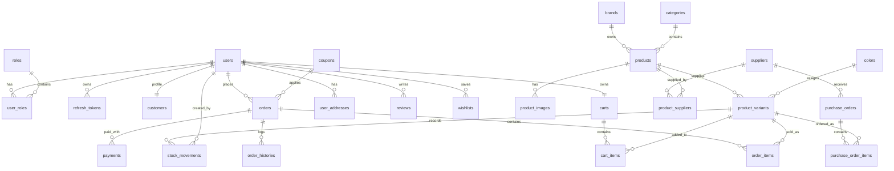

# Cơ Sở Dữ Liệu Và Module

Tài liệu này mô tả chi tiết schema cơ sở dữ liệu PostgreSQL, các script migration Flyway, và mối quan hệ giữa các module backend với các bảng dữ liệu trong hệ thống Ladux.

---

## 1. Danh Sách Migration Flyway (`backend/src/main/resources/db/migration`)

Hệ thống sử dụng Flyway để quản lý tiến hóa cơ sở dữ liệu phiên bản từ `V1` đến `V43`:

| Version | Tên Migration Script | Mục Đích & Thay Đổi Chính |
| :--- | :--- | :--- |
| `V1` | `V1__init_schema.sql` | Khởi tạo cấu trúc bảng cơ bản (users, roles, brands, categories, products, carts, orders, payments, coupons, reviews) |
| `V2` | `V2__add_hot_path_indexes.sql` | Đánh chỉ mục (Indexes) cho các trường truy vấn tần suất cao (foreign keys, timestamps, order statuses) |
| `V6` | `V6__set_dev_admin_bcrypt_password.sql` | Thiết lập mật khẩu mã hóa BCrypt cho tài khoản admin môi trường dev |
| `V7` | `V7__add_payment_gateway_transaction_no_unique.sql` | Thêm unique constraint cho `gateway_transaction_no` trên bảng payments |
| `V9` | `V9__add_stock_quantity_check.sql` | Thêm constraint `CHECK (stock_quantity >= 0)` chống âm tồn kho |
| `V10` | `V10__harden_category_delete_constraints.sql` | Ràng buộc khóa ngoại an toàn khi xóa danh mục |
| `V11` | `V11__create_shedlock_table.sql` | Tạo bảng `shedlock` phục vụ phân tán Scheduled Jobs trên nhiều instance |
| `V12` - `V13` | `V12__enable_pg_trgm_extension.sql`, `V13...` | Kích hoạt extension `pg_trgm` và tạo GIN Trigram index hỗ trợ tìm kiếm mờ |
| `V19` | `V19__fix_trigram_index_to_lower_name.sql` | Tối ưu GIN trigram index trên biểu thức `LOWER(name)` của bảng products |
| `V20` | `V20__create_refresh_tokens.sql` | Tạo bảng `refresh_tokens` lưu trữ token dài hạn phục vụ xoay vòng token |
| `V21` | `V21__add_token_version_to_users.sql` | Thêm trường `token_version` vào bảng `users` phục vụ thu hồi token tức thì |
| `V22` | `V22__add_customer_and_supply_chain.sql` | Thêm bảng `customers`, `suppliers`, `product_suppliers`, `purchase_orders`, `purchase_order_items`, `stock_movements` |
| `V30` | `V30__add_logo_url_to_brands.sql` | Thêm trường `logo_url` cho bảng `brands` |
| `V31` | `V31__add_shipping_fee_and_carrier_to_orders.sql` | Thêm `shipping_fee` và `carrier_name` vào bảng `orders` |
| `V32` - `V35` | `V32...`, `V35__create_email_verifications.sql` | Thêm các bảng xác thực OTP: `phone_verifications` và `email_verifications` |
| `V36` | `V36__add_google_oauth_identity.sql` | Thêm định danh Google OAuth2 (`oauth_provider`, `oauth_id`) trên bảng users |
| `V37` - `V38` | `V37...`, `V38__seed_product_variants...sql` | Tạo và nạp dữ liệu cấu hình biến thể sản phẩm (`product_variants`, `colors`, `specs`) |
| `V42` | `V42__add_merchantTxnRef_to_payment.sql` | Thêm trường `merchant_txn_ref` vào bảng `payments` phục vụ đối soát VNPay |
| `V43` | `V43__enable_pgvector_extension.sql` | Kích hoạt extension `vector` cho tính năng RAG / Embedding của Chatbot AI |

---

## 2. Sơ Đồ Quan Hệ Thực Thể (ERD Overview)

---

## 3. Chi Tiết Các Phân Hệ & Bảng Dữ Liệu

### 3.1 Phân Hệ Định Danh & Xác Thực (Identity Module)
- **`users`**: Tài khoản người dùng (`id`, `username`, `email`, `password_hash`, `is_active`, `token_version`, `oauth_provider`, `oauth_id`).
- **`roles` & `user_roles`**: Phân quyền vai trò (`ROLE_CUSTOMER`, `ROLE_ADMIN`).
- **`refresh_tokens`**: Lưu trữ opaque refresh tokens có gắn hạn dùng `expires_at` và cờ thu hồi `is_revoked`.
- **`email_verifications` & `phone_verifications`**: Lưu trữ mã OTP băm/mã hóa, thời hạn hết hạn (TTL) và số lần thử sai.
- **`customers`**: Thông tin mở rộng cho khách hàng (điểm tích lũy, phân hạng thành viên, ghi chú CRM).

### 3.2 Phân Hệ Danh Mục & Biến Thể (Catalog Module)
- **`brands`**: Thương hiệu máy tính (`name`, `slug`, `logo_url`, `description`).
- **`categories`**: Danh mục phân loại (`name`, `slug`, `image_url`).
- **`colors`**: Bảng màu sắc chuẩn (`name`, `hex_code`).
- **`products`**: Sản phẩm gốc (`name`, `slug`, `brand_id`, `category_id`, `specs` JSONB thông số, `is_active`, `thumbnail`).
- **`product_variants`**: Các biến thể cấu hình cụ thể:
  - `sku`: Mã SKU duy nhất cho từng phiên bản.
  - `ram_gb`, `storage_gb`, `color_id`: Thông số phần cứng.
  - `price`: Giá gốc niêm yết.
  - `discount_price`: Giá khuyến mãi.
  - `stock_quantity`: Số lượng tồn kho thực tế (có ràng buộc `CHECK (stock_quantity >= 0)`).
- **`product_images`**: Bộ sưu tập hình ảnh chi tiết theo sản phẩm.

### 3.3 Phân Hệ Giỏ Hàng & Mua Sắm (Cart & Wishlist)
- **`carts`**: Giỏ hàng của từng người dùng (`user_id`).
- **`cart_items`**: Dòng sản phẩm trong giỏ (`cart_id`, `product_variant_id`, `quantity`). Có ràng buộc duy nhất `UNIQUE (cart_id, product_variant_id)`.
- **`wishlists`**: Danh sách yêu thích (`user_id`, `product_id`) với ràng buộc `UNIQUE (user_id, product_id)`.

### 3.4 Phân Hệ Đơn Hàng & Vòng Đời (Order Module)
- **`orders`**:
  - `user_id`: Khách hàng đặt mua.
  - `coupon_id`: Mã giảm giá đã áp dụng.
  - `sub_total`, `discount_amount`, `shipping_fee`, `final_amount`: Các giá trị tiền tệ.
  - `carrier_name`, `tracking_number`: Thông tin đơn vị vận chuyển và mã vận đơn.
  - `status`: Enum trạng thái (`PENDING`, `CONFIRMED`, `SHIPPED`, `DELIVERED`, `CANCELLED`, `RETURN_REQUESTED`, `RETURNED`, `REFUNDED`).
  - `payment_expires_at`: Mốc thời gian tự động hủy đơn nếu quá hạn thanh toán.
- **`order_items`**: Chi tiết dòng đơn hàng (`order_id`, `product_variant_id`, `quantity`, `price_at_purchase`). Trường `price_at_purchase` bảo lưu giá trị tại thời điểm mua.
- **`order_histories`**: Nhật ký chuyển trạng thái đơn hàng (`order_id`, `user_id`, `status`, `description`, `created_at`).

### 3.5 Phân Hệ Thanh Toán & Khuyến Mãi (Payment & Coupon)
- **`coupons`**: Mã ưu đãi (`code`, `discount_type`, `discount_value`, `min_order_value`, `usage_limit`, `used_count`, `expires_at`, `is_active`).
- **`payments`**: Bản ghi giao dịch thanh toán (`order_id`, `provider`, `amount`, `merchant_txn_ref`, `gateway_transaction_no`, `status`).

### 3.6 Phân Hệ Chuỗi Cung Ứng & Sổ Cái Kho (Supply Chain & Inventory)
- **`suppliers`**: Thông tin nhà cung cấp thiết bị (`name`, `contact_name`, `email`, `phone`, `address`).
- **`product_suppliers`**: Bảng liên kết sản phẩm - nhà cung cấp kèm giá nhập tham chiếu (`product_id`, `supplier_id`, `cost_price`).
- **`purchase_orders`**: Đơn nhập hàng (`po_number`, `supplier_id`, `status`, `total_amount`, `expected_delivery_date`).
- **`purchase_order_items`**: Dòng sản phẩm trong đơn nhập (`purchase_order_id`, `product_variant_id`, `quantity_ordered`, `quantity_received`, `unit_cost`).
- **`stock_movements` (Sổ cái kho - Immutable Stock Ledger)**:
  - `product_variant_id`: Biến thể sản phẩm biến động.
  - `quantity`: Số lượng biến động (số âm khi xuất kho, số dương khi nhập kho).
  - `movement_type`: Loại biến động (`PURCHASE_IN`, `SALE_OUT`, `RETURN_IN`, `DAMAGE_OUT`, `ADJUSTMENT_IN`, `ADJUSTMENT_OUT`, `OTHER`).
  - `reference_type`: Loại chứng từ (`ORDER`, `PURCHASE_ORDER`, `ADJUSTMENT`).
  - `reference_id`: Mã ID của chứng từ liên kết.
  - `created_by_user_id`: Người thực hiện giao dịch.
  - `note`: Ghi chú chi tiết lý do biến động.

### 3.7 Bảng Hệ Thống & Hạ Tầng
- **`shedlock`**: Bảng điều phối khóa phân tán cho các cron jobs (`name`, `lock_until`, `locked_at`, `locked_by`).
- **`notifications`**: Thông báo hệ thống gửi đến người dùng.
- **`reviews`**: Đánh giá và nhận xét sản phẩm (`user_id`, `product_id`, `rating`, `comment`).

---

## 4. Các Chỉ Mục Trọng Điểm (Hot Path Indexes)

Cơ sở dữ liệu được tối ưu bằng các chỉ mục chuyên dụng:
- **Trigram GIN Index**: `idx_products_lower_name_trgm` trên `LOWER(name)` hỗ trợ tìm kiếm mờ cực nhanh không phụ thuộc vào `LIKE '%...%'` thông thường.
- **Composite Indexes**:
  - `orders(user_id, created_at DESC)`: Tối ưu trang danh sách đơn của khách hàng.
  - `orders(status, created_at DESC)`: Tối ưu trang lọc đơn hàng của Admin.
  - `payments(order_id, created_at DESC)`: Tối ưu tra cứu giao dịch thanh toán.
  - `stock_movements(product_variant_id, created_at DESC)`: Tối ưu truy xuất lịch sử sổ cái kho.
- **Partial Index**: `idx_orders_pending_expiration` trên `orders(payment_expires_at) WHERE status = 'PENDING'` giúp Scheduled Job quét đơn hết hạn chỉ trong vài mili-giây.
