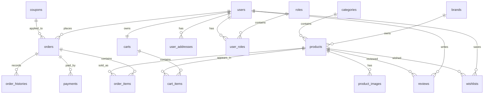

# Cơ Sở Dữ Liệu Và Module

Tài liệu này mô tả schema database và cách từng module backend gắn với các bảng.

## 1. Migration

Migration nằm ở:

```text
backend/src/main/resources/db/migration
```

Dev seed data nằm ở:

```text
backend/src/main/resources/db/devdata
```

Các file chính:

| File | Vai trò |
| --- | --- |
| `V1__init_schema.sql` | Tạo bảng, khóa chính, khóa ngoại, unique constraint |
| `V2__add_hot_path_indexes.sql` | Thêm index cho truy vấn hay dùng |
| `V3__insert_mock_data.sql` | Mock data cho profile dev |

## 2. Nhóm Bảng



## 3. Identity Module

### Bảng

- `users`
- `roles`
- `user_roles`

### Entity

- `User`
- `Role`
- `UserPrincipal`

### Repository

- `UserRepository`
- `RoleRepository`

### Service

- `UserServiceImpl`
- `MyUserDetailsService`
- `JwtService`
- `AuthCookieService`

### Controller

- `AuthController`
- `UserController`

### Luồng chính

```text
Register
  -> tạo User
  -> assign CUSTOMER role

Login
  -> load user by username/email
  -> BCrypt verify password
  -> generate JWT
  -> set AUTH_TOKEN cookie

Authenticated request
  -> JwtFilter
  -> load user/roles
  -> UserPrincipal
```

## 4. Catalog Module

### Bảng

- `brands`
- `categories`
- `products`
- `product_images`

### Entity

- `Brand`
- `Category`
- `Product`
- `ProductImage`

### Repository

- `BrandRepository`
- `CategoryRepository`
- `ProductRepository`
- `ProductImageRepository`

### Service

- `BrandServiceImpl`
- `CategoryServiceImpl`
- `ProductServiceImpl`
- `ProductImageServiceImpl`
- `PricingServiceImpl`

### Controller

- `BrandController`
- `CategoryController`
- `ProductController`
- `ProductImageController`

### Field quan trọng

`products`:

- `sku`: mã sản phẩm, unique.
- `slug`: URL slug, unique.
- `base_price`: giá gốc.
- `discount_price`: giá giảm.
- `stock_quantity`: tồn kho.
- `specs`: JSONB thông số kỹ thuật.
- `thumbnail`: ảnh đại diện.
- `is_active`: trạng thái hiển thị.

### Query chính

- Tìm product theo id.
- Tìm product theo slug.
- Tìm product theo sku.
- Lọc theo brand.
- Lọc theo category.
- Lọc active.
- Search theo name/sku.

## 5. Cart Module

### Bảng

- `carts`
- `cart_items`

### Entity

- `Cart`
- `CartItem`

### Repository

- `CartRepository`
- `CartItemRepository`

### Service

- `CartServiceImpl`

### Controller

- `CartController`

### Quan hệ

```text
users 1-1 carts
carts 1-n cart_items
products 1-n cart_items
```

### Constraint quan trọng

```text
uk_cart_items_cart_product UNIQUE (cart_id, product_id)
```

Ý nghĩa: một sản phẩm chỉ xuất hiện một lần trong một giỏ hàng. Muốn tăng số lượng thì update `quantity`, không tạo dòng mới.

## 6. Order Module

### Bảng

- `orders`
- `order_items`
- `order_histories`

### Entity

- `Order`
- `OrderItem`
- `OrderHistory`

### Repository

- `OrderRepository`
- `OrderItemRepository`
- `OrderHistoryRepository`

### Service

- `OrderServiceImpl`
- `OrderStateMachineImpl`
- `OrderLifecycleService`
- `OrderItemServiceImpl`
- `OrderHistoryServiceImpl`

### Controller

- `OrderController`
- `OrderItemController`
- `OrderHistoryController`

### Field quan trọng

`orders`:

- `user_id`: người đặt.
- `coupon_id`: coupon áp dụng nếu có.
- `sub_total`: tổng trước giảm giá.
- `discount_amount`: số tiền giảm.
- `final_amount`: số tiền cuối.
- `status`: trạng thái đơn.
- `shipping_address`: địa chỉ giao.
- `tracking_number`: mã vận đơn.
- `payment_expires_at`: hạn thanh toán.

`order_items`:

- `product_id`: sản phẩm.
- `quantity`: số lượng.
- `price_at_purchase`: giá chốt tại thời điểm mua.

### Order Status

```text
PENDING
CONFIRMED
SHIPPED
DELIVERED
CANCELLED
```

### Transition hợp lệ

```text
PENDING -> CONFIRMED
CONFIRMED -> SHIPPED
SHIPPED -> DELIVERED
PENDING -> CANCELLED
CONFIRMED -> CANCELLED
```

## 7. Inventory Module

Inventory không có bảng riêng. Tồn kho hiện nằm trong:

```text
products.stock_quantity
```

Service chính:

```text
InventoryServiceImpl
```

Luồng reserve:

```text
Lock product
  -> kiểm tra stock_quantity >= quantity
  -> stock_quantity = stock_quantity - quantity
  -> trả LineDraft gồm product, quantity, priceAtPurchase, lineTotal
```

Luồng release khi hủy:

```text
Lock product
  -> stock_quantity = stock_quantity + orderItem.quantity
```

## 8. Coupon Module

### Bảng

- `coupons`

### Entity

- `Coupon`

### Repository

- `CouponRepository`

### Service

- `CouponServiceImpl`
- `CouponRedemptionServiceImpl`

### Controller

- `CouponController`

### Field quan trọng

- `code`: mã coupon, unique.
- `discount_type`: loại giảm giá.
- `discount_value`: giá trị giảm.
- `min_order_value`: đơn tối thiểu.
- `usage_limit`: giới hạn số lượt.
- `used_count`: đã dùng bao nhiêu lượt.
- `expires_at`: hạn dùng.

### Discount Type

```text
PERCENT
FIXED
```

### Redeem

```text
findByCodeForUpdate
  -> check expiresAt
  -> check usedCount < usageLimit
  -> check subTotal >= minOrderValue
  -> calculate discount
  -> usedCount + 1
```

## 9. Payment Module

### Bảng

- `payments`

### Entity

- `Payment`

### Repository

- `PaymentRepository`

### Service

- `PaymentServiceImpl`
- `PaymentAttemptServiceImpl`

### Controller

- `PaymentController`
- `PaymentWebhookController`

### Field quan trọng

- `order_id`: order được thanh toán.
- `provider`: cổng/phương thức thanh toán.
- `transaction_no`: mã giao dịch.
- `amount`: số tiền.
- `status`: trạng thái payment.

### Provider

```text
VNPAY
MOMO
COD
```

### Payment Status

```text
PENDING
SUCCESS
FAILED
```

## 10. Review Module

### Bảng

- `reviews`

### Entity

- `Review`

### Repository

- `ReviewRepository`

### Service

- `ReviewServiceImpl`

### Controller

- `ReviewController`

### Constraint

```text
uk_reviews_user_product UNIQUE (user_id, product_id)
```

Ý nghĩa: một user chỉ review một product một lần.

### Business rule

User chỉ được review nếu có order `DELIVERED` chứa product đó.

## 11. Wishlist Module

### Bảng

- `wishlists`

### Entity

- `Wishlist`

### Repository

- `WishlistRepository`

### Service

- `WishlistServiceImpl`

### Controller

- `WishlistController`

### Constraint

```text
uk_wishlists_user_product UNIQUE (user_id, product_id)
```

Ý nghĩa: một user không thể wishlist trùng cùng một product.

## 12. User Address Module

### Bảng

- `user_addresses`

### Entity

- `UserAddress`

### Repository

- `UserAddressRepository`

### Service

- `UserAddressServiceImpl`

### Controller

- `UserAddressController`

### Field quan trọng

- `receiver_name`
- `phone`
- `street`
- `district`
- `city`
- `is_default`

Khi set một địa chỉ làm default, service clear default cũ của user trước.

## 13. Index Hiện Có

File `V2__add_hot_path_indexes.sql` thêm index cho:

- `products.brand_id`
- `products.category_id`
- `products.is_active`
- `product_images.product_id`
- `cart_items.product_id`
- `orders(user_id, created_at DESC)`
- `orders(status, created_at DESC)`
- `orders(payment_expires_at)` với partial index cho pending order
- `order_items.order_id`
- `order_items.product_id`
- `order_histories.order_id`
- `payments(order_id, created_at DESC)`
- `payments.status`
- `user_addresses.user_id`
- `reviews(product_id, created_at DESC)`
- `reviews(user_id, created_at DESC)`
- `wishlists.product_id`

## 14. Gợi Ý Đọc Database

Đọc theo thứ tự này:

1. `roles`, `users`, `user_roles`
2. `brands`, `categories`, `products`, `product_images`
3. `carts`, `cart_items`
4. `coupons`
5. `orders`, `order_items`, `order_histories`
6. `payments`
7. `reviews`, `wishlists`
8. `user_addresses`

Sau đó mở entity Java tương ứng để hiểu quan hệ JPA.
