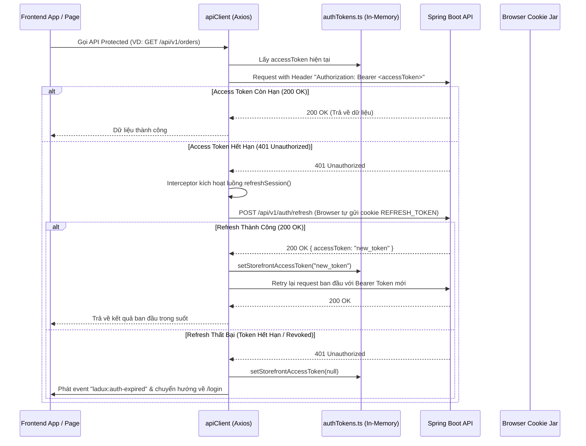

# Frontend Và Tầng Giao Tiếp API (Frontend & API Client)

Tài liệu này mô tả kiến trúc tầng giao diện React 18 SPA (Single Page Application) và cách thức frontend kết nối, xác thực và đồng bộ dữ liệu với Backend REST API.

---

## 1. Stack Công Nghệ Frontend

| Công nghệ | Phiên bản | Vai trò & Mục đích |
| :--- | :--- | :--- |
| **UI Library** | React 18.3.x | Xây dựng giao diện người dùng theo component |
| **Ngôn ngữ** | TypeScript 5.8.x | Đảm bảo tính an toàn kiểu dữ liệu (Type-safety) đồng bộ với Backend DTO |
| **Build Tool** | Vite 6.3.x | Môi trường phát triển HMR nhanh và đóng gói bundle tối ưu |
| **Routing** | React Router DOM v7 | Điều hướng client-side cho Storefront và Admin Portal |
| **HTTP Client** | Axios | Gửi HTTP requests, cấu hình Interceptors tự động refresh token |
| **State Management** | Zustand & TanStack Query | Quản lý state toàn cục (Auth, Cart, Wishlist, UI) và caching server state |
| **Styling** | Tailwind CSS 4.x | Thiết kế Cyber Gaming / Dark Mode sang trọng, responsive |
| **UI Primitives** | Radix UI | Các component headless chuẩn accessibility (Dialog, Popover, Select, Dropdown) |
| **Icons & Toaster** | Lucide React, Sonner | Bộ icon hiện đại và thông báo toast động |

---

## 2. Cấu Trúc Thư Mục Frontend (`frontend/src/`)

```text
frontend/src/
├── main.tsx                   # Entry point React
├── App.tsx                    # Cấu hình routes cho toàn bộ ứng dụng
├── config/                    # Cấu hình biến môi trường (env.apiBaseUrl)
├── types/                     # TypeScript Interfaces (khớp 100% với DTO Backend)
├── services/                  # Tầng dịch vụ giao tiếp REST API
│   ├── apiClient.ts           # Axios instance chính với Request/Response Interceptors
│   ├── authTokens.ts          # Quản lý Access Token trong bộ nhớ ứng dụng
│   ├── authService.ts         # API Đăng nhập, Đăng ký, Logout, Refresh, OTP
│   ├── productService.ts      # API Sản phẩm, Biến thể, Danh mục, Thương hiệu, Tìm kiếm
│   ├── cartService.ts         # API Thao tác giỏ hàng
│   ├── orderService.ts        # API Đặt hàng, Lịch sử đơn hàng, Hủy đơn, Đổi trả
│   ├── paymentService.ts      # API Khởi tạo thanh toán VNPay, Callback return, Retry
│   ├── purchaseOrderService.ts# API Quản lý đơn nhập hàng (Purchase Orders)
│   ├── supplierService.ts     # API Quản lý nhà cung cấp thiết bị
│   ├── stockMovementService.ts# API Tra cứu sổ cái biến động kho
│   └── chatbotService.ts      # API Tương tác với trợ lý AI
├── stores/                    # Zustand Store quản lý trạng thái Client (Auth, Cart, Wishlist, UI)
├── pages/                     # Các trang Storefront cho khách hàng
├── admin/                     # Toàn bộ giao diện và trang quản trị Admin Portal
└── components/                # UI Components tái sử dụng (Header, Footer, ProductCard, Dialogs, ...)
```

---

## 3. Cơ Chế Xác Thực & Tự Động Làm Mới Phiên (Auth & Token Interceptors)

Frontend áp dụng mô hình bảo mật **Dual-Token** tiêu chuẩn cao:



### Triển khai trong `apiClient.ts`:
- **Request Interceptor**: Tự động đính kèm `Authorization: Bearer <token>` nếu có token trong bộ nhớ.
- **Response Interceptor**: Chặn lỗi `401`, khóa hàng đợi (mutex lock `refreshPromise`) để nhiều request đồng thời cùng chờ 1 lần refresh duy nhất, tránh gửi bão request refresh lên server.

---

## 4. Hệ Thống Định Tuyến (Routing)

### 4.1 Storefront Routes (Khách Hàng)
| Đường dẫn URL | Trang Giao Diện | Mô tả chức năng |
| :--- | :--- | :--- |
| `/` | `Home` | Trang chủ, Banner carousel, Danh mục nổi bật, Sản phẩm mới |
| `/shop` | `Shop` | Bộ lọc sản phẩm đa tiêu chí (CPU, RAM, ROM, Giá), tìm kiếm mờ |
| `/product/:slug` | `ProductDetail` | Chi tiết sản phẩm, chọn biến thể, thông số kỹ thuật, đánh giá |
| `/cart` | `Cart` | Quản lý giỏ hàng, cập nhật số lượng, áp dụng mã giảm giá |
| `/checkout` | `Checkout` | Điền thông tin giao hàng, chọn cổng thanh toán (VNPay / COD) |
| `/orders` | `Orders` | Danh sách lịch sử đơn hàng của tôi |
| `/orders/:id` | `OrderDetail` | Chi tiết đơn hàng, timeline trạng thái, yêu cầu đổi trả |
| `/wishlist` | `Wishlist` | Bộ sưu tập sản phẩm yêu thích |
| `/login`, `/register` | `Login`, `Register` | Đăng nhập mật khẩu, Google OAuth2, Đăng ký tài khoản |

### 4.2 Admin Portal Routes (Quản Trị Viên)
| Đường dẫn URL | Trang Giao Diện | Quyền hạn yêu cầu |
| :--- | :--- | :--- |
| `/admin/login` | `AdminLogin` | Public |
| `/admin` | `AdminDashboard` | `ROLE_ADMIN` |
| `/admin/products` | `AdminProducts` | `ROLE_ADMIN` (CRUD sản phẩm, biến thể, hình ảnh) |
| `/admin/categories` | `AdminCategories` | `ROLE_ADMIN` (Quản lý danh mục) |
| `/admin/brands` | `AdminBrands` | `ROLE_ADMIN` (Quản lý thương hiệu) |
| `/admin/orders` | `AdminOrders` | `ROLE_ADMIN` (Điều phối đơn hàng qua State Machine) |
| `/admin/purchase-orders` | `AdminPurchaseOrders` | `ROLE_ADMIN` (Lập đơn nhập hàng, nhận hàng vào kho) |
| `/admin/suppliers` | `AdminSuppliers` | `ROLE_ADMIN` (Quản lý đối tác nhà cung cấp) |
| `/admin/inventory` | `AdminInventoryLedger` | `ROLE_ADMIN` (Tra cứu sổ cái biến động kho) |
| `/admin/coupons` | `AdminCoupons` | `ROLE_ADMIN` (Quản lý mã khuyến mãi) |
| `/admin/users` | `AdminUsers` | `ROLE_ADMIN` (Quản trị tài khoản & phân quyền) |

---

## 5. Đồng Bộ Kiểu Dữ Liệu TypeScript (`types/api.ts`)

Mọi DTO của Backend đều được ánh xạ chặt chẽ sang TypeScript Interfaces để đảm bảo an toàn kiểu:
- `ProductResponse`, `ProductVariantResponse`, `BrandResponse`, `CategoryResponse`.
- `OrderResponse`, `OrderItemResponse`, `OrderHistoryResponse`.
- `PaymentCallbackResponse`, `CouponResponse`.
- `PurchaseOrderResponse`, `StockMovementResponse`, `SupplierResponse`.
- `UserResponse`, `CustomerResponse`.
