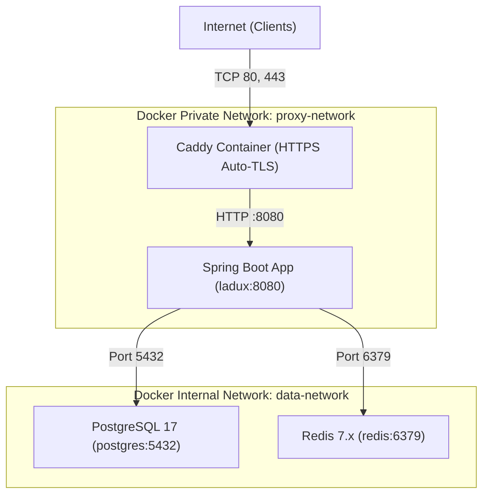

# Vận Hành, Kiểm Thử Và Khả Năng Mở Rộng (Operations, Testing & Scalability)

Tài liệu này hướng dẫn chi tiết quy trình build, kiểm thử tự động, triển khai hạ tầng container hóa và các chiến lược mở rộng quy mô cho hệ thống Ladux.

---

## 1. Kiểm Thử Tự Động (Automated Testing)

### 1.1 Kiểm Thử Tích Hợp Với Testcontainers
Backend sử dụng thư viện **Testcontainers** để chạy các bài kiểm thử tích hợp (Integration Tests) trực tiếp trên một container PostgreSQL thật:

- **Ưu điểm**:
  - Không phụ thuộc vào cơ sở dữ liệu cài đặt trên máy local.
  - Chạy đầy đủ 42 migration script của Flyway trên container tạm thời.
  - Đảm bảo kiểm chứng chính xác các tính năng đặc thù của PostgreSQL (JSONB specs, GIN Trigram index, pessimistic lock `FOR UPDATE`, CHECK constraints).
- **Cách chạy**:
  ```powershell
  cd backend
  ./mvnw test
  ```

### 1.2 Kiểm Thử Frontend Với Vitest & TypeScript
```powershell
cd frontend
# Kiểm tra an toàn kiểu dữ liệu
npm run typecheck

# Chạy unit tests frontend
npm run test
```

---

## 2. Đóng Gói Ứng Dụng (Build & Packaging)

### 2.1 Backend (Spring Boot JAR)
```powershell
cd backend
# Bỏ qua test khi đóng gói nhanh
./mvnw clean package -DskipTests
```
- File kết quả: `backend/target/ladux.jar`

### 2.2 Frontend (Vite Production Bundle)
```powershell
cd frontend
npm run build
```
- Thư mục đầu ra: `frontend/dist/` (Tối ưu minified JS, CSS, Tree-shaking).

---

## 3. Khởi Chạy Hạ Tầng Với Docker Compose

### 3.1 Môi Trường Development (Chỉ Database & Redis)
Phục vụ chạy code trực tiếp từ IDE:
```bash
cd backend
docker compose up -d postgres redis
```
- PostgreSQL lắng nghe tại: `localhost:5432`
- Redis lắng nghe tại: `localhost:6379`

### 3.2 Môi Trường Production (Stack Toàn Diện Kèm Caddy)
File cấu hình `backend/docker-compose.prod.yml` kết hợp **Caddy Reverse Proxy**:



**Nguyên tắc cô lập bảo mật hạ tầng:**
- Chỉ duy nhất container **Caddy** được publish port ra ngoài Host (`80:80`, `443:443`).
- Các container `app`, `postgres`, `redis` hoàn toàn **không mở port host**, không thể truy cập trực tiếp từ Internet.
- Giao tiếp giữa App và Database/Redis nằm hoàn toàn trong mạng nội bộ ảo `data-network`.

**Lệnh khởi chạy Production:**
```bash
# Từ root repository
docker compose --env-file .env.production -f backend/docker-compose.prod.yml up -d --build
```

---

## 4. Danh Mục Kiểm Tra Vận Hành & Bảo Mật (Production Checklist)

### 4.1 Bảo Mật & Secrets
- [x] `APP_JWT_SECRET` sử dụng chuỗi Base64 bảo mật tối thiểu 256 bits, tách biệt khỏi mã nguồn.
- [x] Access Token lưu in-memory; Refresh Token lưu trong Cookie có gắn cờ `HttpOnly; Secure; SameSite=Strict/Lax`.
- [x] CORS được cấu hình chặt chẽ chỉ chấp nhận domain production (`APP_CORS_ALLOWED_ORIGINS`).
- [x] Webhook VNPay IPN bắt buộc xác thực chữ ký HMAC-SHA512 và đối soát số tiền trước khi ghi nhận.
- [x] Phân quyền Role-Based trên API (`@PreAuthorize("hasRole('ADMIN')")`).

### 4.2 Lưu Trữ & Cơ Sở Dữ Liệu
- [x] Database sử dụng Flyway migration, `spring.jpa.hibernate.ddl-auto=validate`.
- [x] Dữ liệu PostgreSQL và Redis được lưu trên Docker Named Volumes (`postgres-data`, `redis-data`) chống mất mát dữ liệu khi restart container.
- [x] Thư mục upload ảnh được bind-mount ra ngoài host (`uploads/`).

### 4.3 Khả Năng Giám Sát (Observability)
- [x] Endpoint Health check sẵn sàng qua Spring Boot Actuator:
  - Liveness: `GET /actuator/health/liveness`
  - Readiness: `GET /actuator/health/readiness`
- [x] Logging định dạng chuẩn hỗ trợ truy vết lỗi theo thời gian thực.

---

## 5. Chiến Lược Mở Rộng Quy Mô (Scalability Strategy)

### 5.1 Xử Lý Concurrency & Đồng Bộ Đa Nút
- **Distributed Scheduling (ShedLock)**: Khi scale backend lên 2 hoặc nhiều instance, bảng `shedlock` trong database đảm bảo chỉ 1 instance duy nhất thực thi cron job quét đơn quá hạn, triệt tiêu nguy cơ duplicate cancellation.
- **Distributed Rate Limiting (Bucket4j + Redis)**: Tất cả các instance cùng chia sẻ chung các bucket trên Redis, đảm bảo người dùng không thể lách rate limit bằng cách gửi request luân phiên qua nhiều server.
- **Distributed Caching (Redis Cache)**: Dữ liệu danh mục sản phẩm, thương hiệu được cache tập trung trên Redis, giảm tải tới 80% truy vấn đọc vào PostgreSQL.

### 5.2 Lộ Trình Nâng Cấp Tương Lai
1. **Message Queue Asynchronous Processing**: Đưa các tác vụ gửi email OTP, gửi thông báo đơn hàng và báo cáo tài chính sang hàng đợi RabbitMQ / Kafka để giải phóng nhanh HTTP Worker Threads.
2. **Database Read Replicas**: Khi lưu lượng đọc tăng cao, cấu hình Spring Routing Datasource để chuyển các truy vấn `@Transactional(readOnly = true)` sang máy chủ PostgreSQL Read Replica.
3. **Giám Sát Toàn Diện**: Tích hợp Prometheus và Grafana để hiển thị biểu đồ latency, JVM heap usage, active database connections và HTTP request rates.
