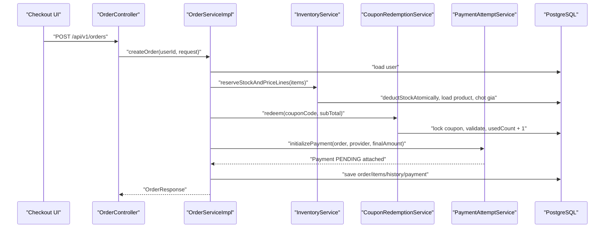

# Bài Giảng Backend Ladux Từ Tổng Quan Đến Chi Tiết

Tài liệu này là một bài giảng đọc sâu backend Ladux. Mục tiêu là giúp bạn không chỉ biết endpoint nào làm gì, mà còn hiểu request đi qua những tầng nào, nghiệp vụ được kiểm soát ở đâu, dữ liệu được lưu thế nào, và các workflow thương mại điện tử nối vào nhau ra sao.

## 1. Cách Nhìn Tổng Quan

Ladux backend là một Spring Boot monolith cho hệ thống bán hàng công nghệ. Nó không tách thành nhiều microservice, mà gom các module vào một ứng dụng duy nhất:

```text
Client
  -> Controller
  -> Request DTO validation
  -> Service nghiệp vụ
  -> Repository
  -> Entity/JPA
  -> PostgreSQL
  -> Response DTO
  -> Client
```

Các nhóm nghiệp vụ lớn:

| Nhóm | Vai trò |
| --- | --- |
| Identity/Auth | Đăng ký, đăng nhập, JWT cookie, user, role |
| Catalog | Brand, category, product, product image |
| Commerce | Cart, wishlist, checkout, order |
| Inventory | Kiểm tra và giữ tồn kho khi tạo đơn |
| Coupon | Preview coupon, redeem coupon, rollback lượt dùng |
| Payment | Payment attempt, payment callback, retry, webhook |
| Review | Đánh giá sản phẩm sau khi đơn đã giao |
| Admin | Quản trị catalog, user, order, payment, coupon, review |

Điểm quan trọng nhất: backend không chỉ CRUD. Nghiệp vụ tạo đơn hàng có nhiều bước cần nhất quán: trừ tồn kho, chốt giá, dùng coupon, tạo payment, ghi lịch sử đơn, hủy đơn thì hoàn kho và rollback coupon.

## 2. Stack Và Cấu Hình Khởi Động

Backend dùng:

| Công nghệ | Vai trò |
| --- | --- |
| Java 21 | Ngôn ngữ chính |
| Spring Boot 4.0.6 | Framework ứng dụng |
| Spring Web MVC | REST API |
| Spring Security | Authentication, authorization, CSRF |
| Spring Data JPA/Hibernate | ORM và repository |
| PostgreSQL | Database chính |
| Flyway | Migration schema và seed dev data |
| JJWT | Tạo và verify JWT |
| OAuth2 Client | Google login |
| Bean Validation | Validate DTO request |
| Lombok | Giảm boilerplate |
| Commons Codec | HMAC SHA-512 cho VNPay webhook |

File khởi động:

```text
backend/src/main/java/org/akira/ladux/LaduxApplication.java
```

Ứng dụng bật:

```text
@SpringBootApplication
@EnableScheduling
@EnableJpaAuditing
```

Ý nghĩa:

| Annotation | Tác dụng |
| --- | --- |
| `@SpringBootApplication` | Boot toàn bộ Spring app |
| `@EnableScheduling` | Cho phép job định kỳ, hiện dùng để hủy order pending quá hạn |
| `@EnableJpaAuditing` | Cho phép entity dùng auditing timestamp |

File cấu hình chính:

| File | Vai trò |
| --- | --- |
| `application.properties` | Cấu hình chung, chọn profile, DB, JWT, OAuth2, cookie, upload (`app.upload.*`, multipart limit) |
| `application-dev.properties` | Dev: Flyway chạy migration và devdata, show SQL, JWT fallback |
| `application-prod.properties` | Prod: validate schema, secure cookie, không show SQL |

Backend dùng Flyway và `ddl-auto=validate`. Điều này có nghĩa Hibernate không tự sửa bảng. Schema phải đúng theo migration.

## 3. Kiến Trúc Phân Tầng

### 3.1 Controller

Controller là cửa vào HTTP. Ví dụ:

```text
ProductController
ProductImageController
OrderController
PaymentController
PaymentWebhookController
CartController
AuthController
```

Controller làm các việc:

- Định nghĩa route bằng `@RequestMapping`, `@GetMapping`, `@PostMapping`.
- Nhận `@PathVariable`, `@RequestParam`, `@RequestBody`, `@RequestPart`.
- Gắn `@Valid` để validate request DTO, hoặc `@Validated` khi validate trực tiếp trên tham số (ví dụ `List<String>` trong `ProductImageController`).
- Lấy user hiện tại bằng `@AuthenticationPrincipal UserPrincipal`.
- Chặn quyền bằng `@PreAuthorize`.
- Gọi service và trả `ResponseEntity`.

Controller không chứa logic nghiệp vụ nặng. Nó chỉ điều phối request vào service.

### 3.2 DTO

DTO nằm ở:

```text
backend/src/main/java/org/akira/ladux/dto/request
backend/src/main/java/org/akira/ladux/dto/response
```

Request DTO giúp kiểm soát dữ liệu client gửi lên. Ví dụ:

| DTO | Ý nghĩa |
| --- | --- |
| `RegisterRequest` | Đăng ký user mới |
| `ProductRequest` | Tạo/sửa product |
| `OrderRequest` | Checkout tạo order |
| `PaymentCallbackRequest` | Admin cập nhật payment |
| `CouponApplyRequest` | Preview coupon |

Response DTO giúp backend không trả entity trực tiếp. Ví dụ:

| DTO | Ý nghĩa |
| --- | --- |
| `ProductResponse` | Dữ liệu product trả về client |
| `ProductImageResponse` | Một ảnh phụ trong gallery (`id`, `imageUrl`) |
| `OrderResponse` | Dữ liệu order |
| `CartResponse` | Dữ liệu cart kèm tổng tiền |
| `PaymentCallbackResponse` | Dữ liệu payment |
| `UserResponse` | Dữ liệu user, không trả password |

### 3.3 Service

Service là nơi chứa nghiệp vụ thật. Ví dụ:

| Service | Vai trò |
| --- | --- |
| `OrderServiceImpl` | Tạo order, lấy order, cập nhật order status, retry payment |
| `InventoryServiceImpl` | Lock product, kiểm tra và trừ tồn kho |
| `CouponRedemptionServiceImpl` | Lock coupon, kiểm tra hạn/lượt, tăng used count |
| `OrderLifecycleService` | Confirm/cancel order, hoàn kho, rollback coupon |
| `PaymentServiceImpl` | Tạo/cập nhật payment |
| `PaymentWebhookServiceImpl` | Xử lý VNPay IPN: verify HMAC, idempotency, lifecycle |
| `ProductImageServiceImpl` | Thêm/xóa/upload ảnh phụ của product |
| `CartServiceImpl` | Sửa giỏ hàng của user |

Service dùng `@Transactional` để đảm bảo nhiều thao tác DB nằm trong một transaction.

### 3.4 Repository

Repository là lớp truy vấn database. Nó dùng Spring Data JPA:

```text
ProductRepository extends JpaRepository<Product, Integer>
OrderRepository extends JpaRepository<Order, Integer>
```

Các kỹ thuật quan trọng:

| Kỹ thuật | Dùng để làm gì |
| --- | --- |
| `@EntityGraph` | Load sẵn quan hệ cần map DTO, tránh lazy loading khi `open-in-view=false` |
| `@Lock(PESSIMISTIC_WRITE)` | Khóa dòng dữ liệu khi xử lý stock/coupon/order/cart |
| JPQL `@Query` | Viết query tùy biến cho search, review eligibility, expired order |

### 3.5 Entity Và Database

Entity nằm ở:

```text
backend/src/main/java/org/akira/ladux/model
```

Mỗi entity map với một bảng:

| Entity | Table |
| --- | --- |
| `User` | `users` |
| `Role` | `roles` |
| `Product` | `products` |
| `ProductImage` | `product_images` |
| `Cart` | `carts` |
| `Order` | `orders` |
| `Payment` | `payments` |
| `Coupon` | `coupons` |
| `Review` | `reviews` |
| `Wishlist` | `wishlists` |

## 4. Security Và Auth

### 4.1 Mô hình auth

Backend dùng stateless security. JWT được tạo sau login và lưu vào cookie HttpOnly.

```text
POST /api/v1/auth/login
  -> AuthenticationManager xác thực username/password
  -> JwtService.generateToken(username)
  -> AuthCookieService tạo Set-Cookie AUTH_TOKEN
  -> Browser lưu cookie
```

Sau login, mỗi request protected đi qua:

```text
Browser gửi AUTH_TOKEN cookie
  -> JwtFilter đọc cookie
  -> JwtService extract username và verify chữ ký/hạn token
  -> MyUserDetailsService load user + roles
  -> Tạo UserPrincipal
  -> Set SecurityContext
  -> Controller dùng @AuthenticationPrincipal
```

### 4.2 Public và protected route

SecurityConfig cho phép public:

| Route | Quyền |
| --- | --- |
| `/error` | Public |
| `/api/v1/auth/**` | Public |
| `/oauth2/**`, `/login/oauth2/**` | Public |
| `GET /uploads/**` | Public |
| `GET /api/v1/products/**` | Public |
| `GET /api/v1/brands/**` | Public |
| `GET /api/v1/categories/**` | Public |
| `GET /api/v1/reviews/**` | Public |

Mọi request khác phải authenticated, rồi có thể bị chặn tiếp bằng `@PreAuthorize`.

### 4.3 Role

Role enum:

```text
ADMIN
CUSTOMER
```

`UserPrincipal` chuyển role thành authority dạng:

```text
ROLE_ADMIN
ROLE_CUSTOMER
```

Vì vậy `@PreAuthorize("hasRole('ADMIN')")` hoạt động đúng.

### 4.4 CSRF

Vì JWT nằm trong cookie, backend bật CSRF bằng:

```text
CookieCsrfTokenRepository.withHttpOnlyFalse()
```

Frontend phải lấy token qua:

```text
GET /api/v1/auth/csrf
```

Sau đó gửi header:

```text
X-XSRF-TOKEN: <token>
```

cho các method ghi dữ liệu như `POST`, `PUT`, `PATCH`, `DELETE`.

### 4.5 OAuth2 Google

Luồng Google login:

```text
User login Google
  -> Google xác thực
  -> OAuth2SuccessHandler
  -> Lấy email từ OAuth2User
  -> Tìm user theo email trong DB
  -> Nếu tồn tại và active, tạo JWT
  -> Set AUTH_TOKEN cookie
  -> Redirect về frontend
```

Điểm cần nhớ: OAuth2 handler hiện không tự tạo user mới. Email Google phải khớp user đã có trong DB.

## 5. Database Theo Module

### 5.1 Nhóm bảng

| Module | Bảng |
| --- | --- |
| Identity | `users`, `roles`, `user_roles` |
| Catalog | `brands`, `categories`, `products`, `product_images` |
| Cart | `carts`, `cart_items` |
| Order | `orders`, `order_items`, `order_histories` |
| Payment | `payments` |
| Coupon | `coupons` |
| Review | `reviews` |
| Wishlist | `wishlists` |
| Address | `user_addresses` |

### 5.2 Quan hệ chính

```text
User 1-1 Cart
Cart 1-n CartItem
Product 1-n CartItem

User 1-n Order
Order 1-n OrderItem
Product 1-n OrderItem
Order 1-n Payment
Order 1-n OrderHistory
Coupon 1-n Order

Brand 1-n Product
Category 1-n Product
Category self parent-child
Product 1-n ProductImage

User 1-n Review
Product 1-n Review

User 1-n Wishlist
Product 1-n Wishlist

User n-n Role qua user_roles
```

### 5.3 Constraint quan trọng

| Constraint | Ý nghĩa |
| --- | --- |
| `users.email unique` | Không trùng email |
| `users.username unique` | Không trùng username |
| `products.sku unique` | SKU là duy nhất |
| `products.slug unique` | Slug là duy nhất |
| `carts.user_id unique` | Mỗi user có một cart |
| `uk_cart_items_cart_product` | Một product chỉ có một dòng trong cart |
| `uk_reviews_user_product` | Một user review một product tối đa một lần |
| `uk_wishlists_user_product` | Một user wishlist một product tối đa một lần |
| `chk_reviews_rating` | Rating chỉ từ 1 đến 5 (`V16`) |
| `chk_stock_quantity_non_negative` | `stock_quantity >= 0` (`V9`) |
| `uk_payments_transaction_no` | Mã giao dịch gateway duy nhất khi không null (`V7`) |

Rule xóa category (`CategoryServiceImpl`):

```text
Không xóa nếu category còn category con
Không xóa nếu category còn product liên quan
DB cũng chặn xóa cha khi còn con/product qua ON DELETE RESTRICT (V10)
```

### 5.4 Index hot path

`V2__add_hot_path_indexes.sql` và các migration sau thêm index cho các đường truy vấn nóng:

| Index | Phục vụ |
| --- | --- |
| `products.brand_id`, `products.category_id` | Lọc product |
| `products.is_active` | Trang public active product |
| `orders(user_id, created_at DESC)` | Lịch sử đơn của user |
| `orders(status, created_at DESC)` | Admin lọc trạng thái đơn |
| partial index `orders(payment_expires_at)` | Job hủy order pending quá hạn |
| `payments(order_id, created_at DESC)` | Lấy payment mới nhất |
| `reviews(product_id, created_at DESC)` | Review theo product |
| `wishlists.product_id` | Tra wishlist theo product |
| `product_images(product_id)` | Lấy gallery ảnh theo product |
| `products.name` trigram GIN (`V12`, `V13`) | Tăng tốc search tên sản phẩm |
| `categories.parent_id` (`V10`) | Kiểm tra category con khi xóa |

## 6. Bản Đồ Toàn Bộ API

Tất cả endpoint có prefix:

```text
/api/v1
```

### 6.1 Auth API

| Method | Endpoint | Quyền | Service | Ý nghĩa |
| --- | --- | --- | --- | --- |
| `POST` | `/auth/register` | Public | `UserServiceImpl.savedUser` | Tạo user CUSTOMER và cart |
| `POST` | `/auth/login` | Public | `AuthenticationManager`, `JwtService` | Login bằng username/password, set cookie |
| `POST` | `/auth/logout` | Public | `AuthCookieService` | Clear cookie auth |
| `GET` | `/auth/csrf` | Public | Spring CSRF | Trả CSRF token |

Ghi chú: `LoginRequest` field tên là `username`; code hiện tìm user bằng `findByUsername`, không tìm bằng email.

### 6.2 User API

| Method | Endpoint | Quyền | Ý nghĩa |
| --- | --- | --- | --- |
| `GET` | `/users` | ADMIN | Lấy page user |
| `GET` | `/users/me` | Authenticated | Lấy profile user hiện tại |
| `POST` | `/users/me/avatar` | Authenticated | Upload avatar |
| `GET` | `/users/{id}` | ADMIN hoặc chính user đó | Lấy user theo id |
| `GET` | `/users/email/{email}` | ADMIN | Lấy user theo email |
| `GET` | `/users/active` | ADMIN | Lấy user active |
| `PUT` | `/users/{id}` | ADMIN | Cập nhật user, role, active, password |
| `DELETE` | `/users/{id}` | ADMIN | Xóa user |

Workflow đăng ký user:

```text
RegisterRequest
  -> check email/username unique
  -> tìm role CUSTOMER
  -> BCrypt encode password
  -> save User
  -> tạo Cart gắn với user
  -> trả UserResponse
```

### 6.3 User Address API

| Method | Endpoint | Quyền | Ý nghĩa |
| --- | --- | --- | --- |
| `GET` | `/user-addresses` | ADMIN | Lấy tất cả địa chỉ |
| `GET` | `/user-addresses/{addressId}` | Owner | Lấy địa chỉ thuộc user hiện tại |
| `GET` | `/user-addresses/user` | Owner | Lấy danh sách địa chỉ của user |
| `GET` | `/user-addresses/default` | Owner | Lấy địa chỉ default |
| `POST` | `/user-addresses` | Owner | Tạo địa chỉ |
| `PUT` | `/user-addresses/{addressId}` | Owner | Sửa địa chỉ |
| `DELETE` | `/user-addresses/{addressId}` | Owner | Xóa địa chỉ |

Workflow default address:

```text
Nếu request.isDefault = true
  -> lock user
  -> lock danh sách địa chỉ của user
  -> clear default cũ
  -> save địa chỉ mới hoặc cập nhật địa chỉ hiện tại
```

### 6.4 Brand API

| Method | Endpoint | Quyền | Ý nghĩa |
| --- | --- | --- | --- |
| `GET` | `/brands` | Public | Lấy page brand |
| `GET` | `/brands/{id}` | Public | Lấy brand theo id |
| `GET` | `/brands/name/{name}` | Public | Lấy brand theo name |
| `GET` | `/brands/slug/{slug}` | Public | Lấy brand theo slug |
| `POST` | `/brands` | ADMIN | Tạo brand |
| `PUT` | `/brands/{id}` | ADMIN | Sửa brand |
| `DELETE` | `/brands/{id}` | ADMIN | Xóa brand |

Brand service tự tạo slug từ name bằng `SlugUtils.toSlug`.

### 6.5 Category API

| Method | Endpoint | Quyền | Ý nghĩa |
| --- | --- | --- | --- |
| `GET` | `/categories` | Public | Lấy page category |
| `GET` | `/categories/{id}` | Public | Lấy category theo id |
| `GET` | `/categories/name/{name}` | Public | Lấy category theo name |
| `GET` | `/categories/slug/{slug}` | Public | Lấy category theo slug |
| `GET` | `/categories/roots` | Public | Lấy page category gốc (không có parent) |
| `POST` | `/categories` | ADMIN | Tạo category |
| `PUT` | `/categories/{id}` | ADMIN | Sửa category |
| `DELETE` | `/categories/{id}` | ADMIN | Xóa category |

Rule quan trọng:

```text
Khi update parent: service kiểm tra không tạo vòng lặp category tree
Khi delete: chặn nếu còn category con hoặc còn product thuộc category
```

### 6.6 Product API

| Method | Endpoint | Quyền | Ý nghĩa |
| --- | --- | --- | --- |
| `GET` | `/products` | Public | Search/list product theo `search` và `Pageable` |
| `GET` | `/products/{id}` | Public | Lấy product theo id |
| `GET` | `/products/slug/{slug}` | Public | Lấy product theo slug |
| `GET` | `/products/sku/{sku}` | Public | Lấy product theo sku |
| `GET` | `/products/brand/{brandId}` | Public | Lấy product theo brand |
| `GET` | `/products/category/{categoryId}` | Public | Lấy product theo category |
| `GET` | `/products/active` | Public | Lấy product active |
| `POST` | `/products` | ADMIN | Tạo product |
| `PUT` | `/products/{id}` | ADMIN | Sửa product |
| `DELETE` | `/products/{id}` | ADMIN | Xóa product |

Workflow create product:

```text
ProductRequest
  -> tìm brand/category
  -> validate discountPrice <= basePrice
  -> tạo Product (gồm thumbnail nếu có)
  -> generate slug từ name
  -> nếu có imageUrls, replace toàn bộ gallery ProductImage
  -> save (cascade images)
```

Ghi chú:

| Điểm | Chi tiết |
| --- | --- |
| `thumbnail` | Ảnh đại diện chính, lưu trực tiếp trên bảng `products` |
| `imageUrls` | Danh sách ảnh gallery phụ, lưu ở bảng `product_images` |
| `PUT` validation | `ProductRequest` có nhiều field `@NotNull`, nên dù service update hỗ trợ field nullable, controller `PUT` hiện vẫn yêu cầu payload đầy đủ theo validation DTO |
| List/search response | `ProductResponse.summaryFromEntity` không trả gallery (`image = []`), chỉ detail mới có đủ ảnh |

### 6.7 Product Image API

Module ảnh tách riêng controller `ProductImageController`, base path:

```text
/api/v1/products/{productId}/images
```

| Method | Endpoint | Quyền | Service method | Ý nghĩa |
| --- | --- | --- | --- | --- |
| `GET` | `/products/{productId}/images` | Public | `getProductImagesByProductId` | Lấy gallery ảnh phụ của product |
| `POST` | `/products/{productId}/images` | ADMIN | `addImages` | Thêm danh sách URL ảnh phụ (append, không xóa ảnh cũ) |
| `POST` | `/products/{productId}/images/upload` | ADMIN | `uploadImage` | Upload một file ảnh, lưu disk và tạo bản ghi DB |
| `DELETE` | `/products/{productId}/images/{imageId}` | ADMIN | `deleteProductImageById` | Xóa một ảnh phụ theo id |

#### Mô hình dữ liệu ảnh

```text
products.thumbnail          -> ảnh đại diện chính (set qua ProductRequest hoặc PUT /products)
product_images.image_url    -> ảnh gallery phụ
product_images.is_primary   -> cột tồn tại nhưng entity luôn ép false (@PrePersist/@PreUpdate)
```

Hiện tại backend coi mọi bản ghi `product_images` là ảnh phụ. Ảnh chính hiển thị ở listing/detail là `thumbnail`, không phải `is_primary`.

#### Hai cách quản lý gallery

| Cách | Endpoint | Hành vi |
| --- | --- | --- |
| Gộp trong product | `POST/PUT /products` với `imageUrls` | `replaceProductImages`: xóa sạch gallery cũ, thay bằng list mới |
| Quản lý riêng | `ProductImageController` | Thêm từng URL, upload file, hoặc xóa từng ảnh mà không đụng các ảnh còn lại |

#### Validation ở controller

`ProductImageController` dùng `@Validated` thay vì DTO riêng:

```text
POST /images body: List<String>
  @NotEmpty trên list
  @NotBlank + @Size(max=255) trên từng URL
```

Upload dùng `@RequestPart("file") MultipartFile file` với `consumes = MULTIPART_FORM_DATA`.

#### Workflow thêm URL ảnh phụ

```text
POST /products/{productId}/images
  -> ProductImageServiceImpl.addImages
  -> kiểm tra product tồn tại
  -> map từng URL thành ProductImage (isPrimary=false)
  -> saveAll
  -> trả List<ProductImageResponse> (201 Created)
```

#### Workflow upload file

```text
POST /products/{productId}/images/upload
  -> kiểm tra product tồn tại
  -> storeProductImage(file)
       -> reject nếu file null/empty
       -> chỉ nhận content-type:
            image/jpeg, image/png, image/webp, image/gif
       -> tạo tên UUID + extension (.jpg/.png/.webp/.gif)
       -> lưu vào {app.upload.root}/{app.upload.product-dir}/
       -> chống path traversal (target phải nằm trong thư mục upload)
  -> tạo ProductImage với imageUrl = /uploads/products/<filename>
  -> save
  -> trả ProductImageResponse (201 Created)
```

Cấu hình upload (`application.properties`):

```text
app.upload.root=${UPLOAD_ROOT:uploads}
app.upload.product-dir=products
spring.servlet.multipart.max-file-size=5MB
spring.servlet.multipart.max-request-size=20MB
```

File vật lý:

```text
uploads/products/<uuid>.<ext>
```

URL public (serve qua `WebConfig.addResourceHandlers`):

```text
GET /uploads/products/<filename>
```

Route này public trong `SecurityConfig`, không cần JWT.

#### Workflow xóa ảnh

```text
DELETE /products/{productId}/images/{imageId}
  -> tìm ProductImage theo imageId
  -> kiểm tra image.product.id == productId
  -> nếu không khớp: BusinessRuleException 400
  -> repo.delete(image)
  -> trả 204 No Content
```

Ghi chú: xóa bản ghi DB hiện chưa xóa file vật lý trên disk.

#### Response DTO

`ProductImageResponse` chỉ gồm:

```text
id
imageUrl
```

Không trả `isPrimary` vì field này hiện không có ý nghĩa nghiệp vụ ở API.

### 6.8 Cart API

| Method | Endpoint | Quyền | Ý nghĩa |
| --- | --- | --- | --- |
| `GET` | `/cart` | Owner | Lấy cart user hiện tại |
| `POST` | `/cart/items` | Owner | Thêm item vào cart |
| `PUT` | `/cart/items/{productId}` | Owner | Cập nhật quantity |
| `DELETE` | `/cart/items/{productId}` | Owner | Xóa item |
| `DELETE` | `/cart` | Owner | Xóa toàn bộ cart |

Workflow thêm vào cart:

```text
principal.getId()
  -> lock user
  -> lock cart của user
  -> tìm product
  -> nếu product đã có trong cart: tăng quantity
  -> nếu chưa có: tạo CartItem
  -> save cart
```

`CartResponse` tự tính `totalPrice` bằng giá bán hiện tại của product. Giá này chưa phải giá chốt mua. Giá chốt mua nằm ở `OrderItem.priceAtPurchase` khi checkout.

### 6.9 Wishlist API

| Method | Endpoint | Quyền | Ý nghĩa |
| --- | --- | --- | --- |
| `POST` | `/wishlists` | Owner | Thêm product vào wishlist |
| `GET` | `/wishlists` | Owner | Lấy wishlist user hiện tại |
| `DELETE` | `/wishlists/{productId}` | Owner | Xóa product khỏi wishlist |

Rule:

```text
Một user không được wishlist trùng cùng một product.
```

Service check bằng `existsByUserIdAndProductId`, DB cũng có unique constraint.

### 6.10 Coupon API

| Method | Endpoint | Quyền | Ý nghĩa |
| --- | --- | --- | --- |
| `GET` | `/coupons` | ADMIN | Lấy tất cả coupon |
| `GET` | `/coupons/{id}` | ADMIN | Lấy coupon theo id |
| `GET` | `/coupons/code/{code}` | ADMIN | Lấy coupon theo code |
| `POST` | `/coupons` | ADMIN | Tạo coupon |
| `PUT` | `/coupons/{id}` | ADMIN | Sửa coupon |
| `DELETE` | `/coupons/{id}` | ADMIN | Xóa coupon |
| `POST` | `/coupons/apply` | Authenticated theo SecurityConfig hiện tại | Preview coupon discount |

Coupon có:

```text
code
discountType: PERCENT hoặc FIXED_AMOUNT
discountValue
minOrderValue
usageLimit
usedCount
expiresAt
```

Workflow preview coupon:

```text
CouponApplyRequest(code, subTotal)
  -> tìm coupon theo code
  -> check expiresAt
  -> check usageLimit
  -> check subTotal >= minOrderValue
  -> tính discountAmount
  -> trả CouponApplyResponse
```

Workflow redeem khi tạo order:

```text
couponCode
  -> findByCodeForUpdate
  -> validate hạn/lượt/min order
  -> tính discountAmount
  -> usedCount + 1
```

Ghi chú: `OrderRequest` đặt tên field là `couponId`, nhưng service đang xử lý nó như coupon code string.

### 6.11 Order API

| Method | Endpoint | Quyền | Ý nghĩa |
| --- | --- | --- | --- |
| `GET` | `/orders` | ADMIN | Lấy page toàn bộ order |
| `GET` | `/orders/{orderId}` | Owner | Lấy chi tiết order thuộc user hiện tại |
| `GET` | `/orders/user` | Owner | Lấy page order của user hiện tại |
| `GET` | `/orders/status/{status}` | ADMIN | Lấy order theo status |
| `POST` | `/orders` | Owner | Checkout tạo order |
| `PATCH` | `/orders/{orderId}/status` | ADMIN | Cập nhật trạng thái order |
| `POST` | `/orders/{orderId}/payments/retry` | Owner | Tạo payment retry nếu lần trước failed |

Order status:

```text
PENDING
CONFIRMED
SHIPPED
DELIVERED
CANCELLED
```

Transition hợp lệ:

```text
PENDING -> CONFIRMED
CONFIRMED -> SHIPPED
SHIPPED -> DELIVERED
PENDING -> CANCELLED
CONFIRMED -> CANCELLED
```

Không cho đổi trạng thái nếu order đã:

```text
CANCELLED
DELIVERED
```

Khi chuyển sang `SHIPPED`, request bắt buộc có `trackingNumber`.

### 6.12 Order Item Và Order History API

| Method | Endpoint | Quyền | Ý nghĩa |
| --- | --- | --- | --- |
| `GET` | `/order-items` | ADMIN | Lấy tất cả order item |
| `GET` | `/order-items/{id}` | ADMIN | Lấy order item theo id |
| `GET` | `/order-items/order/{orderId}` | ADMIN | Lấy item theo order |
| `GET` | `/order-histories` | ADMIN | Lấy tất cả history |
| `GET` | `/order-histories/{id}` | ADMIN | Lấy history theo id |
| `GET` | `/order-histories/order/{orderId}` | ADMIN | Lấy history theo order |

Các API này là admin-only vì chứa dữ liệu vận hành.

### 6.13 Payment API

| Method | Endpoint | Quyền | Ý nghĩa |
| --- | --- | --- | --- |
| `GET` | `/payments` | ADMIN | Lấy page toàn bộ payment |
| `GET` | `/payments/{id}` | ADMIN | Lấy payment theo id |
| `GET` | `/payments/order/{orderId}` | Owner | Lấy payment của order thuộc user hiện tại |
| `GET` | `/payments/status/{status}` | ADMIN | Lấy payment theo status |
| `POST` | `/payments` | Owner | Tạo payment attempt mới |
| `PUT` | `/payments/{id}` | ADMIN | Cập nhật payment status/provider/transaction |
| `GET/POST` | `/payments/vnpay-webhook` | Public (controller riêng) | Xử lý VNPay IPN qua `PaymentWebhookController` |

Payment provider:

```text
VNPAY
MOMO
COD
```

Payment status:

```text
PENDING
SUCCESS
FAILED
```

Workflow admin update payment:

```text
PUT /payments/{id}
  -> lock payment
  -> lock order kèm items
  -> ensure order còn nhận payment
  -> nếu payment đã không còn PENDING: trả payment hiện tại
  -> cập nhật provider/transactionNo/status
  -> status SUCCESS: confirm order
  -> status FAILED: cancel order
```

### 6.14 Review API

| Method | Endpoint | Quyền | Ý nghĩa |
| --- | --- | --- | --- |
| `GET` | `/reviews` | Public | Lấy page review |
| `GET` | `/reviews/{id}` | Public | Lấy review theo id |
| `GET` | `/reviews/product/{productId}` | Public | Lấy review theo product |
| `GET` | `/reviews/user/{userId}` | Public | Lấy review theo user |
| `POST` | `/reviews` | Authenticated | Tạo review |
| `PUT` | `/reviews/{reviewId}` | Owner | Sửa review của chính mình |
| `DELETE` | `/reviews/{reviewId}` | Owner | Xóa review của chính mình |

Rule tạo review:

```text
User tồn tại
Product tồn tại
User chưa review product này
User có order DELIVERED chứa product này
```

## 7. Workflow Quan Trọng Nhất: Checkout

Checkout là luồng thể hiện nhiều nguyên tắc backend nhất.



Chi tiết từng bước:

1. Controller lấy `principal.getId()`. Client không được tự chọn userId.
2. Service kiểm tra user tồn tại và `isActive=true`.
3. Inventory service trừ tồn bằng `ProductRepository.deductStockAtomically` (UPDATE có điều kiện `stock_quantity >= quantity`).
4. Nếu `updated == 0` (không đủ hàng hoặc product không tồn tại), ném `InsufficientStockException` và toàn bộ transaction rollback.
5. Nếu trừ thành công, load product để lấy giá bán hiện tại.
6. Pricing service chọn giá bán: `discountPrice` nếu có, nếu không thì `basePrice`.
7. Tạo `LineDraft` gồm product, quantity, priceAtPurchase, lineTotal.
8. Cộng tất cả line total thành `subTotal`.
9. Coupon redemption khóa coupon theo code, check hạn/lượt/min order, tính discount, tăng `usedCount`.
10. Tính `finalAmount = max(subTotal - discountAmount, 0)`.
11. Tạo `Order` status `PENDING`.
12. Tạo `OrderItem`, lưu `priceAtPurchase`.
13. Tạo `OrderHistory` với status `PENDING`.
14. Tạo `Payment` status `PENDING`.
15. Nếu provider không phải COD, set `paymentExpiresAt = now + 15 phút`.
16. Save order cascade sang items, histories, payments.

Ý nghĩa nghiệp vụ:

| Quyết định | Tác dụng |
| --- | --- |
| Trừ tồn ngay khi tạo order pending | Giữ hàng cho user trong cửa sổ thanh toán |
| Lưu `priceAtPurchase` | Giá đơn hàng không đổi nếu product đổi giá sau này |
| Tăng coupon usedCount ngay | Giữ lượt coupon cho order pending |
| Có `paymentExpiresAt` | Tự hủy nếu user không thanh toán online đúng hạn |

## 8. Workflow Hủy Đơn Và Hoàn Kho

Mọi logic hủy đơn nên đi qua:

```text
OrderLifecycleService.cancelOrder(order, description)
```

Luồng:

```text
Nếu order đã CANCELLED
  -> return

Nếu order đã SHIPPED hoặc DELIVERED
  -> chặn hủy

Ngược lại
  -> releaseReservedInventory
       -> lock từng product
       -> stockQuantity += orderItem.quantity
  -> rollbackCouponUsage
       -> lock coupon
       -> usedCount -= 1 nếu > 0
  -> status = CANCELLED
  -> paymentExpiresAt = null
  -> thêm OrderHistory
```

Đây là điểm gom trách nhiệm rất quan trọng. Nếu code ở nơi khác set order `CANCELLED` trực tiếp, có thể bỏ sót hoàn kho/coupon/history.

## 9. Workflow Payment

### 9.1 Payment pending ban đầu

Khi tạo order, backend luôn tạo một payment attempt:

```text
Payment(provider, finalAmount, PENDING)
```

Với COD:

```text
paymentExpiresAt = null
```

Với VNPAY/MOMO:

```text
paymentExpiresAt = now + 15 phút
```

### 9.2 Payment success

Khi payment được update thành `SUCCESS` qua admin API:

```text
PaymentServiceImpl.updatePayment
  -> applyPaymentStatus(SUCCESS)
  -> OrderLifecycleService.confirmAfterSuccessfulPayment
  -> order.status = CONFIRMED
  -> paymentExpiresAt = null
  -> thêm history "Payment succeeded"
```

### 9.3 Payment failed

Khi payment update thành `FAILED`:

```text
PaymentServiceImpl.updatePayment
  -> applyPaymentStatus(FAILED)
  -> OrderLifecycleService.cancelOrder
  -> hoàn kho
  -> rollback coupon
  -> order.status = CANCELLED
```

### 9.4 Payment retry

Retry chỉ hợp lệ khi:

```text
Order chưa CANCELLED/DELIVERED
Order thuộc user hiện tại
Payment gần nhất có status FAILED
```

Nếu hợp lệ, backend tạo payment mới:

```text
Payment(order, finalAmount, PENDING, same provider as last payment)
```

### 9.5 VNPay webhook

Webhook tách riêng ở `PaymentWebhookController`, public và bỏ qua CSRF:

```text
GET/POST /api/v1/payments/vnpay-webhook
  -> PaymentWebhookServiceImpl.processVNPayWebhook
```

Luồng xử lý:

```text
1. Validate HMAC SHA-512 (vnp_SecureHash) TRUOC khi mo transaction DB
2. Trich xuat vnp_TransactionNo, vnp_TxnRef (orderId), vnp_Amount, vnp_ResponseCode
3. Idempotency:
     -> neu payment da SUCCESS voi cung gateway_transaction_no: tra 200 (IDEMPOTENT)
     -> unique index uk_payments_transaction_no chan trung ma giao dich
4. Lock order kem items/coupon
5. Kiem tra vnp_Amount khop order.finalAmount (VNPay gui theo don vi xu = VND * 100)
6. Luu gateway_transaction_no vao payment.transaction_no
7. Neu responseCode = 00:
     -> payment.status = SUCCESS
     -> OrderLifecycleService.confirmAfterSuccessfulPayment
   Nguoc lai:
     -> payment.status = FAILED
     -> OrderLifecycleService.cancelOrder (hoan kho, rollback coupon, history)
8. Tra JSON chuan VNPay: RspCode + Message
```

HTTP status mapping:

| Ket qua | HTTP |
| --- | --- |
| PROCESSED / IDEMPOTENT | 200 OK |
| INVALID_SIGNATURE | 403 Forbidden |
| AMOUNT_MISMATCH | 400 Bad Request |
| ORDER_NOT_FOUND | 404 Not Found |

Điểm thiết kế đáng học:

| Nguyen tac | Ly do |
| --- | --- |
| Khong set `order.status` truc tiep trong webhook | Gom side effects vao lifecycle service |
| Verify amount | Chan callback gia tien sai |
| Idempotency bang state check + unique transaction_no | Gateway co the goi lai nhieu lan |
| Public endpoint nhung bao mat bang HMAC | Gateway khong co cookie JWT |

## 10. Workflow Scheduled Job Hủy Order Quá Hạn

`OrderStateMachineImpl.expirePendingOrders` chạy định kỳ:

```text
@Scheduled(fixedDelayString = "${ladux.order-expiration.fixed-delay-ms:60000}")
```

Mỗi 60 giây mặc định:

```text
Tìm order:
  status = PENDING
  paymentExpiresAt != null
  paymentExpiresAt <= now

Với mỗi order:
  cancelOrder(order, "Payment window expired")
```

COD không bị job này hủy vì `paymentExpiresAt = null`.

Hạ tầng ShedLock đã có sẵn (`ShedLockConfig`, bảng `shedlock` qua `V11`), nhưng method `expirePendingOrders` hiện chưa gắn `@SchedulerLock`. Khi scale nhiều instance, cần bổ sung annotation lock cho job này.

## 11. Workflow Catalog Public Và Admin

### 11.1 Public đọc sản phẩm

```text
GET /api/v1/products?search=...&brandId=...&categoryId=...
  -> ProductController
  -> ProductServiceImpl.searchProducts
  -> ProductRepository.search
  -> Page<ProductResponse.summaryFromEntity>
```

Search hiện dùng:

```text
p.name ILIKE %:search%
```

Chỉ tìm theo tên, không tìm theo SKU trên endpoint `GET /products`. Lọc theo brand/category dùng endpoint riêng `/products/brand/{brandId}` và `/products/category/{categoryId}`.

Đã có hỗ trợ tăng tốc search tên bằng PostgreSQL trigram (`V12` bật `pg_trgm`, `V13` tạo GIN index trên `products.name`).

### 11.2 Product detail

```text
GET /api/v1/products/slug/{slug}
  -> ProductRepository.findBySlug
  -> EntityGraph brand/category/images
  -> ProductResponse.fromEntity
```

Detail (`ProductResponse.fromEntity`) trả đủ `thumbnail`, gallery `image`, specs, brand, category.

List/search (`summaryFromEntity`) chỉ trả `thumbnail`, không load gallery để giảm payload.

### 11.3 Admin product và ảnh

Admin tạo/sửa/xóa product:

```text
@PreAuthorize("hasRole('ADMIN')")
```

Khi tạo/sửa product:

```text
validate brand/category tồn tại
validate discountPrice <= basePrice
generate slug
set thumbnail neu request co
replace toan bo gallery neu request.imageUrls != null
```

Khi quản lý ảnh phụ sau khi product đã tồn tại, dùng `ProductImageController`:

```text
Them URL       -> POST /products/{id}/images
Upload file    -> POST /products/{id}/images/upload
Xoa tung anh   -> DELETE /products/{id}/images/{imageId}
```

Pattern upload ảnh product tương tự upload avatar user (`UserServiceImpl.storeAvatar`), cùng dùng `app.upload.root` và serve static qua `/uploads/**`.

## 12. Workflow Review

Review không phải ai cũng tạo được. Backend kiểm tra lịch sử mua:

```text
POST /api/v1/reviews
  -> userId từ principal
  -> productId từ request
  -> check user tồn tại
  -> check product tồn tại
  -> check chưa review product này
  -> OrderRepository.existsOrderContainingProductWithStatus(userId, productId, DELIVERED)
  -> save Review
```

Điểm hay: rule nằm ở backend, không phụ thuộc frontend. Dù frontend bị bypass, user vẫn không thể review nếu chưa có đơn delivered.

## 13. Transaction, Lock Và Rollback

### 13.1 Transaction

Quy ước hiện tại:

| Loại thao tác | Annotation |
| --- | --- |
| Đọc | `@Transactional(readOnly = true)` |
| Ghi | `@Transactional` |
| Service phụ bắt buộc nằm trong transaction cha | `@Transactional(propagation = MANDATORY)` |

Ví dụ:

```text
OrderServiceImpl.createOrder
  @Transactional
  -> InventoryServiceImpl.reserveStockAndPriceLines
     @Transactional(MANDATORY)
  -> CouponRedemptionServiceImpl.redeem
     @Transactional(MANDATORY)
```

Nếu bất kỳ bước nào fail, toàn bộ transaction rollback. Ví dụ: đã trừ stock nhưng coupon hết hạn, transaction rollback nên stock không bị trừ thật.

### 13.2 Pessimistic lock

Các điểm lock:

| Repository method | Dùng cho |
| --- | --- |
| `ProductRepository.deductStockAtomically` | Trừ tồn kho khi checkout (UPDATE có điều kiện) |
| `ProductRepository.findByIdForUpdate` | Hoàn tồn kho khi hủy đơn |
| `CouponRepository.findByCodeForUpdate` | Redeem coupon |
| `CouponRepository.findByIdForUpdate` | Rollback coupon |
| `CartRepository.findByUserIdForUpdate` | Sửa cart |
| `UserAddressRepository.findByUserIdForUpdate` | Clear default address |
| `OrderRepository.findByIdForUpdate` | Payment retry, payment create |
| `OrderRepository.findWithItemsByIdForUpdate` | Update status/cancel |
| `PaymentRepository.findByIdForUpdate` | Update payment |

Tư duy:

```text
Nếu nhiều request cùng có thể sửa một dòng quan trọng
  -> lock dòng đó
  -> kiểm tra điều kiện trên dữ liệu mới nhất
  -> cập nhật
  -> commit
```

## 14. Exception Và HTTP Status

`GlobalExceptionHandler` gom lỗi:

| Exception | Status | Ý nghĩa |
| --- | --- | --- |
| `ResourceNotFoundException` | 404 | Không tìm thấy resource |
| `BusinessRuleException` | 400 | Vi phạm rule nghiệp vụ |
| `MethodArgumentNotValidException` | 400 | Request body invalid |
| `ConstraintViolationException` | 400 | Param/path/list validation invalid |
| `UsernameNotFoundException` | 401 | Sai username/password |
| `BadCredentialsException` | 401 | Sai username/password |
| `AccessDeniedException` | 403 | Không đủ quyền |
| `DataIntegrityViolationException` | 409 | Vi phạm constraint DB |
| Exception khác | 500 | Lỗi hệ thống |

Response lỗi có dạng:

```text
timestamp
status
error
message
```

Điểm tốt: DB constraint được chuyển thành message dễ hiểu hơn, ví dụ email/username trùng.

## 15. Pageable

`WebConfig` cấu hình:

```text
fallback page size = 12
max page size = 50
```

Các API dùng `Pageable`:

```text
products
orders
payments
users
reviews
```

Một số API admin còn trả `List`:

```text
coupons
order-items
order-histories
user-addresses admin
product images (GET /products/{id}/images)
```

`brands` và `categories` đã trả `Page`.

Khi dữ liệu tăng lớn, nên chuyển các endpoint này sang `Page`.

## 16. Một Request Đi Qua Backend Như Thế Nào

Ví dụ `POST /api/v1/cart/items`:

```text
1. Browser gửi request kèm AUTH_TOKEN cookie và X-XSRF-TOKEN.
2. CORS/CSRF/SecurityFilterChain xử lý.
3. JwtFilter đọc AUTH_TOKEN.
4. JwtService verify token.
5. MyUserDetailsService load user và roles.
6. SecurityContext có Authentication.
7. CartController nhận UserPrincipal.
8. Bean Validation validate CartItemRequest.
9. CartServiceImpl lock user/cart và sửa cart.
10. Repository flush dữ liệu trong transaction.
11. Controller trả 201 Created.
```

Ví dụ `GET /api/v1/products`:

```text
1. Request public, không cần auth.
2. ProductController nhận query params và Pageable.
3. ProductServiceImpl.searchProducts.
4. ProductRepository.search chạy JPQL.
5. EntityGraph load brand/category.
6. ProductResponse.summaryFromEntity.
7. Trả Page JSON.
```

## 17. Bài Học Thiết Kế Từ Backend Này

### 17.1 Đừng tin dữ liệu userId từ client

Các API owner lấy user từ:

```text
@AuthenticationPrincipal UserPrincipal principal
```

Sau đó dùng:

```text
principal.getId()
```

Điều này tránh việc user A gửi userId của user B để xem/sửa dữ liệu.

### 17.2 Giá đơn hàng phải được chốt

Cart dùng giá hiện tại để hiển thị, nhưng order item dùng:

```text
priceAtPurchase
```

Nếu product đổi giá sau khi user đặt hàng, order cũ vẫn giữ giá tại thời điểm mua.

### 17.3 Hủy đơn phải là một workflow, không chỉ set status

Hủy đơn liên quan:

```text
order status
inventory
coupon usedCount
paymentExpiresAt
history
```

Vì vậy cần gom vào `OrderLifecycleService.cancelOrder`.

### 17.4 Dữ liệu tăng theo thời gian cần pagination

Order, payment, review, user nên trả `Page`, không nên trả toàn bộ `List`.

### 17.5 Webhook payment cần idempotency

Payment gateway thường gọi lại nhiều lần. Ladux đã xử lý ở `PaymentWebhookServiceImpl` bằng state check + unique `transaction_no`. Bài học chung: luôn verify chữ ký, khớp số tiền, và không update order trực tiếp ngoài lifecycle service.

### 17.6 Tách thumbnail và gallery ảnh phụ

`thumbnail` phục vụ hiển thị nhanh ở list/card. `product_images` phục vụ gallery chi tiết. Upload file và URL external có thể cùng tồn tại miễn là `imageUrl` trỏ đúng nguồn (path `/uploads/...` hoặc CDN URL).

## 18. Những Điểm Cần Chú Ý Trong Code Hiện Tại

Đây không phải lỗi chắc chắn trong mọi môi trường, nhưng là các điểm nên nhớ khi học và khi nâng cấp:

| Điểm | Ghi chú |
| --- | --- |
| Login dùng username | `AuthController` gọi `findByUsername`, không login bằng email |
| `OrderRequest.couponId` thực chất là coupon code | Nên đổi tên thành `couponCode` để tránh nhầm |
| `PUT /products/{id}` dùng DTO create | Validation yêu cầu nhiều field bắt buộc, dù service có logic partial |
| Một số find by slug/name trả null | Một vài service map null thành response null thay vì 404 |
| `product_images.is_primary` chưa dùng | Entity luôn ép `false`; ảnh chính thực tế là `products.thumbnail` |
| Xóa `ProductImage` chưa xóa file disk | Chỉ xóa bản ghi DB |
| Search `GET /products` chỉ theo tên | Không search SKU; dùng `/products/sku/{sku}` nếu cần |
| ShedLock chưa gắn vào `expirePendingOrders` | Hạ tầng có sẵn nhưng job chưa có `@SchedulerLock` |
| `CategoryServiceImpl.deleteCategoryById` | Message lỗi nói chặn khi có category con, nhưng điều kiện `!existsByParentId` trong code có vẻ ngược logic |

## 19. Lộ Trình Đọc Code Khuyến Nghị

Nếu muốn tự đọc lại backend theo thứ tự hiệu quả:

1. `LaduxApplication.java`
2. `application.properties`, `application-dev.properties`, `application-prod.properties`
3. `SecurityConfig`, `JwtFilter`, `AuthCookieService`, `JwtService`
4. `V1__init_schema.sql`, `V2__add_hot_path_indexes.sql`, rồi đọc tiếp `V7`–`V16` (constraint, trigram, shedlock, rating check...)
5. Entity trong `model`
6. Repository trong `repository`
7. Request DTO và Response DTO
8. Service interface và service impl
9. Controller
10. Docs hiện có trong `docs/`

Khi đọc một module, dùng công thức:

```text
Table
  -> Entity
  -> Repository
  -> Request DTO
  -> Response DTO
  -> Service
  -> Controller
  -> Frontend API wrapper
```

Ví dụ đọc module Product Image:

```text
product_images
  -> ProductImage
  -> ProductImageRepository
  -> (validate inline List<String> hoac MultipartFile)
  -> ProductImageResponse
  -> ProductImageServiceImpl
  -> ProductImageController
  -> WebConfig (/uploads/** static)
```

## 20. Tóm Tắt Một Mạch Toàn Backend

Ladux backend là một monolith Spring Boot cho ecommerce. Public user có thể đọc catalog và review. Khi đăng ký, backend tạo user CUSTOMER và cart. Khi đăng nhập, backend xác thực username/password, tạo JWT và set vào cookie HttpOnly. Các request protected đi qua JwtFilter để nạp UserPrincipal vào SecurityContext.

User có thể quản lý cart, wishlist, address và tạo order. Tạo order là workflow transaction lớn: backend khóa product, kiểm tra và trừ tồn kho, chốt giá, redeem coupon, tạo order PENDING, order item, history và payment PENDING. Nếu payment thành công, order được confirm. Nếu payment fail, hủy hoặc quá hạn, lifecycle service hoàn kho, rollback coupon, set status CANCELLED và ghi history.

Admin quản lý catalog (gồm product, thumbnail, gallery ảnh qua `ProductImageController`), coupon, user, order, payment, order item, order history và review. Order status đi qua state machine để tránh nhảy trạng thái sai. Review chỉ được tạo khi user đã có order DELIVERED chứa product, rating bị ràng buộc 1–5 ở DB. Database được kiểm soát bằng Flyway, JPA validate schema, EntityGraph để load quan hệ cần thiết, atomic stock update khi checkout, và pessimistic lock ở các điểm còn lại có cạnh tranh dữ liệu.

Nếu hiểu được 5 luồng này, bạn đã nắm phần lớn backend:

```text
Auth/JWT/CSRF
Catalog search/detail + Product Image upload
Cart/Wishlist/Address
Checkout/Order/Inventory/Coupon
Payment/Webhook/Cancel/Review
```

