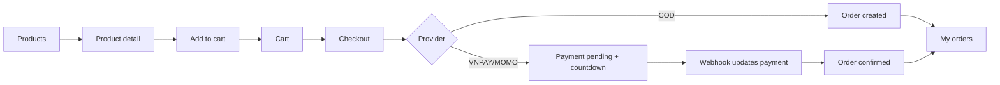
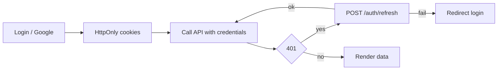
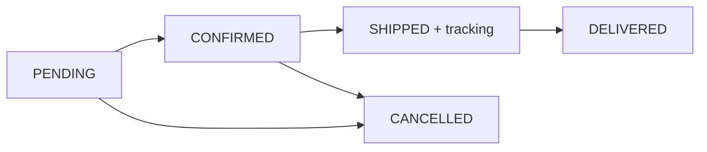
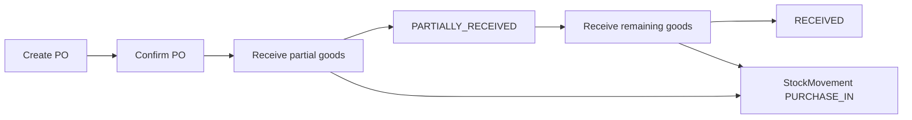

# Ladux - Đặc tả giao diện cho Figma / AI Design

> Tài liệu canonical cho UI/UX Ladux. Dùng file này làm context cho Figma,
> FigJam, Figma AI hoặc designer/frontend dev để tạo giao diện đúng nghiệp vụ,
> đúng API backend và đúng hướng visual của dự án.

---

## 0. Nguyên tắc bắt buộc

Ladux là sàn thương mại điện tử **chỉ bán laptop**. Mọi sản phẩm, danh mục,
ảnh minh họa, alt text, nội dung marketing và dữ liệu mẫu trong Figma phải xoay
quanh laptop. Không tạo điện thoại, tablet, màn hình, chuột, bàn phím rời, tai
nghe, linh kiện PC hay phụ kiện.

Tài liệu này đã đối chiếu với:

- Backend Spring Boot REST API trong `backend/src/main/java/org/akira/ladux`.
- DTO request/response và enum trong `backend/src/main/java/org/akira/ladux/dto`
  và `backend/src/main/java/org/akira/ladux/model/enums`.
- Frontend React/Vite hiện tại trong `frontend/src`, đang dùng state mock ở
  `context.tsx` và `mockData.ts`, chưa đấu nối API thật.
- Design direction trong `design_guidelines.json` và
  `frontend/imports/pasted_text/ladux-ds.md`.

Figma cần thiết kế trải nghiệm production, nhưng phải ghi chú rõ các điểm backend
hoặc frontend hiện tại chưa có endpoint/chưa implement.

---

## 1. Tóm tắt sản phẩm

**Ladux** là e-commerce laptop cao cấp, có 2 không gian chính:

1. **Storefront**: khách hàng tìm laptop, lọc theo nhu cầu, xem cấu hình, thêm
   giỏ hàng, checkout, thanh toán, theo dõi đơn, đánh giá, wishlist, quản lý tài
   khoản và địa chỉ.
2. **Admin**: vận hành catalog laptop, đơn hàng, khách hàng, người dùng, coupon,
   thanh toán, review và supply chain.

Personas:

- **Khách hàng**: chọn laptop theo nhu cầu gaming, văn phòng, business,
  creator/workstation hoặc MacBook; quan tâm giá, cấu hình, tồn kho, đánh giá.
- **Admin/Ops**: cần màn hình dày thông tin, dễ scan, thao tác nhanh, lọc/sắp xếp
  tốt, cập nhật đơn và kho chính xác.

Mood thương hiệu:

- Premium technology, tối giản, đáng tin cậy, tập trung vào ảnh laptop và thông
  số kỹ thuật.
- Storefront có thể dùng dark hero, 3D laptop hoặc neon accent nhẹ.
- Admin ưu tiên tính vận hành, bảng dữ liệu rõ, ít trang trí.

---

## 2. Hiện trạng frontend và hướng thiết kế

Frontend hiện tại:

- Stack: React 18, TypeScript, Vite, Tailwind, Radix UI, lucide-react, Recharts,
  Framer Motion, Three.js/R3F.
- App đang điều hướng bằng in-memory context, chưa dùng route thật.
- Storefront page state: `home`, `products`, `product-detail`, `cart`,
  `checkout`, `orders`, `wishlist`, `account`, `login`, `register`.
- Admin page state: `dashboard`, `products`, `orders`, `customers`,
  `categories`, `brands`, `suppliers`, `product-suppliers`, `purchase-orders`,
  `stock-movements`, `coupons`, `reviews`, `payments`.
- Mock `ProductsPage` hiện chia 8 item/page; backend default là 12. Bản Figma và
  production nên dùng **12 item/page**.

Thiết kế Figma nên dùng sitemap target như một bộ route production, nhưng không
được giả định backend có endpoint chưa tồn tại.

---

## 3. Ràng buộc kỹ thuật ảnh hưởng UI

| Chủ đề | Giá trị thật | Ý nghĩa với UI |
| --- | --- | --- |
| API prefix | `/api/v1` | Tất cả endpoint backend bắt đầu bằng prefix này. |
| Auth | Cookie HttpOnly `AUTH_TOKEN` 15 phút, `REFRESH_TOKEN` 7 ngày; refresh cookie path `/api/v1/auth` | UI không lưu token vào localStorage. 401 thì gọi `POST /api/v1/auth/refresh`; fail thì về login. |
| CSRF | `GET /api/v1/auth/csrf`, header `X-XSRF-TOKEN` cho request ghi dữ liệu, trừ auth/webhook | Mọi form POST/PUT/PATCH/DELETE cần có error state CSRF. |
| Google OAuth | `/oauth2/authorization/google`, redirect thành công về `http://localhost:3000/checkout/success` | Auth page cần nút Google; success page xử lý cả OAuth redirect và payment result. |
| Pagination | Spring `Page`: `content`, `totalElements`, `totalPages`, `number`, `size`, `first`, `last`; default 12, max 50 | Mọi list/table có pagination, loading, empty, error. |
| Product detail | Backend hiện có `GET /api/v1/products/{id}`, chưa có `/products/slug/{slug}` | Route frontend có thể là `/products/:id`; muốn SEO slug thì cần bổ sung endpoint. |
| Price | `BigDecimal`, mock frontend hiện format USD | Component giá luôn hỗ trợ `basePrice`, `discountPrice`, badge `%`. |
| Date/time | Backend trả `Instant`; app chạy timezone VN | UI format rõ ngày giờ, ví dụ `14-06-2026 10:30`. |
| Upload | Static `/uploads/**`; ảnh có thể là relative path | Image component cần fallback và prefix host khi cần. |
| Error | `ErrorResponse { timestamp, status, error, message }` | Toast/inline hiển thị trực tiếp `message`. |
| Login rate limit | 5 lần/phút/IP, 429 message tiếng Việt | Login có warning/lock state, disable submit tạm thời. |
| Customer cancel order | User `OrderController` hiện chưa có endpoint hủy đơn | Có thể prototype nút "Hủy đơn", nhưng annotate là gap; admin đã có PATCH status. |

---

## 4. Design system chuẩn

### 4.1 Visual direction

Hướng thống nhất:

- **Base**: premium monochrome, nhiều trắng/đen/xám, border tinh tế, typography
  gọn, card phẳng.
- **Accent**: neon green `#00FF66` dùng có kiểm soát cho focus, hero dark,
  promo hoặc active filter; không biến toàn bộ UI thành neon.
- **Semantic**: success green, warning amber, danger red, info blue/indigo.
- **Admin**: dense, dễ scan, ít animation, ưu tiên table/filter/action.
- **Storefront**: ảnh laptop lớn, thông số rõ, CTA mạnh, hover/micro motion nhẹ.

### 4.2 Token Figma

| Token | Light | Dark | Ghi chú |
| --- | --- | --- | --- |
| `background` | `#FFFFFF` | `#050505` | Nền app. |
| `surface` | `#F8FAFC` | `#0F0F0F` | Card/table/panel. |
| `surface-hover` | `#F1F5F9` | `#1A1A1A` | Hover row/card. |
| `text-primary` | `#0F172A` | `#FFFFFF` | Text chính. |
| `text-secondary` | `#475569` | `#A1A1AA` | Mô tả. |
| `text-muted` | `#94A3B8` | `#71717A` | Caption/meta. |
| `border` | `#E2E8F0` | `rgba(255,255,255,0.08)` | Border mặc định. |
| `focus` | `#334155` hoặc `#00FF66` | `#00FF66` | Dùng tiết chế. |
| `danger` | `#DC2626` | `#FF3366` | Xóa/lỗi. |
| `warning` | `#F59E0B` | `#F59E0B` | Chờ xử lý/thấp tồn. |
| `success` | `#16A34A` | `#00FF66` | Thành công. |

Typography:

- Font: Inter hoặc Manrope cho app; JetBrains Mono cho tiền, SKU, mã đơn.
- Scale: Display 48-64, H1 32-40, H2 24-28, H3 18-20, Body 14-16, Caption 11-12.
- Không dùng hero-scale type trong card/table/sidebar.

Spacing/radius:

- Spacing 4px base: 4, 8, 12, 16, 24, 32, 48, 64.
- Radius: input/button 8-12px; product card 12-16px; admin panel/table 8-12px.
- Shadow nhẹ; admin ưu tiên border hơn shadow.

### 4.3 Component library bắt buộc

Tạo component có variants light/dark, default/hover/focus/disabled/loading/error:

- Button: primary, secondary/outline, ghost, danger; size sm/md/lg; icon-left.
- Icon button: wishlist, cart, search, edit, delete, view, theme toggle.
- Input, Textarea, Select, Search input, Number input.
- Checkbox, Radio card, Toggle switch.
- Quantity stepper: min 1, max theo `stockQuantity`.
- Price display: `basePrice`, `discountPrice`, `% off`, order totals.
- ProductCard: large, compact, list row; laptop only.
- Image gallery: main image, thumbnail, fallback.
- Rating stars: readonly và input.
- Badge: order, payment, customer, purchase order, stock movement.
- Pagination: page number, prev/next, total summary.
- Tabs/segmented control.
- DataTable: sortable header, filters, row actions, pagination, loading/empty/error.
- Modal, Drawer, Alert dialog.
- Toast/Inline alert.
- Skeleton loaders cho grid, card, table, detail page.
- Empty state có icon/minh họa tinh tế và CTA.
- Storefront header/footer, mobile nav.
- Admin sidebar/topbar.

Badge mapping:

| Enum | Giá trị | Label VI | Màu gợi ý |
| --- | --- | --- | --- |
| `OrderStatus` | PENDING | Chờ xử lý/Chờ thanh toán | warning |
| | CONFIRMED | Đã xác nhận | info |
| | SHIPPED | Đang giao | indigo/info |
| | DELIVERED | Đã giao | success |
| | CANCELLED | Đã hủy | danger |
| `PaymentStatus` | PENDING | Chờ thanh toán | warning |
| | SUCCESS | Thành công | success |
| | FAILED | Thất bại | danger |
| `PaymentProvider` | VNPAY, MOMO, COD | VNPay, MoMo, COD | logo/màu nhẹ |
| `PurchaseOrderStatus` | PENDING, CONFIRMED, PARTIALLY_RECEIVED, RECEIVED, CANCELLED | Chờ xác nhận, Đã xác nhận, Nhận một phần, Đã nhận đủ, Đã hủy | warning/info/amber/success/danger |
| `StockMovementType` | PURCHASE_IN, SALE_OUT, RETURN_IN, DAMAGE_OUT, ADJUSTMENT_IN, ADJUSTMENT_OUT, OTHER | Nhập NCC, Xuất bán, Trả hàng, Hàng hỏng, Điều chỉnh tăng/giảm, Khác | success/danger/info/warning |
| `CustomerLevel` | BROWSER, SILVER, GOLD, RUBY | Mới, Bạc, Vàng, Ruby | muted/silver/gold/ruby |

---

## 5. Sitemap target

### 5.1 Storefront

```text
/                         Home
/products                 Product listing
/products/:id             Product detail
/cart                     Cart
/checkout                 Checkout
/checkout/payment/:id     Payment pending / retry
/checkout/success         Payment or OAuth success
/orders                   My orders
/orders/:id               Order detail
/wishlist                 Wishlist
/account                  Profile, security, orders shortcut
/account/addresses        Address book
/login                    Login
/register                 Register
```

### 5.2 Admin

```text
/admin                         Dashboard
/admin/products                Laptop catalog
/admin/orders                  Order operations
/admin/customers               CRM customer profile
/admin/users                   User and role management
/admin/coupons                 Coupons
/admin/categories              Category tree
/admin/brands                  Brands
/admin/reviews                 Review moderation
/admin/payments                Payment lookup
/admin/suppliers               Suppliers
/admin/product-suppliers       Product-supplier links
/admin/purchase-orders         Procurement / PO
/admin/stock-movements         Inventory ledger
```

Ghi chú: frontend mock hiện chưa có route/page riêng cho `/admin/users`, nhưng
backend có đầy đủ `AdminUserController`; Figma nên thiết kế để không bỏ sót mảng
quản lý người dùng.

---

## 6. Data contract quan trọng

### 6.1 Product

`ProductResponse`:

```text
id, brand{...}, category{...}, sku, name, slug,
basePrice, discountPrice, stockQuantity, specs,
thumbnail, isActive, createdAt, image[]
```

UI notes:

- `specs` là string JSON, render thành bảng thông số laptop. Hỗ trợ key:
  `screen`, `cpu`, `ram`, `storage`, `gpu`, `battery`, `weight`, `ports`, `os`
  và các key tiếng Việt cũ nếu seed có.
- `image` là gallery; nếu rỗng thì dùng `thumbnail`.
- Product list summary không nhất thiết có gallery đầy đủ.

`ProductRequest` admin:

```text
brandId, categoryId, sku, name, basePrice, discountPrice?,
stockQuantity, specs, thumbnail, isActive, imageUrls[]
```

### 6.2 Cart, checkout, order

`CartResponse`:

```text
id, userId, items[{ id, product: ProductResponse, quantity }], totalPrice
```

`OrderRequest`:

```text
couponCode?, paymentProvider(VNPAY|MOMO|COD), shippingAddress
```

Checkout tạo đơn từ giỏ hàng server-side, không gửi item list lên `POST /orders`.

`OrderResponse`:

```text
id, userId, couponCode, subTotal, discountAmount, finalAmount,
status, shippingAddress, trackingNumber, createdAt, paymentExpiresAt,
orderItems[{ id, orderId, productId, quantity, priceAtPurchase }],
paymentProvider
```

UI notes:

- `orderItems` chỉ có `productId`, không có tên/ảnh. Order detail cần map product
  bằng `GET /api/v1/products/{id}` hoặc backend cần bổ sung snapshot field.
- `paymentExpiresAt` dùng cho countdown đơn online.
- State machine: `PENDING -> CONFIRMED -> SHIPPED -> DELIVERED`; `CANCELLED`
  chỉ từ `PENDING`/`CONFIRMED`; `SHIPPED` bắt buộc `trackingNumber`.

### 6.3 Payment

`PaymentCallbackResponse`:

```text
id, orderId, provider, transactionNo, amount, status, createdAt
```

UI không gọi webhook VNPay. Webhook `/api/v1/payments/vnpay-webhook` là flow
giữa payment gateway và backend.

### 6.4 Customer và supply chain

`CustomerResponse`:

```text
id, userId, email, username, fullName, phone, avatarUrl,
loyaltyPoints, level(BROWSER|SILVER|GOLD|RUBY), totalSpent
```

`SupplierResponse`:

```text
id, name, address, phone, email, isActive, createdAt, updatedAt
```

`ProductSupplierResponse`:

```text
id, productId, productName, supplierId, supplierName, costPrice, leadTimeDays
```

`PurchaseOrderResponse`:

```text
id, supplierId, supplierName, status, expectedDeliveryDate,
totalAmount, note, createdById, createdAt, updatedAt,
items[{ id, productId, productName, quantity, costPrice, receivedQuantity, note }]
```

`PurchaseOrderReceiveRequest`:

```text
lines[{ itemId, receivedQuantity }]
```

`StockMovementResponse`:

```text
id, productId, productName, quantity, movementType,
referenceType, referenceId, note, createdById, createdAt
```

---

## 7. Storefront screen spec

Mọi màn storefront cần responsive desktop/tablet/mobile. Header sticky gồm logo,
search, nav danh mục laptop, wishlist, cart badge, account và theme toggle.

### 7.1 Home `/`

API:

- `GET /api/v1/products/active?page=0&size=12`
- `GET /api/v1/categories/roots`
- `GET /api/v1/brands`

UI:

- Hero có ảnh laptop thật hoặc 3D laptop render, CTA "Khám phá laptop cao cấp".
- Category cards: Gaming Laptop, Ultrabook, MacBook, Workstation/Creator,
  Business Laptop.
- Grid "Laptop mới ra mắt", "Laptop đang giảm giá".
- Brand strip: Apple, Dell, Lenovo, ASUS, MSI, HP, LG, Razer, Microsoft.
- Footer ngắn gọn: bảo hành, đổi trả, vận chuyển, hỗ trợ.

States: skeleton section, ẩn section nếu rỗng, error inline/toast.

### 7.2 Products `/products`

API:

- `GET /api/v1/products?search=&page=&size=12&sort=`
- `GET /api/v1/products/brand/{brandId}`
- `GET /api/v1/products/category/{categoryId}`
- `GET /api/v1/brands`, `GET /api/v1/categories`

UI:

- Sidebar filter desktop, drawer filter mobile.
- Filter brand, category laptop, khoảng giá UI-side nếu backend chưa có param giá.
- Sort dropdown: default/newest, price asc/desc, name; map sang Spring sort khi
  backend hỗ trợ.
- View toggle grid/list.
- ProductCard bắt buộc có ảnh, brand, tên laptop, short spec, rating nếu có
  aggregate, giá, discount badge, stock state, wishlist, add-to-cart.
- Pagination 12 item/page.

States: skeleton grid, empty có nút xóa filter, error có retry.

### 7.3 Product detail `/products/:id`

API:

- `GET /api/v1/products/{id}`
- `GET /api/v1/products/{productId}/images`
- `GET /api/v1/reviews/product/{productId}?page=&size=`
- `POST /api/v1/cart/items`
- `POST /api/v1/wishlists`, `DELETE /api/v1/wishlists/{productId}`
- `POST /api/v1/reviews`, `PUT /api/v1/reviews/{reviewId}`,
  `DELETE /api/v1/reviews/{reviewId}`

UI:

- Gallery ảnh lớn + thumbnails + fallback.
- Info block: brand/category link, SKU, name, rating, price, discount, stock.
- Specs table parsed từ JSON; có icon cho screen/cpu/ram/storage/gpu/battery.
- Quantity stepper bị giới hạn bởi `stockQuantity`.
- CTA add-to-cart disabled khi hết hàng; wishlist icon.
- Tabs: Mô tả, Thông số kỹ thuật, Đánh giá.
- Reviews: stars, reviewer avatar/name, comment, createdAt, pagination.
- Related products cùng brand/category nếu dùng được list API hiện có.

States: loading skeleton, product not found, out-of-stock, unauthenticated action
-> login modal/redirect.

### 7.4 Cart `/cart`

API:

- `GET /api/v1/cart`
- `POST /api/v1/cart/items`
- `PUT /api/v1/cart/items/{productId}`
- `DELETE /api/v1/cart/items/{productId}`
- `DELETE /api/v1/cart`

UI:

- Line item: thumbnail, tên laptop, SKU/short spec, unit price, quantity stepper,
  line total, remove icon.
- Summary: subtotal `totalPrice`, shipping copy, CTA checkout.
- Empty: "Giỏ hàng của bạn đang trống" + CTA "Khám phá laptop".
- Cảnh báo nếu quantity vượt tồn kho.

### 7.5 Checkout `/checkout`

API:

- `GET /api/v1/user-addresses/user`
- `GET /api/v1/user-addresses/default`
- `POST /api/v1/user-addresses`
- `POST /api/v1/coupons/apply`
- `GET /api/v1/cart`
- `POST /api/v1/orders`

UI:

- Two-column desktop, single-column mobile.
- Left: address selector, add address form, coupon input, payment radio cards.
- Payment providers: VNPAY, MOMO, COD.
- Right: order summary, subtotal, discount, final total, place order.
- Inline coupon error từ `message`; loading state tránh double-submit.
- Sau submit:
  - COD: về order detail/success.
  - VNPAY/MOMO: payment pending/success flow với countdown từ `paymentExpiresAt`.

### 7.6 Payment and success

API:

- `POST /api/v1/payments` body `{ orderId, provider }`
- `GET /api/v1/payments/my`
- `GET /api/v1/payments/my/order/{orderId}`
- `GET /api/v1/payments/my/status/{status}`
- `POST /api/v1/orders/{orderId}/payments/retry`

UI:

- Pending payment: amount, provider, countdown, button "Thanh toán ngay",
  payment status badge, order id.
- Success: mã đơn, tổng tiền, CTA xem đơn hàng.
- Failure/expired: reason, retry button nếu backend cho phép, hoặc về products.
- Polling/refresh trạng thái vì webhook cập nhật backend.

### 7.7 Orders `/orders` và `/orders/:id`

API:

- `GET /api/v1/orders/user?page=&size=`
- `GET /api/v1/orders/{orderId}`
- `GET /api/v1/order-histories/my?page=&size=`
- `POST /api/v1/orders/{orderId}/payments/retry`

UI list:

- Tabs theo status.
- Card/list row: order id, date, finalAmount, provider, status badge, item count.
- Empty: "Bạn chưa có đơn hàng nào".

UI detail:

- Header order id + badge + createdAt.
- Stepper PENDING, CONFIRMED, SHIPPED, DELIVERED; CANCELLED hiển thị nhánh đỏ.
- Items, tiền, địa chỉ, tracking number, payment block.
- Timeline order history.
- Retry payment khi payment FAILED.
- Nút hủy đơn chỉ là prototype/gap note nếu chưa thêm customer cancel endpoint.

### 7.8 Wishlist `/wishlist`

API:

- `GET /api/v1/wishlists`
- `POST /api/v1/wishlists`
- `DELETE /api/v1/wishlists/{productId}`

UI:

- Grid ProductCard với remove wishlist và add-to-cart.
- Empty state có CTA về products.

### 7.9 Auth `/login`, `/register`

API:

- `POST /api/v1/auth/register`
- `POST /api/v1/auth/login`
- `POST /api/v1/auth/refresh`
- `POST /api/v1/auth/logout`
- `GET /api/v1/auth/csrf`
- Google: `/oauth2/authorization/google`

UI:

- Login: username/password, show password, Google button, rate-limit warning.
- Register: fullName, username, email, password, phone optional.
- Inline validation theo backend `message`.
- 429 login: warning "Bạn đăng nhập quá nhiều, hãy thử lại sau!", disable submit.

### 7.10 Account and addresses

API:

- `GET /api/v1/users/me`
- `PUT /api/v1/users/me`
- `POST /api/v1/users/me/avatar` multipart, max 5MB
- `GET/POST/PUT/DELETE /api/v1/user-addresses...`

UI:

- Profile form, avatar upload preview, phone validation.
- Security tab đổi mật khẩu; note "Đổi mật khẩu sẽ đăng xuất các phiên khác".
- Address cards: default badge, edit/delete, set default, add form.

---

## 8. Admin screen spec

Admin là operational UI: sidebar có nhóm Tổng quan, Catalog, Thương mại, Supply
Chain; topbar có search, theme toggle, notification, avatar/admin menu. Mọi list
admin dùng DataTable.

### 8.1 Dashboard `/admin`

API gợi ý:

- `GET /api/v1/admin/orders`
- `GET /api/v1/admin/orders/status/{status}`
- `GET /api/v1/admin/stock-movements`

UI:

- Stat cards: doanh thu, đơn hôm nay, khách mới, cảnh báo tồn kho.
- Chart doanh thu/order status.
- Recent orders table.
- Low-stock alert.
- Quick links đến products, orders, purchase orders, stock movements.

### 8.2 Products `/admin/products`

API:

- Read list: `GET /api/v1/products`
- Create/update/delete: `POST|PUT|DELETE /api/v1/admin/products`
- Images: `GET /api/v1/products/{id}/images`,
  `POST /api/v1/admin/products/{id}/images`,
  `POST /api/v1/admin/products/{id}/images/upload`,
  `DELETE /api/v1/admin/products/{id}/images/{imageId}`

UI:

- DataTable columns: image, name/SKU, brand, category, price, stock, active, actions.
- Filters: search, brand, category, active, low stock.
- Create/Edit form: brand, category, SKU, name, basePrice, discountPrice,
  stockQuantity, specs JSON/key-value editor, thumbnail, imageUrls, isActive.
- Specs editor có mode key-value và raw JSON.

### 8.3 Orders `/admin/orders`

API:

- `GET /api/v1/admin/orders`
- `GET /api/v1/admin/orders/status/{status}`
- `PATCH /api/v1/admin/orders/{orderId}/status`

UI:

- Tabs/filter theo status.
- Detail drawer: customer/userId, items, totals, address, payments, history.
- Status action chỉ hiện transition hợp lệ:
  - PENDING -> CONFIRMED/CANCELLED
  - CONFIRMED -> SHIPPED/CANCELLED
  - SHIPPED -> DELIVERED
  - DELIVERED/CANCELLED -> readonly
- Khi chuyển SHIPPED bắt buộc nhập trackingNumber.

### 8.4 Customers `/admin/customers`

API:

- `GET /api/v1/admin/customers`
- `GET /api/v1/admin/customers/search?keyword=...`
- `GET /api/v1/admin/customers/level/{level}`
- `GET /api/v1/admin/customers/{customerId}`
- `PUT /api/v1/admin/customers/{customerId}`

UI:

- DataTable: avatar/name, email, phone, level, loyaltyPoints, totalSpent.
- Filter level: BROWSER, SILVER, GOLD, RUBY.
- Detail/edit drawer cho CRM profile.

### 8.5 Users `/admin/users`

API:

- `GET /api/v1/admin/users`, `/active`, `/{id}`, `/email/{email}`
- `PUT /api/v1/admin/users/{id}`
- `DELETE /api/v1/admin/users/{id}`

UI:

- DataTable: avatar, username, email, roles, active, createdAt.
- Role badges CUSTOMER/ADMIN.
- Toggle active/locked, confirm destructive actions.

### 8.6 Coupons `/admin/coupons`

API:

- `GET /api/v1/admin/coupons`, `GET /{id}`, `GET /code/{code}`
- `POST /api/v1/admin/coupons`
- `PUT /api/v1/admin/coupons/{id}`
- `DELETE /api/v1/admin/coupons/{id}`

Form:

```text
code, discountType(PERCENT|FIXED_AMOUNT), discountValue,
minOrderValue, usageLimit, expiresAt
```

UI:

- Show usedCount/usageLimit progress, expiry, active/expired derived state.
- Inline validation: future date, positive values.

### 8.7 Categories and brands

Categories API:

- Public read: `GET /api/v1/categories`, `/{id}`, `/name/{name}`, `/roots`
- Admin write: `POST|PUT|DELETE /api/v1/admin/categories`

Brands API:

- Public read: `GET /api/v1/brands`, `/{id}`, `/name/{name}`, `/slug/{slug}`
- Admin write: `POST|PUT|DELETE /api/v1/admin/brands`

UI:

- Categories: tree view parent-child, delete guard khi còn con/sản phẩm.
- Brands: table/grid với logo, name, slug, product count nếu có.

### 8.8 Reviews `/admin/reviews`

API:

- `GET /api/v1/admin/reviews`
- `GET /api/v1/admin/reviews/user/{userId}`

UI:

- DataTable: reviewer, product, rating, comment, createdAt.
- Approve/reject/delete moderation chỉ nên annotate là prototype nếu backend chưa
  có endpoint tương ứng.

### 8.9 Payments `/admin/payments`

API:

- `GET /api/v1/admin/payments`
- `GET /api/v1/admin/payments/order/{orderId}`
- `GET /api/v1/admin/payments/{id}`
- `GET /api/v1/admin/payments/status/{status}`
- `PUT /api/v1/admin/payments/{id}`

UI:

- Read-mostly transaction lookup: orderId, provider, transactionNo, amount,
  status, createdAt.
- Filters by status/provider/order.
- Detail drawer for reconciliation.

### 8.10 Suppliers `/admin/suppliers`

API:

- `GET /api/v1/admin/suppliers`
- `GET /api/v1/admin/suppliers/active`
- `GET /api/v1/admin/suppliers/{id}`
- `GET /api/v1/admin/suppliers/search?name=&phone=`
- `POST|PUT|DELETE /api/v1/admin/suppliers`

UI:

- DataTable: supplier name, address, phone, email, active, created/updated date.
- Create/edit form: `name`, `address`, `phone`, `email`, `isActive`.
- Deactivate/delete confirm.

### 8.11 Product suppliers `/admin/product-suppliers`

API:

- `GET /api/v1/admin/product-suppliers/product/{productId}`
- `GET /api/v1/admin/product-suppliers/supplier/{supplierId}`
- `POST|PUT|DELETE /api/v1/admin/product-suppliers`

UI:

- Link laptop với supplier: `productId`, `supplierId`, `costPrice`,
  `leadTimeDays`.
- Useful views: by product và by supplier.

### 8.12 Purchase orders `/admin/purchase-orders`

API:

- `GET /api/v1/admin/purchase-orders`
- `GET /api/v1/admin/purchase-orders/status/{status}`
- `GET /api/v1/admin/purchase-orders/supplier/{supplierId}`
- `GET /api/v1/admin/purchase-orders/{id}`
- `POST /api/v1/admin/purchase-orders`
- `PATCH /api/v1/admin/purchase-orders/{id}/status`
- `POST /api/v1/admin/purchase-orders/{id}/receive`

UI:

- PO list cards/table: id, supplier, status, expectedDeliveryDate, totalAmount.
- Create PO: select supplier, add nhiều dòng laptop với `productId`, `quantity`,
  `costPrice`, `note`.
- Detail: line items ordered vs received.
- Receive goods modal:
  - Mỗi line có max remaining quantity.
  - Cho phép partial receive.
  - Submit `lines[{ itemId, receivedQuantity }]`.
  - Result updates PO status to PARTIALLY_RECEIVED/RECEIVED and creates
    StockMovement.

### 8.13 Stock movements `/admin/stock-movements`

API:

- `GET /api/v1/admin/stock-movements`
- `GET /api/v1/admin/stock-movements/product/{productId}`
- `POST /api/v1/admin/stock-movements/adjustments`

UI:

- Immutable ledger table: time, product, movementType, quantity sign, reference,
  note, createdBy.
- Filters: product, type, date range.
- Manual adjustment modal: product, quantity positive, movementType, note.
- Decrease stock actions need serious confirm state.

---

## 9. Luồng prototype chính

### 9.1 Purchase flow



### 9.2 Auth session



### 9.3 Order operations



### 9.4 Procurement



---

## 10. API matrix nhanh

| Màn hình | Endpoint chính | Ghi chú |
| --- | --- | --- |
| Home | `GET /products/active`, `/categories/roots`, `/brands` | Public |
| Products | `GET /products?search=`, `/products/brand/{id}`, `/products/category/{id}` | Public, Page |
| Product detail | `GET /products/{id}`, `/products/{id}/images`, `/reviews/product/{id}` | Public read |
| Cart | `GET /cart`, `POST /cart/items`, `PUT/DELETE /cart/items/{productId}` | Auth |
| Checkout | `GET /cart`, `/user-addresses/*`, `POST /coupons/apply`, `POST /orders` | Auth |
| Payment | `POST /payments`, `GET /payments/my*`, `POST /orders/{id}/payments/retry` | Auth |
| Orders | `GET /orders/user`, `GET /orders/{id}`, `GET /order-histories/my` | Auth |
| Wishlist | `GET/POST /wishlists`, `DELETE /wishlists/{productId}` | Auth |
| Account | `GET/PUT /users/me`, `POST /users/me/avatar`, `/user-addresses` | Auth |
| Auth | `/auth/register`, `/auth/login`, `/auth/refresh`, `/auth/logout`, `/auth/csrf` | Public/auth |
| Admin products | `POST/PUT/DELETE /admin/products`, image endpoints | ADMIN |
| Admin orders | `GET /admin/orders`, `/status/{status}`, `PATCH /admin/orders/{id}/status` | ADMIN |
| Admin customers | `GET/PUT /admin/customers` | ADMIN |
| Admin users | `GET/PUT/DELETE /admin/users` | ADMIN |
| Admin coupons | CRUD `/admin/coupons` | ADMIN |
| Admin catalog | CRUD `/admin/categories`, `/admin/brands` | ADMIN |
| Admin reviews | `GET /admin/reviews`, `/user/{userId}` | ADMIN |
| Admin payments | `GET/PUT /admin/payments` | ADMIN |
| Suppliers | CRUD `/admin/suppliers` | ADMIN |
| Product suppliers | CRUD `/admin/product-suppliers` | ADMIN |
| Purchase orders | CRUD/status/receive `/admin/purchase-orders` | ADMIN |
| Stock movements | `GET /admin/stock-movements`, `POST /adjustments` | ADMIN |

---

## 11. Micro-copy và state dùng chung

Mọi list/table/detail/form cần có 4 state:

- Loading: skeleton đúng layout thật.
- Data: nội dung bình thường.
- Empty: icon/minh họa nhỏ + CTA hợp lý.
- Error: message từ backend + retry.

Micro-copy gợi ý:

- Empty cart: "Giỏ hàng của bạn đang trống" - CTA "Khám phá laptop".
- Empty orders: "Bạn chưa có đơn hàng nào".
- Empty wishlist: "Danh sách yêu thích đang trống".
- Out of stock: "Tạm hết hàng".
- Low stock: "Chỉ còn {n} sản phẩm".
- Add cart success: "Đã thêm vào giỏ hàng".
- Place order success: "Đặt hàng thành công! Mã đơn #{id}".
- Coupon invalid: hiển thị `message` dưới input.
- Cancel confirm: "Bạn chắc chắn muốn hủy đơn #{id}?"
- Admin destructive: "Hành động này không thể hoàn tác."

---

## 12. Yêu cầu output Figma

Tạo một Figma file có cấu trúc:

1. **Cover / Product Context**: Ladux laptop-only, personas, constraints.
2. **Design System**: color tokens, typography, spacing, components, variants
   light/dark.
3. **Storefront**: desktop + mobile key screens, prototype purchase flow.
4. **Admin**: desktop-first screens, DataTable states, supply chain flow.
5. **API Notes**: frame comments gắn với mỗi màn hình, ghi endpoint + fields.

Rules khi generate:

- Không dùng placeholder category ngoài laptop.
- Ảnh sản phẩm phải là laptop thật/render laptop; alt/caption cũng là laptop.
- Không tạo landing page marketing riêng nếu đã là app screen; Home phải mua sắm
  được ngay.
- Mọi form có disabled/loading/error states.
- Table admin có sort indicator, filter, pagination, row hover actions.
- Product detail specs render như bảng thông số laptop chuyên nghiệp.
- Storefront mobile không overflow text/button.
- Theme toggle có light/dark variants.
- Annotate rõ gap: product slug endpoint, customer cancel order endpoint, review
  moderation approve/reject nếu chưa có API.

Prompt ngắn để đưa vào Figma AI:

```text
Design Ladux, a laptop-only premium e-commerce and admin operations platform.
Use this UI spec as the source of truth. Create a complete Figma file with a
Design System page, Storefront screens, Admin screens, API notes, light/dark
variants, loading/empty/error/data states, and laptop-only realistic data.
Respect backend endpoints, DTO fields, pagination 12/page, order state machine,
payment flow, and supply-chain modules.
```

---

## 13. Definition of Done cho bản thiết kế

- Tất cả màn hình trong sitemap có frame desktop; storefront có thêm mobile.
- Component library có light/dark variants và state bắt buộc.
- Product data chỉ có laptop và đúng field `ProductResponse`.
- Admin supply chain đầy đủ: suppliers, product suppliers, purchase orders,
  receive goods, stock movements.
- Mọi table/list có pagination 12/page và empty/loading/error.
- Mọi action ghi dữ liệu có validation/error state từ `message`.
- Order/payment badges và action đúng enum/state machine.
- Không có field backend không trả mà không annotate là `future/gap`.
