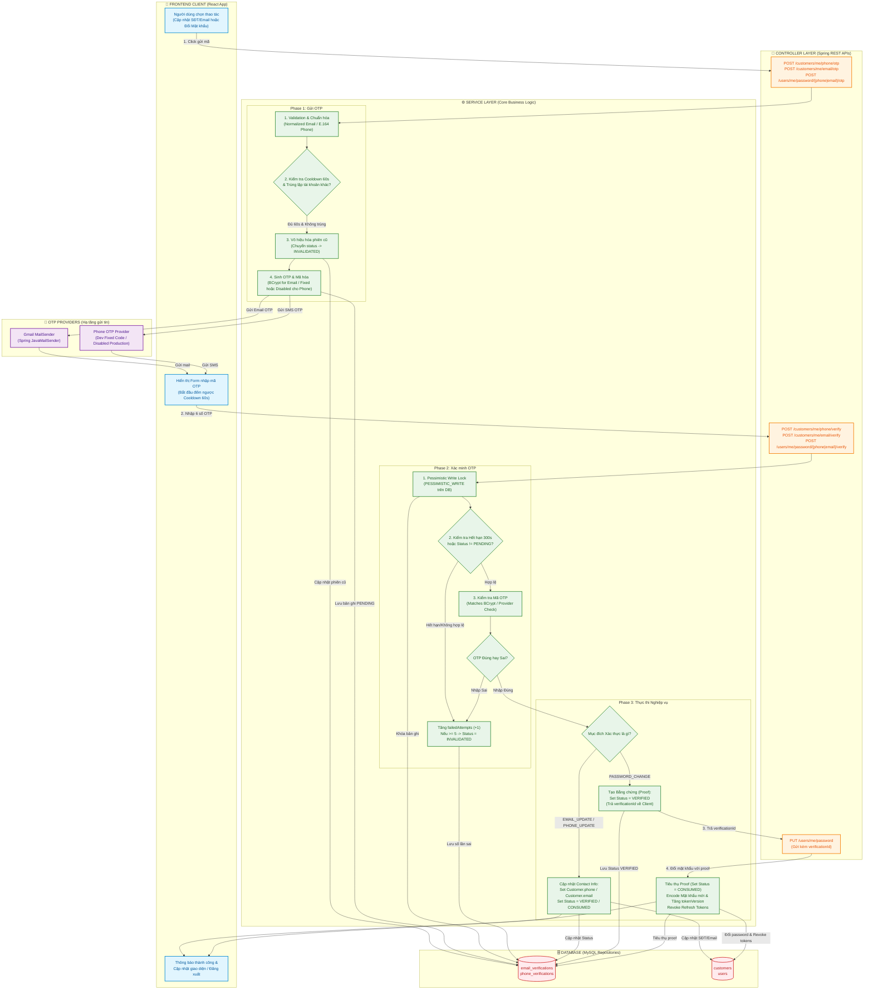
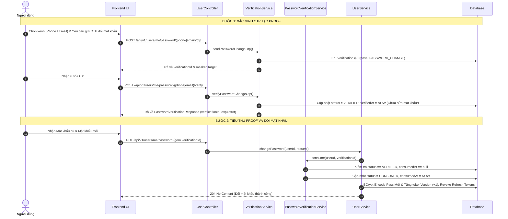

# BÁO CÁO CHI TIẾT LUỒNG XÁC THỰC PHONE VÀ EMAIL (OTP)

> **Hệ thống**: Ladux E-commerce Framework  
> **Tài liệu**: Báo cáo Phân tích Kiến trúc & Hướng dẫn Đọc mã nguồn Luồng Xác thực OTP Phone & Email  
> **Đường dẫn lưu trữ**: `docs/otp/bao_cao_xac_thuc_phone_email.md`

---

## I. TỔNG QUAN HỆ THỐNG VÀ KIẾN TRÚC LUỒNG HOẠT ĐỘNG

Hệ thống xác thực qua OTP (One-Time Password) trên hệ thống **Ladux** hỗ trợ 2 kênh truyền thông tin chính (**Email** và **Phone**) cho 2 mục đích nghiệp vụ quan trọng:
1. **Cập nhật / Xác minh thông tin liên hệ (`EMAIL_UPDATE` / `PHONE_UPDATE`)**: Cho phép khách hàng thêm hoặc thay đổi Email / Số điện thoại vào hồ sơ cá nhân (`Customer.email`, `Customer.phone`).
2. **Xác minh 2 lớp khi Đổi mật khẩu (`PASSWORD_CHANGE`)**: Cho phép người dùng sử dụng Email hoặc Số điện thoại đã xác thực làm **Bằng chứng xác minh (Verification Proof)** trước khi thực hiện đổi mật khẩu tài khoản.

### Sơ đồ luồng hoạt động tổng quan (Comprehensive Flowchart)

---

## II. BẢNG SO SÁNH QUY TRÌNH XÁC THỰC EMAIL VS PHONE

| Tiêu chí | Luồng Xác thực Email | Luồng Xác thực Phone |
| :--- | :--- | :--- |
| **Mục đích hỗ trợ** | `EMAIL_UPDATE`, `PASSWORD_CHANGE` | `PHONE_UPDATE`, `PASSWORD_CHANGE` |
| **Đơn vị phát sinh OTP** | Backend tự sinh ngẫu nhiên 6 chữ số (`SecureEmailOtpGenerator`) | Dev dùng mã cố định; production hiện tắt phone OTP |
| **Lưu trữ bảo mật OTP** | Mã hóa bằng **BCrypt** (`otpHash`), không lưu text thô | Production không tạo phiên OTP vì chưa bật SMS provider |
| **Thời gian hết hạn (TTL)** | 300 giây (5 phút) | 300 giây (5 phút) |
| **Thời gian chờ gửi lại (Cooldown)**| 60 giây | 60 giây |
| **Số lần thử tối đa** | 5 lần sai -> Phiên chuyển thành `INVALIDATED` | 5 lần sai -> Phiên chuyển thành `INVALIDATED` |
| **Cơ chế Khóa dữ liệu** | `PESSIMISTIC_WRITE` trên database khi xác minh | `PESSIMISTIC_WRITE` trên database khi xác minh |
| **Hành vi khi thành công (Update)**| Cập nhật `Customer.email`, `emailVerifiedAt` & Đổi trạng thái -> `CONSUMED` | Cập nhật `Customer.phone` & Đổi trạng thái -> `VERIFIED` |
| **Hành vi khi thành công (Pass Change)**| Chuyển trạng thái -> `VERIFIED` để làm Proof đổi mật khẩu | Chuyển trạng thái -> `VERIFIED` để làm Proof đổi mật khẩu |

---

## III. THỨ TỰ ĐỌC FILE KHUYẾN NGHỊ (FILE READING ORDER)

Để nắm bắt toàn bộ luồng logic từ tổng quan đến chi tiết, các lập trình viên nên đọc file mã nguồn theo thứ tự 5 bước dưới đây:

### Bước 1: Tầng tiếp nhận Request & DTO (Controller & DTO Layer)
Bắt đầu đọc các điểm vào API để hiểu các endpoint được phơi ra cho phía Frontend.
1. `controller/user/CustomerController.java`: Điểm tiếp nhận request gửi/xác minh OTP cho Email (`/customers/me/email/*`) và Phone (`/customers/me/phone/*`).
2. `controller/user/UserController.java`: Điểm tiếp nhận request gửi/xác minh OTP cho Đổi mật khẩu (`/users/me/password/*`).
3. **Các DTO liên quan**:
   - `dto/user/request/EmailRegisterRequest.java`, `dto/user/request/EmailVerifyRequest.java`
   - `dto/user/request/PhoneRegisterRequest.java`, `dto/user/request/PhoneVerifyRequest.java`
   - `dto/user/request/UserUpdatePassword.java`
   - `dto/system/response/OtpSendResponse.java`, `dto/system/response/EmailOtpSendResponse.java`, `dto/system/response/PasswordVerificationResponse.java`

### Bước 2: Tầng Mô hình dữ liệu & Lưu trữ (Entity, Enum & Repository Layer)
Hiểu cách các phiên xác thực OTP được lưu trữ trong cơ sở dữ liệu và vòng đời trạng thái.
1. `model/EmailVerification.java`: Entity lưu phiên xác thực Email (`email_verifications`).
2. `model/PhoneVerification.java`: Entity lưu phiên xác thực Phone (`phone_verifications`).
3. **Trạng thái & Mục đích Enum**:
   - `model/enums/EmailVerificationStatus.java` (`PENDING`, `VERIFIED`, `CONSUMED`, `EXPIRED`, `INVALIDATED`, `SEND_FAILED`)
   - `model/enums/EmailVerificationPurpose.java` (`EMAIL_UPDATE`, `PASSWORD_CHANGE`)
   - `model/enums/PhoneVerificationStatus.java` (`PENDING`, `VERIFIED`, `EXPIRED`, `INVALIDATED`)
   - `model/enums/PhoneVerificationPurpose.java` (`PHONE_UPDATE`, `PASSWORD_CHANGE`)
4. **Repositories**:
   - `repository/EmailVerificationRepository.java`: Chứa truy vấn Lock `PESSIMISTIC_WRITE` (`findForUpdate`) và vô hiệu hóa phiên cũ.
   - `repository/PhoneVerificationRepository.java`: Chứa truy vấn Lock `PESSIMISTIC_WRITE` (`findByVerificationIdAndCustomerIdAndPurpose`).

### Bước 3: Tầng Nghiệp vụ cốt lõi (Service Layer)
Nơi chứa toàn bộ logic kiểm tra cooldown, đếm số lần nhập sai, khóa phiên và cập nhật database.
1. `service/EmailVerificationService.java` & `service/impl/EmailVerificationServiceImpl.java`
2. `service/PhoneVerificationService.java` & `service/impl/PhoneVerificationServiceImpl.java`
3. `service/PasswordVerificationService.java` & `service/impl/PasswordVerificationServiceImpl.java`
4. `service/impl/UserServiceImpl.java`: Đoạn xử lý `changePassword` tiêu thụ (consume) phiên xác thực.

### Bước 4: Tầng Hạ tầng & Cấu hình (Infrastructure & Provider Layer)
Cách thức gửi OTP thật qua SMS / Email và cấu hình thời gian hết hạn.
1. **Email OTP**:
   - `service/EmailOtpGenerator.java` & `service/impl/SecureEmailOtpGenerator.java`
   - `service/EmailOtpSender.java` & `service/impl/GmailEmailOtpSender.java`
   - `config/EmailOtpProperties.java`
2. **Phone OTP**:
   - `service/PhoneOtpProvider.java`
   - `service/impl/DevPhoneOtpProvider.java` (Môi trường Dev với fixed code `123456`)
   - `service/impl/DisabledPhoneOtpProvider.java` (Production tắt phone OTP khi chưa dùng SMS provider)
   - `config/DevOtpProperties.java`

### Bước 5: Tầng Frontend (Client Services & React Components)
Cách UI gọi API, xử lý countdown đếm ngược và hiển thị ô nhập OTP.
1. `frontend/src/services/customerService.ts`: API client gọi gửi/xác thực OTP cập nhật thông tin.
2. `frontend/src/services/userService.ts`: API client gọi gửi/xác thực OTP cho đổi mật khẩu.
3. `frontend/src/pages/AccountView.tsx`: Màn hình giao diện quản lý tài khoản, chứa Modal đổi Email, SĐT và Đổi mật khẩu.
4. `frontend/src/app/components/ui/input-otp.tsx`: Component UI ô nhập mã OTP chuẩn UX.

---

## IV. CHI TIẾT LOGIC XỬ LÝ NGHỆP VỤ THEO TỪNG LUỒNG

### 1. Luồng Xác thực Cập nhật Số điện thoại (Phone Update Flow)

#### Bước 1: Gửi OTP (`POST /api/v1/customers/me/phone/otp`)
1. **Lấy người dùng hiện tại**: `SecurityUtils.getCurrentUserId()`.
2. **Chuẩn hóa số điện thoại**: Sử dụng `PhoneNumberUtils.normalize(request.phone())` chuyển về định dạng E.164 (VD: `+84987654321`).
3. **Kiểm tra ràng buộc nghiệp vụ**:
   - Nếu SĐT mới giống hệt SĐT hiện tại của tài khoản -> Báo lỗi.
   - Nếu SĐT mới đã thuộc về tài khoản khác trong hệ thống (`customerRepository.existsByPhoneAndIdNot`) -> Báo lỗi.
4. **Kiểm tra Cooldown gửi lại**:
   - Tìm phiên OTP gần nhất cùng `customerId` và `purpose`.
   - Nếu thời gian hiện tại chưa qua 60s kể từ `createdAt` -> Báo lỗi yêu cầu chờ thêm số giây còn lại.
5. **Vô hiệu hóa phiên cũ**: Đổi tất cả phiên đang `PENDING`/`VERIFIED` chưa consume của user thành `INVALIDATED`.
6. **Gọi Provider gửi OTP**: `phoneOtpProvider.sendOtp(normalizedPhone)`.
7. **Lưu phiên vào DB**: Tạo bản ghi `PhoneVerification` với trạng thái `PENDING`, TTL 300s.
8. **Trả về Client**: `verificationId`, `maskedPhone` (VD: `+84***4321`), `expiresInSeconds` (300s).

#### Bước 2: Xác minh OTP (`POST /api/v1/customers/me/phone/verify`)
1. **Tìm phiên xác thực**: Tìm `PhoneVerification` bằng `verificationId`, `customerId` và `purpose = PHONE_UPDATE` kèm theo Lock DB (`PESSIMISTIC_WRITE`).
2. **Kiểm tra trạng thái & Thời hạn**:
   - Nếu trạng thái != `PENDING` -> Báo lỗi phiên không còn hiệu lực.
   - Nếu `now >= expiresAt` -> Đổi trạng thái thành `EXPIRED` và báo lỗi hết hạn.
3. **Xác minh mã với Provider**: `phoneOtpProvider.verifyOtp(providerVerificationId, otp)`.
4. **Xử lý khi nhập sai**:
   - Tăng `failedAttempts = failedAttempts + 1`.
   - Nếu `failedAttempts >= 5` -> Đổi trạng thái phiên thành `INVALIDATED`.
   - Ném ngoại lệ `BusinessRuleException` báo nhập sai hoặc quá 5 lần. *(Chú ý: `@Transactional(noRollbackFor = BusinessRuleException.class)` giúp số lần sai vẫn được commit vào DB)*.
5. **Xử lý khi nhập đúng**:
   - Kiểm tra lại xem SĐT có bị tài khoản khác nhanh tay đăng ký trong lúc chờ nhập OTP hay không.
   - Cập nhật `Customer.phone = verifiedPhone`.
   - Cập nhật trạng thái `PhoneVerification.status = VERIFIED` và `verifiedAt = Instant.now()`.
   - Evict cache `users` và trả về `CustomerResponse`.

---

### 2. Luồng Xác thực Cập nhật Email (Email Update Flow)

#### Bước 1: Gửi OTP (`POST /api/v1/customers/me/email/otp`)
1. **Chuẩn hóa Email**: Chuyển về dạng chữ thường không khoảng trắng (`email.trim().toLowerCase(Locale.ROOT)`).
2. **Kiểm tra ràng buộc nghiệp vụ**:
   - Nếu Email trùng với Email hiện tại và đã được xác minh (`emailVerifiedAt != null`) -> Báo lỗi.
   - Cho phép gửi lại OTP nếu Email trùng với Email cũ được migrate từ hệ thống cũ nhưng chưa được xác minh (`emailVerifiedAt == null`).
   - Nếu Email đã thuộc tài khoản khác -> Báo lỗi.
3. **Kiểm tra Cooldown & Vô hiệu hóa phiên cũ**: Tương tự luồng Phone (60s cooldown, vô hiệu hóa phiên `PENDING`/`VERIFIED`).
4. **Sinh mã OTP & Mã hóa Bảo mật**:
   - `SecureEmailOtpGenerator.generate()` tạo mã 6 chữ số ngẫu nhiên.
   - `PasswordEncoder.encode(otp)` băm mã OTP bằng **BCrypt** và lưu vào thuộc tính `otpHash`. **Tuyệt đối không lưu OTP thô vào cơ sở dữ liệu**.
5. **Lưu DB & Gửi Email**:
   - Lưu `EmailVerification` với status `PENDING`.
   - `emailOtpSender.sendOtp(...)` qua Spring `JavaMailSender` (Gmail SMTP).
   - Nếu gửi mail thất bại (SMTP exception) -> Đổi status phiên thành `SEND_FAILED` và báo lỗi.
6. **Trả về Client**: `verificationId`, `maskedEmail` (VD: `k***g@gmail.com`), `expiresAt`, `resendAfterSeconds`.

#### Bước 2: Xác minh OTP (`POST /api/v1/customers/me/email/verify`)
1. **Tìm phiên & Khóa Pessimistic Lock**: `emailVerificationRepository.findForUpdate(verificationId, customerId)`.
2. **Kiểm tra mã OTP**: `passwordEncoder.matches(request.otp(), verification.getOtpHash())`.
3. **Xử lý khi sai / quá số lần**: Đếm `failedAttempts`, vô hiệu hóa khi sai >= 5 lần.
4. **Xử lý khi thành công**:
   - Cập nhật `Customer.email = verification.getEmail()`.
   - Cập nhật `Customer.emailVerifiedAt = Instant.now()`.
   - Đổi trạng thái phiên `EmailVerification.status = CONSUMED`, `verifiedAt = now`, `consumedAt = now`.
   - Evict cache `users` và trả về `UserResponse`.

---

### 3. Luồng Xác thực 2 Lớp cho Đổi Mật Khẩu (Password Change Verification Flow)

Đây là quy trình xác thực 2 bước (Two-Step Proof Verification) nâng cao độ bảo mật:

#### Các điểm đặc thù cần lưu ý trong Luồng Đổi Mật Khẩu:
1. **Không thay đổi SĐT / Email người dùng**: Khi thực hiện `verifyPasswordChangeOtp`, hệ thống **chưa** và **không** cập nhật thông tin liên hệ, mà chỉ xác nhận người dùng sở hữu kênh liên hệ đó và chuyển trạng thái phiên thành `VERIFIED`.
2. **Cơ chế Tiêu thụ Bằng chứng (Consume Proof)**: Khi người dùng bấm "Lưu mật khẩu mới", API `PUT /api/v1/users/me/password` bắt buộc phải kèm `verificationId`. `PasswordVerificationServiceImpl.consume()` sẽ tự động nhận biết `verificationId` đó nằm ở bảng `phone_verifications` hay `email_verifications` để thực hiện kiểm tra và đổi trạng thái thành `CONSUMED`.
3. **Chống Tái Sử Dụng Bằng Chứng (Anti-Replay Attack)**: Một `verificationId` sau khi đã `CONSUMED` sẽ bị từ chối lập tức nếu cố tình gửi lại.
4. **Vô hiệu hóa Token & Đăng xuất thiết bị cũ**: Khi đổi mật khẩu thành công, `tokenVersion` của `User` tăng lên 1 và toàn bộ Refresh Token cũ bị thu hồi (`refreshTokenService.revokeAllRefreshTokens`).

---

## V. CÁC QUY TẮC BẢO MẬT VÀ THIẾT KẾ ĐÁNG CHÚ Ý (SECURITY & DESIGN HIGHLIGHTS)

1. **Transaction & Persisting Failures (`noRollbackFor = BusinessRuleException.class`)**:
   - Khi người dùng nhập sai mã OTP, Service sẽ ném ra `BusinessRuleException`. Thông thường Spring Transaction sẽ rollback toàn bộ thay đổi database.
   - Nhờ khai báo `noRollbackFor = BusinessRuleException.class`, việc tăng số lần nhập sai `failedAttempts` và chuyển trạng thái sang `INVALIDATED` (nếu sai >= 5 lần) vẫn được lưu thành công vào Database để chống tấn công Brute-Force.
2. **Mã hóa OTP phía Server**:
   - Email OTP được băm bằng thuật toán **BCrypt** trước khi lưu DB (`otpHash`). Dù hacker có lấy được Database dump cũng không thể biết OTP thô.
3. **Khóa chống xung đột Race Condition (`PESSIMISTIC_WRITE`)**:
   - Truy vấn xác minh OTP sử dụng `LockModeType.PESSIMISTIC_WRITE` nhằm ngăn chặn các tấn công gửi đồng thời nhiều request xác thực song song để qua mặt bộ đếm `failedAttempts`.
4. **Giấu thông tin nhạy cảm (Data Masking)**:
   - Tất cả các response gửi OTP đều ẩn thông tin: `abcde@gmail.com` -> `a***e@gmail.com`, `+84987654321` -> `+84***4321`.
5. **Cơ chế Phân tách Môi trường OTP Phone (Profile Dev / Disabled Prod)**:
    - **Môi trường Dev (`DevPhoneOtpProvider`)**: Tự động nhận diện mã cố định `123456`, giúp lập trình viên Frontend / QA test nhanh mà không tốn chi phí SMS.
    - **Môi trường Prod (`DisabledPhoneOtpProvider`)**: Không gửi/xác minh phone OTP và trả lỗi rõ ràng cho tới khi tích hợp một SMS provider được quyết định.

---

## VI. KẾT LUẬN

Hệ thống xác thực Email & Phone OTP của **Ladux** được thiết kế chặt chẽ, tuân thủ các chuẩn mực bảo mật nâng cao (BCrypt Hashing, Pessimistic Locking, Anti-Replay Proof, Transaction Isolation control, Rate Limiting & Cooldown). Lập trình viên mới khi tiếp cận chỉ cần đọc theo đúng **Thứ tự đọc file khuyến nghị ở Mục III** là có thể làm chủ toàn bộ luồng nghiệp vụ này một cách nhanh chóng.
